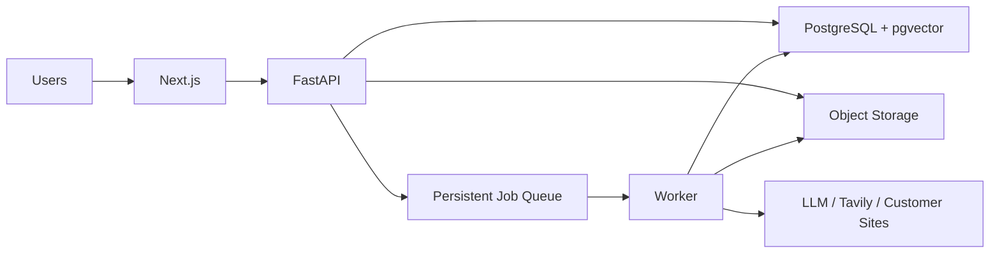

# ADR-0004：按小规模起步并保留横向扩展能力

- 状态：Accepted
- 日期：2026-07-17
- 范围：生产容量、数据库、知识索引、任务队列和 Worker

## 背景

首批用户数量、客户项目数量和并发生成任务尚不确定。系统需要支持多人和多客户知识隔离，但没有证据表明第一版需要 Kubernetes、多个微服务或独立向量数据库。

提前按大规模系统搭建会增加部署、调试、备份和运维成本，也会拖慢从当前本地工作台迁移到共享服务器的速度。

## 决策

1. 第一版按小规模负载部署，同时在接口和数据边界上保留扩展能力。
2. 关系数据、权限、任务元数据和知识来源元数据使用 PostgreSQL。
3. 第一版向量检索使用同一 PostgreSQL 实例中的 pgvector，通过 `KnowledgeIndex` 接口访问。
4. 原始文件、抓取快照、图片、截图、DOCX 和交付文件使用 S3 兼容对象存储。
5. 抓取、解析、Embedding、文章生成和导出在 Worker 中执行；API 不同步阻塞等待长任务。
6. 模型调用、网站抓取和文档解析分别设置并发限制，避免一个任务类型耗尽全部容量。
7. 第一扩展手段是增加 Worker 实例，而不是拆分整个应用。
8. 只有当 pgvector 的数据规模或检索延迟达到明确阈值时，才评估独立向量服务。
9. 第一版不要求 Kubernetes、独立 Qdrant、Redis 集群、读写分离或多区域部署。

## 初始拓扑

## 扩展触发指标

- 队列等待时间持续超过业务可接受范围。
- Worker CPU、内存或并发槽长期饱和。
- 模型供应商限流成为主要瓶颈。
- PostgreSQL 查询或向量检索延迟持续上升。
- 单项目或单租户知识片段数量达到当前索引策略上限。
- 对象存储容量、流量或备份窗口超出预算。

## 扩展顺序

1. 增加 Worker 数量并按任务类型分队列。
2. 调整并发、超时、重试和供应商配额。
3. 优化 PostgreSQL 索引与 pgvector 参数。
4. 必要时拆分独立向量服务或专用抓取 Worker。
5. 只有多服务数量和部署频率证明有必要时再引入容器编排平台。

## 后果

正向影响：

- 第一版部署和运维成本较低。
- 仍能通过 Worker 和 KnowledgeIndex 边界逐步扩展。
- 避免在用户规模未知时过早选择复杂基础设施。

风险：

- 初期容量不是无限的，需要建立监控和告警。
- 从当前 SQLite 任务队列迁移到生产队列时需要兼容正在运行或历史任务。
- PostgreSQL + pgvector 的容量阈值需要用真实知识规模和查询延迟确定。

