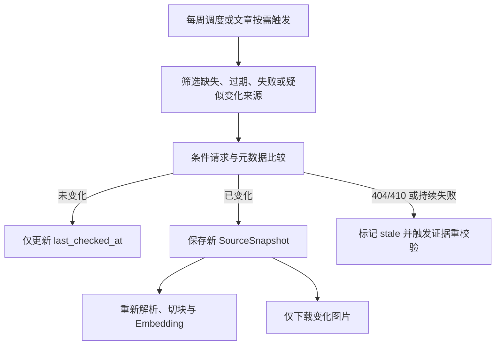

# ADR-0007：每周增量刷新与写作时按需补抓

- 状态：Accepted
- 日期：2026-07-17
- 范围：官网知识新鲜度、抓取频率、版本更新和反爬控制

## 背景

客户官网的产品、图片、Blog 和规格会变化，但每次生成文章前完整重抓网站会显著增加等待时间、Tavily/API 成本和触发反爬的风险。完全依赖人工刷新又容易让知识库长期过期。

系统需要在资料新鲜度和抓取稳定性之间取得平衡，同时避免对未变化页面重复解析、Embedding 和下载图片。

## Decision

1. 完成首次产品目录同步后，每个项目默认每 7 天执行一次 `scheduled_refresh`。
2. 刷新周期允许项目管理员调整，并提供人工“立即刷新”入口。
3. 写文章时启用 `article_incremental` 补抓，但只处理缺失、过期、失败或新发现的强相关页面，不重抓整个网站。
4. 新鲜度窗口默认 7 天，可由项目配置覆盖。
5. 变化检测优先使用 Sitemap `lastmod`、WordPress/WooCommerce 修改时间、HTTP `ETag` 和 `Last-Modified`，最后使用规范化正文内容哈希。
6. 内容未变化时只更新 `last_checked_at`，不创建新快照、不重新切块、不生成 Embedding，也不重复下载相同图片。
7. 内容变化时创建不可变 SourceSnapshot；旧快照继续保留用于证据追踪和历史审计。
8. 页面返回 404/410、持续解析失败或从明确产品目录中消失时，来源标记为 `stale`，不再参与新的知识检索。
9. `stale` 来源关联的未交付文章必须重新校验证据；历史导出文件不自动改写。
10. 所有刷新遵守 robots.txt、单域名并发上限、请求预算、指数退避和失败熔断。

## 刷新流程

## Consequences

### 正面影响

- 知识库无需人工维护也能保持基本新鲜度。
- 写文章时仍能补充刚发布或此前缺失的相关资料。
- 显著减少无变化页面的模型、Embedding、存储和图片下载成本。
- 降低对客户 WordPress 网站造成突发请求压力的风险。

### 代价

- 官网更新后最长可能约一周才进入知识库，除非写作任务或人工刷新提前触发。
- 变化检测必须兼容不可靠的 `lastmod` 和 HTTP 缓存头。
- 来源失效后需要重新检查未交付文章中的证据。

## 实现约束

- 定时任务按项目时区执行并增加随机抖动，不能让全部项目同时刷新。
- `scheduled_refresh` 与 `article_incremental` 复用同一抓取、去重、版本和发布管线。
- 同一 Canonical URL 同一时间只能有一个有效刷新作业。
- 周期刷新不能绕过 Research Inbox 和 PublicationGate。
- UI 应显示最近检查时间、最近变化时间、下次刷新时间和失败状态。
