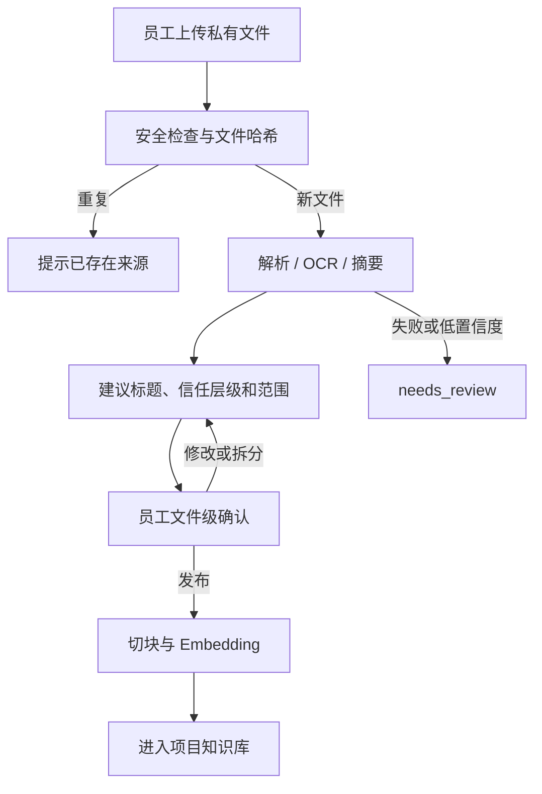

# ADR-0008：私有文件自动解析后由员工确认发布

- 状态：Accepted
- 日期：2026-07-17
- 范围：DOCX、PDF、Excel 等私有资料的导入、分类和发布门槛

## 背景

运营人员会上传客户提供的产品手册、公司介绍、历史文章、写作要求和表格资料。这些文件的用途不同：有些可以支撑产品硬事实，有些只能作为写作参考，还有些是必须执行的写作规则。

上传后立即自动发布容易把历史文章当成产品事实，或把写作要求混入普通检索。逐个知识片段审核虽然严格，但会让日常导入成本过高。

## Decision

1. 私有文件上传后先进入 `inbox`，不能立即用于生成正文。
2. 系统自动执行文件安全检查、格式解析、必要时 OCR、内容摘要、来源用途分类和解析质量检查。
3. 系统建议 `hard_fact`、`reference_material` 或 `writing_instruction`，但最终由拥有项目编辑权限的员工确认。
4. 人工确认以整份文件为默认单位，不要求逐个 KnowledgeChunk 审核。
5. 员工可以修改标题、信任层级，并排除不应入库的页码、章节或工作表。
6. 内容明显混合多个用途时，系统要求拆分来源，或按页码、章节、工作表建立多个 KnowledgeSource。
7. 确认发布后才切出正式 KnowledgeChunk、生成 Embedding 并允许写作检索。
8. 密码保护、解析失败、OCR 置信度过低或内容结构严重缺失的文件保持 `needs_review`，不能静默发布。
9. 相同文件哈希不重复解析；内容变化的重传文件创建新 SourceSnapshot，并要求重新确认。
10. `hard_fact` 文件中的具体事实仍需保留页码、工作表或段落定位，并通过句子级 EvidenceLink 支撑正文。

## 工作流

## 权限

- `editor`：可以在被分配项目中上传文件、查看解析结果、确认文件级分类和发布。
- `reviewer`：可以查看来源、证据和解析警告，并提出调整建议。
- `team_lead` / `org_admin`：除上述操作外，可以撤销发布或删除来源。
- Worker 在解析和索引前后都必须校验目标 Organization、CustomerProject 和发起用户权限。

## Consequences

### 正面影响

- 防止模型错误分类直接污染正式知识库。
- 人工成本远低于逐片段审核。
- 写作规则、参考素材和硬事实保持明确分层。
- 文件更新和历史文章证据仍可追踪到具体快照。

### 代价

- 文件上传后不能立即用于写作，需要一次人工确认。
- 混合内容文件可能需要拆分或设置页码范围。
- 系统需要提供清晰的解析摘要和警告界面。

## 实现约束

- 不执行 Office 宏、嵌入脚本或文件内外部命令。
- 原始文件使用私有对象存储，下载必须经过项目授权。
- 解析结果必须保留页码、章节、工作表和单元格范围等来源定位信息。
- 发布、撤销和重新发布均写入审计日志。
