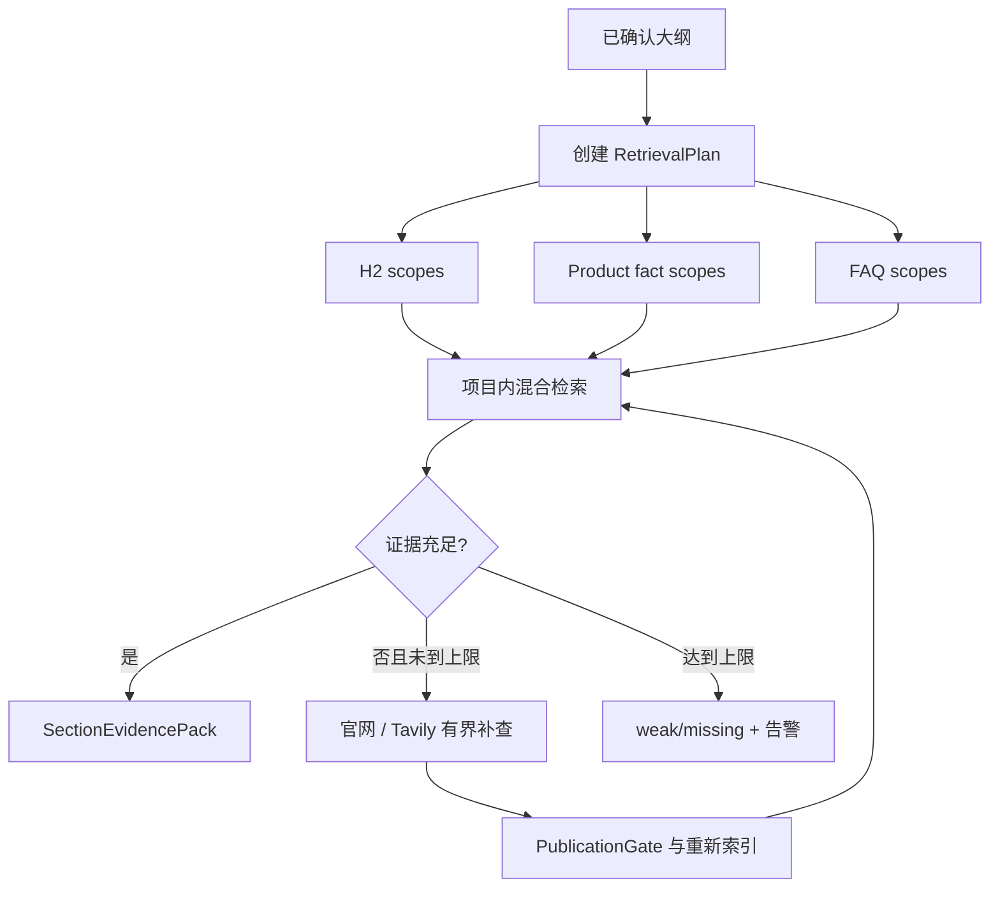

# ADR-0009：按章节检索并限制资料补查轮数

- 状态：Accepted
- 日期：2026-07-17
- 范围：正文知识检索、Evidence Pack、官网/Tavily 补查和 Agent 框架边界

## 背景

在生成整篇正文前只检索一次，容易让前几个主题占满上下文，后面的 H2、产品事实和 FAQ 得不到足够资料。让自主 Agent 无限制搜索虽然灵活，但模型费用、等待时间、停止条件和结果复现性都不稳定。

现有工作台已经有明确的大纲确认点和确定性文章状态机，因此可以在大纲之后建立细粒度、可审计的检索计划。

## Decision

1. 大纲确认后创建 RetrievalPlan。
2. 每个 H2 使用独立 `h2_section` 检索范围；产品事实和 FAQ 使用独立范围。
3. 每个范围先在当前 CustomerProject 内执行关键词/全文与向量混合检索，再按信任层级、产品分类、来源状态、新鲜度和相关性重排。
4. 每个范围生成独立 SectionEvidencePack，正文生成只能读取对应范围及全局写作规则。
5. Evidence Pack 必须包含 KnowledgeChunk、SourceSnapshot、信任层级、公开链接、硬事实候选和证据充足度，不能只传无来源文本。
6. 资料不足时按“客户知识库 -> 已知官网按需刷新 -> Tavily 发现客户官网 URL -> PublicationGate -> 重新检索”执行补查。
7. Tavily 只负责发现候选页面，第三方搜索结果不能直接发布为客户硬事实。
8. 每个范围默认最多两轮 GapFillAttempt，并受请求数、模型 Token 和 Tavily 查询预算约束。
9. 达到证据要求或预算上限后停止。普通内容不足时生成告警；无证据硬事实必须省略。
10. 第一版使用 LangGraph 编排资料研究子图，并通过 PostgreSQL Checkpointer 保存每次运行的图状态。
11. LangGraph 只管理检索计划、证据判断、有界补查、人工中断和 Evidence Pack 构建，不接管整篇文章生产状态机。
12. 爬虫安全、页面分类硬规则、租户权限、PublicationGate、版本化、人工 ZeroGPT、图片和导出继续由确定性代码执行，不交给 Agent。
13. LangGraph 可以独立使用；第一版不额外引入 LangChain Agent 或 PydanticAI，以免出现重叠编排层。

## 检索流程

## LangGraph 使用边界

LangGraph 节点只负责：`plan_scopes`、`retrieve_knowledge`、`assess_evidence`、`discover_official_sources`、`ingest_candidates`、`await_human_review`、`build_evidence_pack` 和 `finish_with_warning`。条件边决定证据充分时结束、证据不足时补查、模糊候选时暂停，以及达到两轮上限时带告警结束。

每个 Graph Run 必须绑定 `organization_id`、`project_id`、`article_id`、`outline_version` 和唯一 `thread_id`。图状态使用 Pydantic/TypedDict 描述，检查点保存在服务器 PostgreSQL；Agent 对话只是一种输入界面，不是业务数据准源。

代码通过 `ResearchOrchestrator`、`KnowledgeRetriever`、`SourceDiscovery` 和 `EvidencePackBuilder` 接口隔离 LangGraph，防止检索、爬虫和业务规则与框架 API 紧耦合。

## Consequences

### 正面影响

- 后面章节、产品事实和 FAQ 不会被统一检索上下文挤占。
- 每个章节使用了什么资料可以独立审计和重跑。
- 补查成本与等待时间有明确上限。
- 框架复杂度保持在第一版可控范围内。

### 代价

- 每篇文章会执行多次小检索，需要缓存重复查询和知识片段。
- 大纲改变后需要识别并重建受影响的证据包。
- 证据充足度判断需要可解释阈值，不能完全依赖模型直觉。

## 实现约束

- RetrievalPlan 必须绑定 `outline_version`，防止旧证据包用于新大纲。
- 所有检索同时过滤 `organization_id`、`project_id`、`status=published` 和当前有效快照。
- 写作规则按适用范围确定性注入，不与普通资料竞争向量 Top-K。
- 对同一 KnowledgeChunk 跨章节复用时共享缓存，但保留各自的 Evidence Pack 关联。
- UI 显示各 H2、产品事实和 FAQ 的 `sufficient / weak / missing` 状态及补查次数。
- UI 显示当前图节点、历史检查点、人工中断原因、Token/搜索预算和每次工具调用结果。

## 官方参考

- LangGraph Overview: https://docs.langchain.com/oss/python/langgraph/overview
- LangGraph Persistence: https://docs.langchain.com/oss/python/langgraph/persistence
- LangGraph Human-in-the-loop: https://docs.langchain.com/oss/python/langchain/frontend/human-in-the-loop
