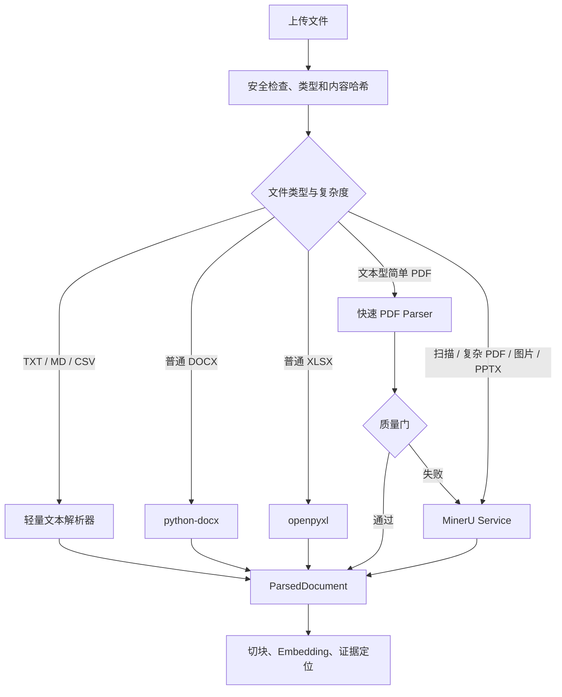

# ADR-0012：自建知识领域层并将 MinerU 作为可插拔解析器

- 状态：Accepted
- 日期：2026-07-17
- 范围：知识库自研边界、文档解析、MinerU 部署和解析产物

## 背景

当前 `backend/services/knowledge.py` 直接读取客户目录，将 TXT/CSV、DOCX、XLSX 和 PDF 文本拼接后截断到固定字符数。PDF 只使用 pypdf 读取前 20 页，无法稳定保留复杂阅读顺序、扫描 OCR、表格结构、图片和页面坐标。

本项目又需要来源版本、硬事实定位、页码/工作表证据、分章节检索、知识占比和 LangGraph Research Inbox。这些业务规则与完整通用知识库产品的模型不一致，直接嵌入另一套 RAG 应用会产生双重项目、权限、状态和证据模型。

## Decision

1. 不引入 Dify、RAGFlow、FastGPT 等完整知识库应用作为本项目的核心数据层。
2. 本项目实现 KnowledgeSource、SourceSnapshot、KnowledgeChunk、EvidenceLink、PublicationGate、检索策略和前端工作流。
3. 不从零实现数据库、向量索引、OCR 或复杂版面分析；分别复用 PostgreSQL、pgvector、LangGraph 和 MinerU 等基础组件。
4. 建立 `DocumentParser` 接口，所有解析器输出项目自己的 `ParsedDocument`，后续切块和证据逻辑不直接依赖具体解析器。
5. 推荐使用分层路由：轻量解析器处理普通文本、DOCX、XLSX 和简单文本 PDF；MinerU 处理扫描件、复杂版面、表格/图片密集 PDF、图片和 PPTX，以及轻量解析质量不足的文件。
6. MinerU 作为独立容器/服务运行，不把大型模型与解析依赖直接安装到 FastAPI 主进程。
7. 私有客户资料默认使用本地或受控服务器上的 MinerU，不上传到外部在线解析服务，除非项目明确批准。
8. 保存原始文件、规范化 ParsedDocument、MinerU Markdown/JSON、提取图片和解析警告；调试布局文件可按保留策略保存。
9. `parser_name`、`parser_version`、配置、内容哈希和解析时间写入 SourceSnapshot，解析器升级不能静默覆盖旧快照。
10. 在正式采用前用真实代表性资料进行小规模 Benchmark。

## Parser Router 草案



## 规范化输出

```text
ParsedDocument
  document_metadata
  pages[]
    page_number
    blocks[]
      block_id
      type: heading | paragraph | list | table | image | equation
      text
      heading_path
      bbox
      table_html
      image_artifact_id
      confidence
  warnings[]
```

`block_id`、页码和 bbox 用于把正文硬事实定位到原文件。KnowledgeChunk 只引用规范化 block，不直接引用 MinerU 的内部 JSON 路径。

## 为什么不让 MinerU 解析所有文件

- 普通 TXT、DOCX、XLSX 的确定性解析更轻、更快，也更容易保留工作表和单元格范围。
- MinerU 模型、OCR 和版面分析会增加下载、启动、CPU/GPU、队列和故障面。
- 简单文件不需要为复杂视觉能力付出额外成本。
- 分层路由仍可在轻量解析失败后自动升级到 MinerU。

## Benchmark

选择 10–20 份真实但可用于测试的资料，覆盖：

- 原生文本 PDF。
- 扫描 PDF。
- 多栏产品手册。
- 规格表和跨页表格。
- 图片型目录。
- 普通/复杂 DOCX。
- 多工作表 XLSX。

记录阅读顺序、文字完整性、表格结构、图片关联、页码/bbox、耗时、峰值内存/显存和失败率。Benchmark 结果决定 MinerU 路由阈值和本地部署配置。

## 风险

- MinerU 输出格式会随版本变化，必须由 Adapter 隔离并保存 parser_version。
- CPU 模式可运行但大文档延迟可能较高，需要独立 Worker 和并发限制。
- Windows Docker 部署依赖 WSL2；云端/公司服务器优先使用 Linux 容器。
- MinerU 使用带附加条件的开源许可证，公司部署前需要检查许可证条款。

## 官方参考

- MinerU GitHub: https://github.com/opendatalab/MinerU
- MinerU 中文说明: https://github.com/opendatalab/MinerU/blob/master/README_zh-CN.md
- MinerU 输出格式: https://opendatalab.github.io/MinerU/reference/output_files/
