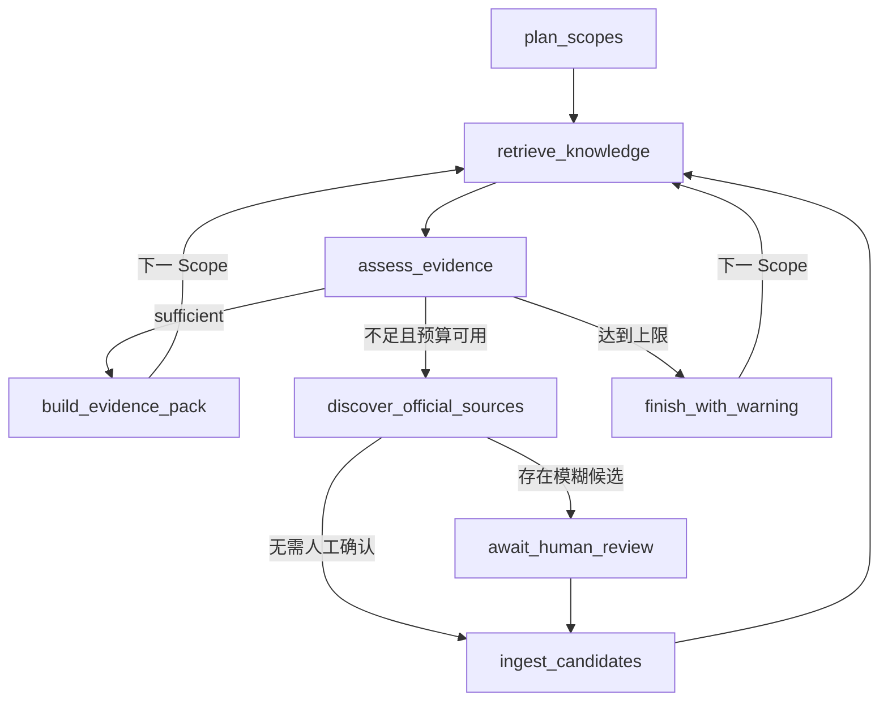

# Knowledge Agent M4：有界 LangGraph 资料研究子图

> 状态：完成
> 分支：`feature/knowledge-agent-m4`
> M3 检查点：`169c39a`

## 1. 框架和版本边界

M4 固定使用：

- `langgraph==1.2.9`
- `langgraph-checkpoint-postgres==3.1.0`

只使用 LangGraph Graph API 和官方 PostgreSQL Checkpointer，不引入 LangChain
Agent、PydanticAI 或第二套自主工具编排层。LangGraph 负责资料研究子图；现有
SQLite 文章状态机、Job Queue、爬虫安全、PublicationGate、人工 ZeroGPT、图片和
导出仍由确定性代码负责。

## 2. Checkpointer Schema 边界

业务表仍只由 Alembic 迁移。官方 Checkpointer 的私有表由其版本化 `setup()` 管理，
但只能通过显式维护命令创建：

```powershell
# Windows，backend 目录
$env:LANGGRAPH_STRICT_MSGPACK="true"
.\.venv\Scripts\python.exe -m knowledge_agent.checkpoint_setup
```

FastAPI 启动和 Runtime 构造都不得调用 `setup()`。这样部署失败不会在应用启动期间
隐式修改数据库，Checkpointer 升级也不会混进业务 Alembic revision。

Checkpoint 反序列化设置 `LANGGRAPH_STRICT_MSGPACK=true`。Graph State 只包含：

- organization/project/article/outline/plan/thread ID；
- Scope ID、当前节点、轮次和预算计数；
- Evidence Pack、Chunk、Source 和 Candidate ID/URL；
- 充分度、缺口、告警和小型结构化证据。

不保存客户全文、文件、Embedding、模型响应正文、Cookie、API Key 或连接串。

## 3. 子图节点



`BoundedResearchGraph` 依赖四个窄接口：

| Port | 作用 |
|---|---|
| `RetrievalPlanPort` | 验证文章、大纲版本和 Plan，并返回有序 Scope ID |
| `ScopeEvidencePort` | 执行一个 Scope 的 M3 检索并返回已持久化 Pack 摘要 |
| `OfficialDiscoveryPort` | 在预算内发现官网候选，不直接发布 |
| `CandidateIngestionPort` | 调用确定性抓取、分类和 PublicationGate |

框架节点不直接调用 SQL、Tavily SDK、网页抓取器或模型客户端。后续替换发现渠道或
检索器时，不需要改图的停止条件。

## 4. 有界循环与重试

- 每个 Scope 的 `max_gap_fill_rounds` 只能是 0 到 2。
- 全 Run 另有 `max_discovery_queries`，任一预算耗尽就进入
  `finish_with_warning`。
- 检索、发现和入库节点对 `ConnectionError`、`TimeoutError`、
  `RuntimeError` 最多重试 3 次；业务 `ValueError` 不重试。
- 外部写操作接收稳定 `attempt_id`。节点失败重试或 Checkpoint 恢复时，适配器必须
  使用该 ID 幂等去重。
- 达到上限后，普通内容保留 weak/missing Pack 和告警；它不会伪造 sufficient。

## 5. 人工中断

`await_human_review` 只把 JSON 可序列化的候选身份和分类证据传给
`interrupt()`。中断前没有发布副作用。恢复时必须：

1. 使用同一个 `thread_id`；
2. 通过 `Command(resume={"approved_urls": [...]})`；
3. 只批准中断载荷中已知的 URL；
4. 之后由 `CandidateIngestionPort` 再执行 PublicationGate。

LangGraph 恢复时会从中断节点开头重跑，因此该节点不得在 `interrupt()` 之前写业务
数据。这一约束是后续重构检查项。

## 6. 当前验收

- 两个充分 Scope 顺序完成，不触发发现。
- weak Scope 在两轮后带告警结束。
- 模糊候选进入人工中断，同一进程内可恢复。
- 未知批准 URL 被拒绝。
- 临时检索故障只重试当前节点，不重跑 `plan_scopes`。
- PostgreSQL Checkpoint 在关闭第一个 Checkpointer、重新构造 Graph 后，仍可使用
  相同 `thread_id` 恢复人工中断并完成。
- thread ID 含随机唯一部分，且不暴露项目或文章原文。
- Graph Run/事件/补证 receipt 在真实 PostgreSQL 中通过复合 FK、幂等和终态约束。
- Tavily 适配器会丢弃跨站结果，重试复用 receipt，不重复搜索。
- 高置信已批准页面只发布一次；低置信页面留在 Research Inbox。
- 节点失败事件只保存异常类型，三次 RetryPolicy 尝试分别记录 attempt 与 duration。
- FastAPI lifespan 会启动独立单并发 Research Worker，普通批量入口不能伪造研究作业。

## 7. Graph Run 业务投影

LangGraph Checkpoint 负责恢复执行，但不直接作为产品查询模型。迁移
`20260730_0006` 因此增加三个由 Alembic 管理的业务表：

| 表 | 身份与作用 | 后续消费者 |
|---|---|---|
| `research_graph_runs` | `(project_id, thread_id)`；记录文章/大纲/Plan、当前节点、状态、两类预算、Pack ID 和脱敏失败 | 查询 API、队列 Worker、M5 Run 列表 |
| `research_graph_events` | Run 内递增 `sequence`；保存节点、尝试次数和小型结构化详情 | M5 研究时间线、运维诊断 |
| `gap_fill_attempts` | `(run, scope, round)`；保存稳定 `attempt_id`、发现渠道、URL/Source ID 和成本摘要 | 幂等重试、两轮上限审计 |

关键约束留在数据库：

- `thread_id` 全局唯一，防止不同项目意外共享 Checkpoint；
- Run 复合外键必须匹配同项目、同文章和同大纲版本的 Retrieval Plan；
- Attempt 同时复合引用 Run 和 Retrieval Scope；
- 终态必须有 `finished_at`，失败态必须有 `error_code`；
- 轮次只能为 1–2，查询使用量不能超过 Run 预算。

`PostgresResearchRunRepository` 是唯一业务写入口：

- `create_run`：以相同请求重试时幂等；身份内容改变则冲突；
- `update_from_state`：先锁 Run，再验证 Checkpoint 的 project/article/plan/version
  不变，最后更新业务投影；
- `append_event`：锁 Run 后分配连续 sequence，避免并发 Worker 产生重复序号；
- `record_gap_attempt`：稳定 attempt 身份不可变，节点重试不会重复计费记录；
- `mark_failed`：只保存异常类型和固定公开文案，不复制 Provider 异常正文或密钥。
- `append_node_attempt`：按 node operation ID 在事务内分配 attempt，记录耗时和结果，
  不记录异常原文。

Checkpoint 表和这三张表不能互相替代：前者服务执行恢复，后者服务权限过滤、列表查询、
产品时间线和审计。重构时必须继续保持这一分界。

## 8. M3 接口适配痕迹

为了避免 HTTP 路由和 Graph 各复制一份检索合并逻辑，M3 的 Scope 流程已提取为
`ScopeEvidenceService`：

```text
HTTP / Evidence API ─┐
                     ├─> ScopeEvidenceService
M3ScopeEvidenceAdapter┘      ├─ RetrievalPlanRepository
                             ├─ BasicHybridRetriever
                             └─ EvidencePackRepository
```

- `PostgresRetrievalPlanAdapter` 实现 `RetrievalPlanPort`，验证 article 与
  outline version 后才返回有序 Scope；
- `M3ScopeEvidenceAdapter` 实现 `ScopeEvidencePort`，只把已持久化 Pack 的 ID、
  充分度、缺口和 Chunk ID 放回 Graph State；
- 完整 Chunk 文本仍留在 Evidence Pack/知识表中，不写 Checkpoint。

这一提取点也是未来替换检索器或把 HTTP 拆成独立服务时的稳定重构缝。

## 9. 后台队列与查询 API

M4 复用现有 SQLite `JobQueue` 的持久化、进程中断恢复、取消前检查和 Worker
并发控制，但不把 Graph Run 伪装成文章写作：

```text
POST research-runs
  -> PostgreSQL create_run + queued event
  -> SQLite job(operation=knowledge_research, task_id=research:<thread_id>)
  -> 独立单并发 Research Worker
  -> 新建 PostgresSaver 会话
  -> graph.start / continue_run / resume
  -> PostgreSQL Run + Event 投影
```

- Queue 的 `source_revision/result_revision` 存 outline version，只用于兼容现有作业记录；
- Worker 不读取或写回 SQLite `TaskRecord`，文章状态机仍保持原边界；
- 每次 Worker 调用新开一个 Checkpointer 连接，避免 API 查询和后台线程共享同一
  psycopg connection；
- 进程在节点中间退出时，SQLite 会把 `running` 作业恢复为 `queued`；Run 为
  `running` 且已存在 Checkpoint 时调用 `continue_run(thread_id)`，不重新提交初始
  State；
- 普通异常只把异常类型和固定文案写入 Run/Queue，Provider 原始消息不进入公开状态。

HTTP 契约：

| 方法 | 路径 | 作用 |
|---|---|---|
| `POST` | `/api/knowledge/{project}/research-runs` | 从不可变 Retrieval Plan 创建唯一 thread 并排队 |
| `GET` | `/api/knowledge/{project}/research-runs` | 按项目， 可选 article 过滤列出 Run |
| `GET` | `/api/knowledge/{project}/research-runs/{thread}` | 返回 Run、事件、补证尝试和待审候选 |
| `POST` | `/api/knowledge/{project}/research-runs/{thread}/resume` | 预验证批准 URL 后排队恢复同一 thread |

接口不返回 Checkpoint 全量 State、客户正文、Embedding、连接串或密钥。待审候选仅来自
同一项目同一 thread 的中断载荷；未知 URL 在入队前和 Graph 节点内各校验一次。

## 10. 官网发现与发布适配器

- `TavilyOfficialDiscoveryAdapter` 用项目表中的 `official_domain` 调用域名限定搜索，
  再用 SSRF/same-site URL 规范器二次过滤；
- 搜索摘要正文不进入 Graph State 或知识库，只记录 URL、分数、是否同站和请求 ID
  是否存在；
- 稳定 `attempt_id` 先写 `pending` receipt，节点重试优先复用已发现 URL，不重复调用
  Tavily；
- 所有搜索发现的新 URL 默认 `needs_review=true`，人工恢复后才抓取；
- `OfficialCandidateIngestionAdapter` 调用正式 M2 网页抓取/分类，分类置信度至少
  `0.75` 才可自动批准并调用 `KnowledgePublicationService`；
- 低置信度、未知类型或解析失败保留在 Research Inbox，结果记为 `blocked`，不伪造
  发布；
- attempt 从 `pending` 只允许一次转换为 `improved/no_change/blocked`，终态不可变；
  重试已完成 attempt 不再次抓取、Embedding 或发布。

## 11. 代码地图与重构缝

| 文件 | 当前职责 | 重构时保持的接口 |
|---|---|---|
| `research_graph.py` | State、节点、条件边、两轮/查询预算、interrupt、RetryPolicy | 四个业务 Port + `ResearchTelemetryPort` |
| `research_adapters.py` | M3 Plan/Pack、Tavily 同站发现、官网抓取与 PublicationGate | Graph 不直接依赖 SQL/SDK/抓取器 |
| `scope_evidence.py` | HTTP 和 Graph 共用的 Scope 检索/合并/Pack 服务 | `build(project, plan, scope, limit)` |
| `research_execution.py` | 每次新建 Checkpointer 会话；start/continue/resume 与业务投影同步 | `ResearchGraphExecutionService` |
| `research_runs.py` | Run、事件、GapFill receipt 的事务与项目隔离 | Repository 方法，不把 Checkpoint 当查询模型 |
| `research_telemetry.py` | 节点 attempt/duration 的脱敏适配器 | Telemetry 失败不触发外部工具重放 |
| `http.py` | 创建、列表、详情、恢复的受项目约束 API | 不返回全量 State/密钥/正文 |
| `app.py` | 把 `knowledge_research` 接入现有 SQLite Queue 和 lifespan | Research Worker 与写作/产品 Worker 分池 |

若未来把 Knowledge Agent 拆成独立服务，优先替换
`ResearchGraphSessionFactory`、Queue enqueue callback 和各 Port 实现；Graph 的停止条件、
Plan/Scope/Evidence 契约及 PostgreSQL 业务身份不应随传输层一起重写。

## 12. M4 最终验收

- 后端完整回归：388 tests，1 skipped；
- M4 定向闭环：41 tests；
- Alembic `0006 -> 0005 -> 0006` 往返和重复 `upgrade head` 通过；
- PostgreSQL Checkpointer 显式 setup 与跨会话 interrupt/resume 通过；
- 前端 ESLint 通过；
- Next.js 16.2.10 webpack production build 通过。Turbopack 在只读复用另一个工作树
  `node_modules` 的临时 junction 上按设计拒绝越出 filesystem root，因此不作为代码
  失败；junction 和额外构建目录均已清理；
- qewit 真实 M2 数据仍为 4 sources / 4 snapshots / 291 chunks / 3 products /
  19 assets；
- main 与学习工作树原有未提交文件保持不变。

## 13. 后续边界

- M5 再接完整研究时间线、SSE 和只读对话，不提前扩张 M4 范围。

## 14. 官方参考

- LangGraph Persistence：https://docs.langchain.com/oss/python/langgraph/persistence
- LangGraph Interrupts：https://docs.langchain.com/oss/python/langgraph/interrupts
- PostgreSQL Checkpointer：https://pypi.org/project/langgraph-checkpoint-postgres/
