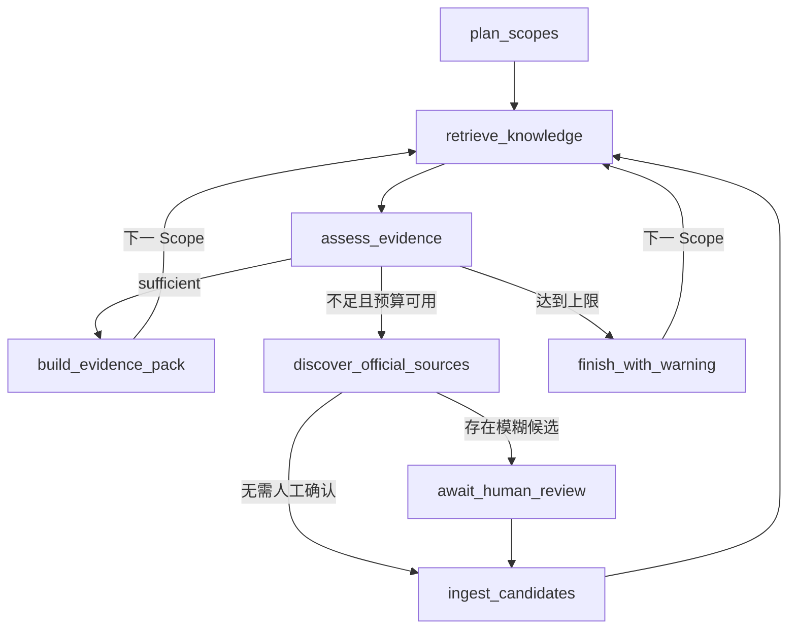

# Knowledge Agent M4：有界 LangGraph 资料研究子图

> 状态：进行中
> 分支：`feature/knowledge-agent-m4`
> M3 检查点：`169c39a`

## 1. 框架和版本边界

M4 固定使用：

- `langgraph==1.2.9`
- `langgraph-checkpoint-postgres==3.1.0`

只使用 LangGraph Graph API 和官方 PostgreSQL Checkpointer，不引入 LangChain
Agent、PydanticAI 或第二套自主工具编排层。LangGraph 负责资料研究子图；现有
SQLite 文章状态机、Job Queue、爬虫安全、PublicationGate、人工 ZeroGPT、图片和
导出仍由确定性代码负责。

## 2. Checkpointer Schema 边界

业务表仍只由 Alembic 迁移。官方 Checkpointer 的私有表由其版本化 `setup()` 管理，
但只能通过显式维护命令创建：

```powershell
# Windows，backend 目录
$env:LANGGRAPH_STRICT_MSGPACK="true"
.\.venv\Scripts\python.exe -m knowledge_agent.checkpoint_setup
```

FastAPI 启动和 Runtime 构造都不得调用 `setup()`。这样部署失败不会在应用启动期间
隐式修改数据库，Checkpointer 升级也不会混进业务 Alembic revision。

Checkpoint 反序列化设置 `LANGGRAPH_STRICT_MSGPACK=true`。Graph State 只包含：

- organization/project/article/outline/plan/thread ID；
- Scope ID、当前节点、轮次和预算计数；
- Evidence Pack、Chunk、Source 和 Candidate ID/URL；
- 充分度、缺口、告警和小型结构化证据。

不保存客户全文、文件、Embedding、模型响应正文、Cookie、API Key 或连接串。

## 3. 子图节点



`BoundedResearchGraph` 依赖四个窄接口：

| Port | 作用 |
|---|---|
| `RetrievalPlanPort` | 验证文章、大纲版本和 Plan，并返回有序 Scope ID |
| `ScopeEvidencePort` | 执行一个 Scope 的 M3 检索并返回已持久化 Pack 摘要 |
| `OfficialDiscoveryPort` | 在预算内发现官网候选，不直接发布 |
| `CandidateIngestionPort` | 调用确定性抓取、分类和 PublicationGate |

框架节点不直接调用 SQL、Tavily SDK、网页抓取器或模型客户端。后续替换发现渠道或
检索器时，不需要改图的停止条件。

## 4. 有界循环与重试

- 每个 Scope 的 `max_gap_fill_rounds` 只能是 0 到 2。
- 全 Run 另有 `max_discovery_queries`，任一预算耗尽就进入
  `finish_with_warning`。
- 检索、发现和入库节点对 `ConnectionError`、`TimeoutError`、
  `RuntimeError` 最多重试 3 次；业务 `ValueError` 不重试。
- 外部写操作接收稳定 `attempt_id`。节点失败重试或 Checkpoint 恢复时，适配器必须
  使用该 ID 幂等去重。
- 达到上限后，普通内容保留 weak/missing Pack 和告警；它不会伪造 sufficient。

## 5. 人工中断

`await_human_review` 只把 JSON 可序列化的候选身份和分类证据传给
`interrupt()`。中断前没有发布副作用。恢复时必须：

1. 使用同一个 `thread_id`；
2. 通过 `Command(resume={"approved_urls": [...]})`；
3. 只批准中断载荷中已知的 URL；
4. 之后由 `CandidateIngestionPort` 再执行 PublicationGate。

LangGraph 恢复时会从中断节点开头重跑，因此该节点不得在 `interrupt()` 之前写业务
数据。这一约束是后续重构检查项。

## 6. 当前验收

- 两个充分 Scope 顺序完成，不触发发现。
- weak Scope 在两轮后带告警结束。
- 模糊候选进入人工中断，同一进程内可恢复。
- 未知批准 URL 被拒绝。
- 临时检索故障只重试当前节点，不重跑 `plan_scopes`。
- PostgreSQL Checkpoint 在关闭第一个 Checkpointer、重新构造 Graph 后，仍可使用
  相同 `thread_id` 恢复人工中断并完成。
- thread ID 含随机唯一部分，且不暴露项目或文章原文。

## 7. 待完成

- 实现四个 Port 的正式 M3/官网适配器。
- 增加 Graph Run、GapFillAttempt 和结构化事件业务表。
- 由现有 SQLite Job Queue 启动 Run，并提供查询/恢复 API。
- 记录节点耗时、重试、查询预算和脱敏失败信息。
- M5 再接完整研究时间线、SSE 和只读对话，不提前扩张 M4 范围。

## 8. 官方参考

- LangGraph Persistence：https://docs.langchain.com/oss/python/langgraph/persistence
- LangGraph Interrupts：https://docs.langchain.com/oss/python/langgraph/interrupts
- PostgreSQL Checkpointer：https://pypi.org/project/langgraph-checkpoint-postgres/
