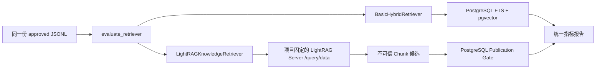

# Knowledge Agent M6：可复现评测与 LightRAG 对照边界

> 状态：评测底座完成；真实 Basic Hybrid / LightRAG 对照实验待数据发布与独立服务
>
> 分支：`feature/knowledge-agent-m6`
>
> M5 检查点：`42c4582`

## 1. 本阶段解决什么

M6 不再用“能搜到一些内容”作为验收，而是建立可复现的比较边界：

1. 同一个 `KnowledgeRetriever` 输入契约评测 Basic Hybrid 和实验性 LightRAG；
2. JSONL 标注区分 `pending` 与 `approved`，未审核样本不能进入指标；
3. 输出 Recall@K、MRR、首条页面类型准确率、错误来源率、正确拒绝率和 P50/P95；
4. 单独记录补查前后 Evidence Pack、硬事实覆盖、补查次数、发布来源和费用变化；
5. LightRAG 的返回值只能作为候选，最终仍由 PostgreSQL 验证项目、发布状态和当前快照；
6. 报告不保存 Chunk 正文、Embedding、API Key 或数据库连接串。

本阶段不把 LightRAG 接入正式 HTTP 路由、LangGraph 默认运行时或文章写作链路，也不让
LightRAG 自身的 KV/Vector/Graph/DocStatus 存储替代 Article Agent 数据库。

## 2. 两条检索链路



Basic Hybrid 保持 M3 的准源规则：项目一致、来源已发布、当前快照、Embedding 模型
一致，再融合关键词与向量名次。

LightRAG 分成两层：

- `LightRAGHttpCandidateProvider` 只访问固定项目 Workspace 的 `/query/data`；
- `LightRAGKnowledgeRetriever` 忽略 LightRAG 返回的正文、实体身份和内部 Chunk ID，
  只接收可映射的 Article Agent Chunk 身份，再通过 PostgreSQL 重新授权。

即使外部服务把项目 B、旧快照或未发布 Chunk 排在第一，最终项目 A 的结果也不会包含
它们。非空元数据过滤当前直接报错，不能静默忽略。

## 3. LightRAG 身份映射

Article Agent 向 LightRAG 索引每个 KnowledgeChunk 时，必须把 `file_path` 设置为：

```text
knowledge-agent://<url-encoded-project-id>/<url-encoded-chunk-id>
```

生成该值的唯一入口是 `lightrag_document_path(project_id, chunk_id)`。查询返回后：

1. URI Scheme 必须是 `knowledge-agent`；
2. URI 项目必须等于 Provider 初始化时固定的项目；
3. 解出的 Chunk ID 只作为候选；
4. PostgreSQL 必须证明 Chunk 属于请求项目、来源为 `published` 且是当前快照；
5. 无法映射的 file path、外项目路径和重复候选直接丢弃。

LightRAG 当前 `/query/data` 没有给 Article Agent 可直接比较的统一相关性分数，因此
Adapter 使用返回顺序的倒数作为实验分数。报告解释字段保留原始候选名次；这不是生产
排序承诺。

LightRAG Server 必须按项目使用独立 Workspace。Article Agent 的项目固定检查是第二道
门，不能用它来补救混用同一 Workspace 的部署错误。

## 4. 评测数据契约

`RetrievalEvaluationCase` 字段：

| 字段 | 作用 |
|---|---|
| `case_id` | 稳定话题/评测身份 |
| `project_id` | 强制租户范围 |
| `query` | 工作台原始话题或审核后的事实问题 |
| `expected_source_ids` | 人工确认的标准来源，不使用临时 Chunk ID |
| `allowed_source_kinds` | 允许的页面类型 |
| `forbidden_canonical_urls` | 明确错误的来源 |
| `expects_refusal` | 官网无依据时的正确拒绝 |
| `annotation_status` | `pending` 不运行，`approved` 才计分 |
| `notes` | 标注理由和待核查项，不放客户正文 |

可回答且 `approved` 的样本必须有 `expected_source_ids`；拒绝样本不能同时设置标准来源。
URL 必须是绝对 HTTP(S) URL，来源类型必须属于正式 Domain 枚举。

## 5. 指标定义

| 指标 | 定义 |
|---|---|
| Recall@K | 标准来源中出现在前 K 条的比例，按 Case 取平均 |
| MRR | 第一条标准来源名次倒数，按可回答 Case 取平均 |
| 首条页面类型准确率 | 第一条结果是否属于 `allowed_source_kinds` |
| 错误来源率 | 返回结果中命中禁止 URL、错误页面类型或缺少 Provenance 的比例 |
| 正确拒绝率 | `expects_refusal=true` 且阈值过滤后无结果的比例 |
| P50/P95 | Retriever 调用端到端耗时的 nearest-rank 百分位 |

`EvidenceImprovementReport` 另算：

- `missing -> weak -> sufficient` 的 Scope 改善率；
- 补查前后 sufficient 比例与平均命中增量；
- 补查前后硬事实覆盖率；
- GapFill 次数、真正发布的新来源数量和总费用。

发现 URL 并不自动算“改善”；只有重建后的 Evidence 状态或硬事实覆盖变好才计入。

## 6. qewitfastener 数据真值门

正式数据集：

```text
evaluation/knowledge-agent/qewitfastener/retrieval-cases.jsonl
```

当前状态：

- 20 条来自稳定 main 工作台的真实 qewitfastener 话题；
- `topic_006` 使用用户确认的 Woodscrews 分类来源，状态为 `approved`；
- 其余 19 条保持 `pending`；
- PostgreSQL 当前有 4 个真实来源、3 个产品和 19 张原图，但来源全是 `inbox`，
  产品也未确认；
- 因此现在不能生成有业务意义的 Basic Hybrid 或 LightRAG 实测分数。

只读检查：

```powershell
Set-Location backend
.\.venv\Scripts\python.exe -m knowledge_agent.evaluation_runner `
  --cases ..\evaluation\knowledge-agent\qewitfastener\retrieval-cases.jsonl `
  --inspect-only
```

输出只含文件名、总数和审核数量，不显示 Query 正文。

## 7. Basic Hybrid 基线命令

人工发布标准来源并生成当前模型 Embedding 后：

```powershell
Set-Location backend
.\.venv\Scripts\python.exe -m knowledge_agent.evaluation_runner `
  --cases ..\evaluation\knowledge-agent\qewitfastener\retrieval-cases.jsonl `
  --output ..\artifacts\evaluation\qewitfastener-basic-hybrid.json `
  --k 5
```

Runner 只有在显式提供 `--output` 时写报告，并使用临时文件 + replace 原子发布。
异常只输出类型，不拼接 Provider 响应正文，避免网关回显密钥。

## 8. 代码地图

| 文件 | 作用 | 重构时不能丢失 |
|---|---|---|
| `evaluation.py` | JSONL 契约、Retrieval 指标和补查改善指标 | pending 门禁、统一指标语义 |
| `evaluation_runner.py` | 数据检查和 Basic Hybrid CLI | 显式输出路径、脱敏失败 |
| `lightrag_retriever.py` | HTTP 候选 Provider 与 PostgreSQL Gate | 项目固定、当前快照和发布检查 |
| `test_knowledge_agent_m6_evaluation.py` | 指标、数据集、报告写入测试 | 20 条真实话题和唯一 approved seed |
| `test_knowledge_agent_m6_lightrag_http.py` | API 映射和密钥脱敏测试 | 不信任正文/内部 ID |
| `test_knowledge_agent_m6_lightrag_postgres.py` | 串库和旧快照攻击测试 | 外部候选必须重新授权 |

## 9. 当前验证与未完成外部实验

已完成：

- JSONL 20 条数据结构检查；
- 统一评测、补查改善和报告序列化单元测试；
- LightRAG HTTP `/query/data` 契约模拟测试；
- 真实 PostgreSQL 中的跨项目、旧快照和过滤拒绝集成测试；
- 测试不调用外部 Embedding、LLM 或 LightRAG 服务。
- M6 定向 14 tests；完整后端 412 tests，1 skipped；
- Alembic 重复升级、前端 ESLint/TypeScript 和 Next.js webpack build 通过；
- 完整本地证据见
  [`docs/validation/knowledge-agent-m6-local.md`](../validation/knowledge-agent-m6-local.md)。

仍待外部条件：

1. 运营人员审核其余 19 条标准来源与拒绝标签；
2. 人工发布 qewit 来源并使用同一模型生成 Embedding；
3. 启动按项目隔离的 LightRAG Server，按稳定 `file_path` 重新索引已发布 Chunk；
4. 记录 Basic / LightRAG 的同集报告、索引 Token、增量更新时间、存储和查询延迟；
5. 保存真实运行截图。未执行前不得在简历或演示中声称 LightRAG 优于 Basic Hybrid。

## 10. 作品描述模板

可如实描述当前已经完成的部分：

> 为多客户内容系统设计 PostgreSQL/pgvector 知识检索评测底座，建立带人工审核门禁的
> JSONL 数据集和 Recall@5、MRR、错误来源、正确拒绝、时延及补证成本指标；通过统一
> Retriever 接口接入实验性 LightRAG Server，并对其候选执行 PostgreSQL 项目、发布
> 状态和当前快照二次授权，自动测试覆盖跨租户和旧证据污染。

只有完成真实对照后，才能补充具体提升百分比和运行成本。

## 11. 重构检查清单

1. Basic 与 LightRAG 是否仍使用完全相同的 approved Case？
2. pending 标注是否仍被排除？
3. 外部候选是否仍会回到 PostgreSQL 验证，而不是直接成为 Evidence？
4. LightRAG Workspace 和 Article Agent project 是否双重隔离？
5. 旧快照、未发布来源和无法映射的引用是否仍被拒绝？
6. 报告是否不含 Chunk 正文、Embedding、密钥和连接串？
7. 指标名称、K、模型、维度和运行元数据是否足够重放？
8. 补查是否按 Evidence 改善计分，而不是按抓取 URL 数量计分？

## 12. 参考

- [ADR-0013：Basic RAG first, LightRAG as evaluated adapter](../adr/0013-basic-rag-first-lightrag-as-evaluated-adapter.md)
- [LightRAG API Server](https://github.com/HKUDS/LightRAG/blob/main/docs/LightRAG-API-Server.md)
- [LightRAG `/query/data` implementation](https://github.com/HKUDS/LightRAG/blob/main/lightrag/api/routers/query_routes.py)
