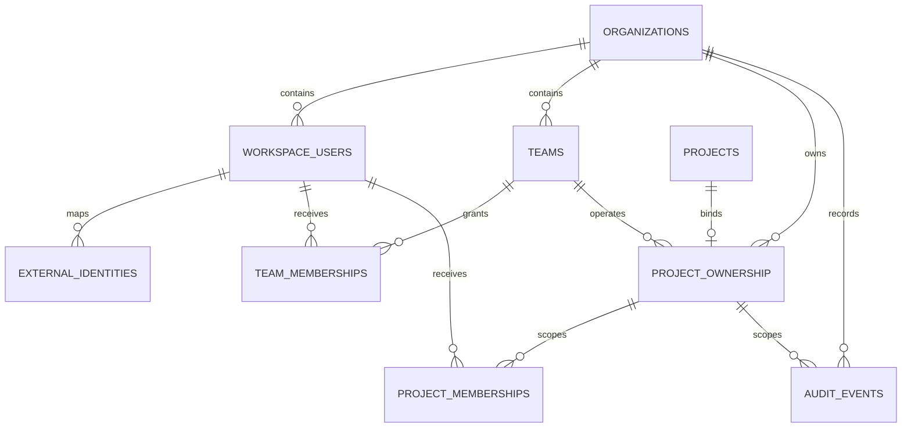

# Knowledge Agent M7：多人服务器版结构记录

## 1. 文档目的

本文记录 M7 的迁移顺序、代码职责、权限不变量和暂未接线的边界。后续重构可以替换内部实现，但不能丢失这些业务语义。

M7 不一次性切换整个应用。采用 expand/contract：

1. 先扩展组织、用户、团队、项目归属、成员授权与审计底座；
2. 再迁移 Task/Job 和身份会话；
3. 再让 API、检索、对象下载与 Worker 强制执行 RBAC；
4. 验证服务器端闭环后，才收缩 SQLite 正式写入路径和临时兼容层。

## 2. 当前完成范围：M7-A / M7-B / M7-C1-C2 / M7-D1

本阶段已实现：

- Alembic `20260730_0008`；
- `organizations`、`workspace_users`、`teams`、`team_memberships`；
- `project_ownership`、`project_memberships`；
- append-only `audit_events`；
- SQLAlchemy Core Schema；
- 从 PostgreSQL 解析事实的 `PostgresProjectAccessRepository`；
- 不依赖数据库的 `ProjectAccessService` 权限策略；
- 必须加入调用方业务事务的 `PostgresAuditEventWriter`；
- 跨组织、禁用用户、角色矩阵、复合外键和审计不可变测试。
- 显式 `ARTICLE_AGENT_SERVER_MODE` 门禁；
- 只签名 Organization/User、不缓存 Role 的 `ServerActorSessionCodec`；
- 使用独立 `ARTICLE_AGENT_SERVER_SESSION_SECRET`，不回退到旧本地 Session Secret；
- `PostgresProjectMembershipService` 的授权、撤销和同事务审计。
- Alembic `20260730_0009` 的项目级 Task/Job 表；
- 兼容现有 `TaskStore` 的 `PostgresTaskRepository`；
- SQLite Task -> PostgreSQL 的一次性摘要校验导入器；
- PostgreSQL Revision compare-and-swap，避免多进程丢更新；
- 使用部分唯一索引、`FOR UPDATE SKIP LOCKED` 和 Worker Lease 的
  `PostgresJobQueue`。
- Active Job 排空门禁和 SQLite Terminal Job 历史迁移；
- Batch/Job 稳定 ID、数量、状态分布和内容 SHA-256 摘要复核。
- S3 兼容 `ObjectStore` 协议与 boto3 适配器；
- Organization/Project/内容哈希组成的不可变对象 Key；
- M2 `ArtifactStore` 到 S3 的项目绑定适配器；
- 产品图片等知识资产的授权上传、数据库登记和短期签名下载；
- localhost-only、显式 profile 的 MinIO 开发兼容服务和真实往返测试。
- `ServerRequestSecurity` 的签名 Actor 解析、项目规范化和数据库事实授权；
- Knowledge Router 全路由统一依赖，以及按操作语义区分
  `project.view / knowledge.edit / knowledge.publish / knowledge.delete`；
- Server Mode 下未完成 Scope 迁移的旧 API、研究队列、上传和原始对象下载 fail closed；
- 真实 Lifespan 中独立构建服务器安全服务，本地模式仍沿用原单密码入口。
- Server Mode 不构造、不启动便携版 SQLite JobQueue/Worker，且全局
  `store()/batch_queue()` 直接拒绝调用；
- `app.py` 中兼容性的 retrieval-plan 路由也显式进入 Knowledge 授权依赖，并在
  PostgreSQL Task Scope 接线前保持 503；
- 新增只在 Server Mode 开放的
  `GET /api/projects/{project}/tasks[/{task_id}]`，请求先按 `project.view`
  重新授权，再读取固定 Organization/Project 的 PostgreSQL TaskStore；
- 新增 `GET /api/projects` Project Directory：只在 SQL 中返回 Actor 可见的 Active
  Project，并给出当前 Metadata Revision 和按既有优先级计算的 Effective Role；
- 新增 `GET/PUT /api/projects/{project}/metadata`：只读共享显示名、官方域名和
  Revision；写入要求 `project.members.manage`，事务内重新锁定权限事实并用 Revision
  CAS 与脱敏 Audit 原子提交。项目 ID、自由 Context、事实正文和 Prompt 不属于此命令；
- Server Task 兼容适配器禁用 JSON/SQLite Legacy Import，构造时也不创建本地数据目录；
- 新增第一个 PostgreSQL-only Task 写操作
  `POST /api/projects/{project}/tasks/{task_id}/rewrite-from-scratch`：
  `article.edit`、Project Scope 与 Revision CAS 全部通过后才清空下游派生状态，不写
  本地 Artifact；
- 新增确定性的标题候选选择命令
  `PUT /api/projects/{project}/tasks/{task_id}/selected-title`：请求只接收 Revision
  与候选索引，服务端从当前 PostgreSQL Task 的 `title_candidates` 选择原值并使
  Outline/Article 等下游派生状态失效；不接受客户端替换标题正文；
- 新增 Project-scoped 标题生成 Job：`POST .../titles` 只接受 Task Revision，Enqueue
  固定 checked-in `titles` 模板 Hash 与当前 Published Chunk ID；Provider 必须返回
  完整、唯一、有界候选，失败不补 mock、不读取本地 Customer Context。成功以 CAS 写入
  `title_candidates`、清空旧选择和下游，并与不含候选正文的 Audit 同事务；
- 新增 Project-scoped 正文初稿 Job：`POST .../article` 只接受 Task Revision，Enqueue
  固定 Article Prompt ID + Version、服务端目标字数与当前 Published Chunk ID；Worker
  执行前复核全部身份，只接受具备 H1/过渡段、H2/H3 与最终 FAQ 契约的完整 Markdown，
  失败不补 mock、不读取或写入本地文件。成功写 Raw/Initial 两个 Version、进入
  `draft_ready` 并清空旧下游，正文与 Audit 同事务；
- 新增已审阅大纲保存/确认命令
  `PUT /api/projects/{project}/tasks/{task_id}/outline`：请求只接收 Revision、
  有界 Markdown 与 Confirmed 标志；草稿只追加 Version 并保留当前确认大纲和下游，
  确认才替换正式大纲、追加 Version 并使 Article/Image/Review/Delivery 失效；
- 新增历史大纲恢复命令
  `POST /api/projects/{project}/tasks/{task_id}/outline/restore-version`：只接收
  Revision 与 Version Index，服务端只允许当前 Task 的 `outline/outline_draft` Version
  恢复成新草稿；不接受客户端历史正文、不恢复 Article Version、不失效当前下游；
- 新增 Project-scoped Outline 生成 Job：`POST .../outline` 只接受 Task Revision，
  Enqueue 固定不可变 Prompt ID + Version 与当前 Published Chunk ID；Worker 两阶段
  重新授权，执行时复核 Prompt/Chunk Scope，模型失败脱敏且不生成 mock。成功只写
  `outline_draft` 和 `generated` Version，人工确认前不替换正式大纲或下游；
- 新增第二个 PostgreSQL-only Task 写操作
  `PUT /api/projects/{project}/tasks/{task_id}/products`：请求只接收 Revision 和
  1–3 个 Product ID；服务端从同 Project 的正式产品目录投影已确认、且有 Published
  Current Snapshot 主详情证据的产品，再用 Revision CAS 替换 Task 产品快照；
- Server 产品投影不接受客户端上传的名称、URL、事实或图片地址；图片只复制稳定
  `asset_id`，不复制对象 URI、源站 URL 或本地路径；
- 新增第三个 PostgreSQL-only 受限 Task 写操作
  `PUT /api/projects/{project}/tasks/{task_id}/article/sections`：只接受当前 Revision、
  唯一 Heading Path 和已审阅的 Replacement Body；在同一次 Task CAS 中保存修改前/
  修改后版本快照，只替换目标 Markdown 章节并使全部下游产物失效；
- 新增第四个 PostgreSQL-only 受限 Task 写操作
  `POST /api/projects/{project}/tasks/{task_id}/prepare-images`：请求只接受 Revision、
  一个项目内 Hero Asset ID 和可选的 Product ID -> Heading 人工锚点；产品图只读取
  Task 已保存的 `selected_asset_id`，重新授权读取私有原图，在内存中验证并生成
  内容寻址 WebP，再用 Revision CAS 保存资产引用和锚点；
- 新增第五个 PostgreSQL-only 受限 Task 写操作
  `POST /api/projects/{project}/tasks/{task_id}/export-docx`：只接受 Revision，
  以 `article.deliver` 重新授权读取 Task 已确认的 WebP Asset，在内存复用现有 Word
  排版器并写入内容寻址 DOCX；Task 只保存 DOCX Asset 身份，`docx_path` 为空；
- 新增 `GET /api/projects/{project}/tasks/{task_id}/docx/download`：再次要求
  `article.deliver` 后签发 DOCX 短期 URL；通用 `project.view` Asset 下载入口显式隐藏
  `article_docx`，避免只知道 Asset ID 就绕过交付权限；
- 新增第六个 PostgreSQL-only Task 写操作
  `POST /api/projects/{project}/tasks/{task_id}/generate-tdk`：服务端从当前文章生成经过
  硬约束验证的 T/D/K，在内存渲染 `D.docx` 并保存为私有 `tdk_docx` Asset；Task
  只保存元数据、Asset 身份和内容哈希，`tdk_path` 为空；
- 新增 `GET /api/projects/{project}/tasks/{task_id}/tdk/download`：再次要求
  `article.deliver` 后才签发 TDK DOCX 短期 URL；通用 Asset 下载和文章 DOCX 专用入口
  都不能取得 `tdk_docx`；
- 新增最终 AI-rate Review 闭环：Reviewer 通过项目级 multipart 路由上传截图，服务端
  规范化为内容寻址 PNG；确认路由把分数/报告绑定当前 Humanized Article 哈希，且
  confirmed=true 时必须已有截图 Asset；专用下载重新要求 `article.review`；
- 新增初稿 AI-rate Review 闭环：初检截图使用独立
  `initial_ai_rate_screenshot` 私有类型，不能冒充终检截图；确认绑定当前 Initial
  Article Hash 并只推进到 `initial_ai_checked`，不沿用 Local 低分自动跳过
  Humanize/终检的隐式捷径；
- 新增人工 Humanized Article 保存命令：`PUT .../humanized-article` 只接受 Revision
  与有界 Markdown，服务端校验标题层级、数字事实、FAQ、表格、列表和必须短语，追加
  `external_manual` Version 并进入 `humanized_ready`；不读取本地 Humanize Prompt；
- 新增 Project-scoped 自动 Humanize Job：`POST .../humanize` 只接受 Revision，
  服务端要求显式配置的 Project `humanize` Default Prompt，并固定精确 Prompt ID +
  Version 与源文章 Hash；Worker 两阶段要求 `article.edit`，提交前再次执行结构/事实
  门禁，成功追加 `humanized` Version；不读取 `humanize_prompt_path`，也不回退 System/
  SQLite Prompt；
- 新增 Project-scoped Link Restore Job：`POST .../restore-links` 只接受 Revision，
  入队固定 checked-in Template Hash、Initial/Humanized Article Hash 和来源链接数；
  Worker 在两阶段重授权后复核 Final AI Check 身份，模型只产生候选，只有链接集合完全
  复现且非链接可见正文不变时才追加 `linked` Version 并进入 `links_verified`；
- 新增 Server Task 写作要求与 Effective Prompt Preview：`PUT .../writing-settings`
  保存十个有界字段，当前 Outline/Article Prompt 选择必须可解析，并以 Revision CAS 和
  不含备注/提示词正文的 Audit 原子提交；`POST .../writing-settings/preview` 可使用未保存
  草稿，复用正式 Prompt Builder 与当前 Published Context，但不调用 LLM、不写业务状态且
  返回 `no-store`。设置保存选择意图，真正生成仍在入队时固定精确 Prompt/Chunk 身份；
- 新增 SEO Review 设置前置命令：`PUT .../seo-review-settings` 只接受 Revision、
  关键词和 Prompt Selection；服务端解析当前 Project 的 `review` Prompt Snapshot，
  规范化/去重关键词，并以不含关键词正文的 CAS/Audit 保存；它不调用 Review Provider；
- 新增 Project-scoped SEO Review 生成 Job：`POST .../seo-reviews` 只接受 Revision，
  入队固定 Initial Article Hash、Project Review Prompt Version、checked-in System
  Template Hash 与当前 Published Chunk ID；Worker 只追加 Open Review Run，不自动
  Apply/Complete，公开 Job 与 Audit 均不返回文章、Prompt、Chunk 正文或 Hash；
- 新增 SEO Review 人工裁决命令：Reviewer 可按精确 Review/Change ID 保存决定和生成
  无写入 Preview，也可在没有 Accepted Change 时 Complete；Apply 额外要求
  `article.edit`、当前 Revision 和精确 Preview Hash，成功才替换 Initial Article；
- 新增 Server Delivery ZIP：只从 Task 已绑定且重新校验过的文章 DOCX、TDK DOCX、
  Prepared WebP 和已确认终审截图在内存组装确定性扁平 ZIP；Task 只保存私有 Asset
  身份与哈希，专用下载重新要求 `article.deliver`；
- 新增窄范围 Server 前端入口：认证状态先决定 Local/Server 组件树；Server 首页只读取
  SQL Project Directory，并直达已迁移的 Delivery Console；未迁移的文章、批量任务和
  设置导航不挂载；交付下载先取 Task-scoped 短期 URL，不暴露对象 URI；
- PostgreSQL Task 写操作统一通过 `PostgresAuditedTaskWriter`：事务内锁定可撤权
  事实、按 Action 固定最小权限、执行 Revision CAS，并追加不含正文的稳定 Audit Event；
  任一授权、CAS 或 Audit 失败都会回滚 Task；
- 新增 `GET /api/projects/{project}/assets/{asset_id}/download`：路由授权后，
  Object Service 在签名前再次读取 `project.view`，核对数据库 URI 的 Bucket 与
  Organization/Project Key 前缀，并签发最长一小时的临时 URL；
- Alembic `20260730_0010` 的供应商无关 External Identity 映射；
- 只接收“已验证 issuer/subject”的本地 Actor 映射和 Session Exchange；
- Org Admin 才能执行且与 Audit Event 同事务的 Identity Link/Revoke；
- 固定 PyJWT 2.13.0 的供应商无关 OIDC Discovery/JWKS 验签边界，只允许 RS256，
  强制精确 Issuer、单一 Client Audience、有效期、签发时间、Nonce 和 Subject；
- `GET /api/auth/oidc/start` 与 `/api/auth/oidc/callback` 使用 Authorization Code +
  PKCE、短期 HMAC State Cookie 和本地 Redirect Path，成功后只签发
  Organization/User Actor Session；
- 登录页先读取 `/api/auth/status`：Server Mode 只显示组织身份登录，本地模式才显示
  旧密码表单；状态读取失败时不降级为密码登录；
- Deployment Preflight 新增 OIDC 完整配置与实时 Discovery/JWKS 探测，
  `trusted_identity_source=true` 只表示代码信任链已接通，不表示生产 IdP 已完成验收。
- Alembic `20260730_0011` 为新 PostgreSQL Job 增加同 Organization 复合外键约束的
  `requested_by_user_id`；旧 SQLite 历史迁移时允许为空；
- Alembic `20260730_0012` 增加项目级 `object_orphan_observations`，只保存对象
  Fingerprint、大小和连续观察时间；
- Alembic `20260731_0013` 为每个 Workspace User 增加正整数 `session_version`；
  新 Actor Cookie 固定携带签发时版本，每次 Server 请求在项目授权前重新读取 Active
  Organization/User 与当前版本；
- 新增 `PostgresActorSessionRevocationService`：只允许当前 Organization 的 Active
  Org Admin 递增目标 User 版本，并与 `workspace_user.sessions.revoked` Audit 同事务；
  审计失败同时回滚版本。
- 新增 Organization-scoped 全会话撤销 HTTP 命令：路径固定 Organization/User，Body
  必须是空对象；Actor、Organization、当前版本和 Org Admin 权限全部来自 Cookie 与
  PostgreSQL，响应不返回内部版本。
- 新增 Organization-scoped Workspace User Directory 与创建/更新 HTTP：只有同组织
  Active Org Admin 可读取或写入；列表稳定分页并只公开登录是否已关联及成员关系数量；
  创建只建立 Active 本地账号事实，不自动创建邀请或 OIDC 映射；禁用和恢复都会递增
  `session_version`，最后一个 Active Org Admin 不可禁用或降级，业务变更与 Audit
  同事务。
- 新增 Organization-scoped Team Directory、Team 生命周期与 TeamMembership HTTP：
  只有同组织 Active Org Admin 可读写；`manager_user_id` 是不授予访问权的管理元数据，
  只有 Active Team 上显式 `team_lead` Membership 才产生项目继承权限；归档保留成员历史
  供查看/撤销但停止新增或改角色，Team/成员写入与 Audit 同事务。
- Alembic `20260731_0014` 新增一次性 Workspace Invitation：数据库只保存 Token
  SHA-256，邀请固定 Organization、Active User、预期 Issuer、过期时间与创建者；
  Pending/Accepted/Revoked 状态由 CHECK、复合 FK 和每 User/Issuer 单 Pending 索引约束。
- 新增邀请目录、签发、撤销与 OIDC 兑换链：Admin 创建响应只返回一次原 Token；目录、
  撤销、Audit 和数据库公开读模型不返回 Token/Hash；兑换要求短期 HttpOnly Cookie 与
  HMAC State 中的 Token Hash 一致，并在 OIDC 验签后原子绑定 External Identity、消费
  邀请和写 Audit。
- Alembic `20260731_0015` 新增 Project Prompt Snapshot 底座：Prompt Head 只保存
  Kind、Status 与 Current Version 指针；每次编辑追加不可变 Version，数据库 Trigger
  禁止修改/删除历史正文；Project Default 绑定精确 Prompt ID + Version，不随新版本
  自动漂移。
- 新增 `PostgresProjectPromptService`：读取要求 `project.view`，创建、追加版本、归档/
  恢复和默认指针切换在事务内重新锁定 `article.edit`，并与不含 Prompt 正文/名称的
  Audit 原子提交；Audit 失败回滚全部业务写入。
- 新增 Project-scoped Prompt HTTP：目录、创建、追加版本、归档/恢复与精确 Default
  切换全部走 PostgreSQL Snapshot Service；Body 字段严格白名单，旧无 Server Scope 的
  `/api/projects/{customer}/prompts` Handler 不复用。Router 始终注册，但 Local 请求由
  Server 依赖返回 `404`，Server Mode 则由精确路由白名单控制；两种模式不回退。
- 新增显式 `migrate_project_prompts()`：把指定 SQLite Customer 的当前 Prompt Library
  导入指定 Organization/Project，保留 Prompt ID、当前 Version、Active/Archived 和
  Default 的精确版本；旧库没有不可变历史行，因此只迁移可证明存在的当前 Snapshot，
  不伪造早期版本。目标非空且摘要不同会拒绝覆盖，重复执行仅在内容完全一致时返回
  `already_matched`；导入、校验和不含正文/名称/Hash 的 Audit 在同一事务。
- Alembic `20260731_0016` 把 `humanize` 加入 Project Prompt Head、Version 与 Default
  的数据库 Kind CHECK；服务层另外要求内容恰好包含一个 `{{ARTICLE}}`。降级时若仍有
  Humanize Prompt 历史，PostgreSQL 在事务内拒绝收窄 CHECK，避免删除不可变版本来迁就
  旧 Schema。
- Alembic `20260731_0017` 新增 `task_intakes`：只保存 Project-scoped 幂等身份、输入
  SHA-256 摘要、来源标签、Task ID 列表与创建者，不保存 Topic/关键词/URL 正文；
- Alembic `20260731_0018` 为 M1 `projects` 增加非负 Revision；相同 Metadata
  upsert 不递增，变更或 Server CAS 成功才递增；
- 新增 `PostgresServerTaskIntakeService`：单条创建与 1–200 条规范化行导入均在事务内
  重新锁定 `article.edit`，以 Intake ID 串行化重试，由服务端分配 Task ID/Topic Index，
  并原子提交 `article_tasks/task_intakes/AuditEvent`。同 ID 同摘要返回原 Task，不同摘要
  409，Audit 故障回滚整批；
- `AuthorizedPostgresJobQueue` 在读取 Request Payload 前只检查 Job ID、Operation 和
  Requester，撤权或无 Requester 的 Job 直接变为通用 conflict；
- `ReauthorizingJobHandler` 在进入业务 Handler 前再次授权，覆盖 Claim 后撤权竞态；
- 新增 `POST /api/projects/{project}/tasks/{task_id}/product-rediscovery` 与对应状态
  GET：入口要求 `knowledge.edit`，Job 固定 Organization/Project/Requester，并由
  PostgreSQL Queue 执行正式官网产品重新发现；
- 产品重新发现只使用 Project 的 Active `official_domain`、安全官网 Fetcher 和
  Organization/Project 绑定的 S3 ArtifactStore；不允许本地 Artifact 回退；
- 重新发现只写不可变 Inbox 来源/快照/产品证据，不改 Task Revision、不替换 Task
  当前产品；旧产品与已发布快照继续服务，确认替换必须走独立产品选择命令；
- 对象存储未配置时，产品发现历史 Job 状态仍可读取但新发现 Job 返回 503；Outline
  Provider 未配置时新生成 Job 返回 503。应用重启按各自配置只恢复
  `product_rediscovery/titles/outline/article/humanize/restore_links/seo_review` 的 Active
  PostgreSQL Job；`knowledge_research` 由独立 Registry 按 Checkpoint 语义恢复。
- 产品重新发现 Runner 已实现有界停机报告：停止新 Claim 后等待已领取工作，协作式停机
  释放为 `queued` 而不是伪装成用户取消；超时仍有在途 Job 时 Lifespan 明确失败并保留
  数据库 Engine，不宣称已经排空。
- `product_rediscovery` 的终态 Job 更新与 `background_job.terminal` Audit 在同一个
  PostgreSQL 事务；审计失败会回滚终态并释放当前 Claim，Audit Details 不含请求正文、
  URL、对象 URI、原始异常或 Provider 响应。

当前明确未做：

- 不把现有 `APP_PASSWORD` Cookie 假装成 User；
- 不猜测或内置 Auth0、Keycloak、Entra ID 等具体供应商；正式 Provider 注册、生产
  Redirect URI、租户策略和 Conformance 冒烟仍需部署环境确认；
- 项目显式成员 UI 与 Organization Admin Console 已接入；Actor Session 全会话撤销已有
  组织级确认入口；
- 不给旧项目自动补一个虚构 Organization；
- 尚未把全部 Task/Job 正式写路径切换到 PostgreSQL；当前
  `product_rediscovery/titles/outline/article/humanize/restore_links/seo_review` 七条
  Operation-specific Job 入口与独立的 `knowledge_research` 入口使用 PostgreSQL 单写；
- 不改变 `knowledge_agent_enabled` 默认关闭；
- 不接邮件发送服务与生产 IdP Provider 配置管理；Organization Admin Console 已接入
  Workspace User、全会话撤销、Team、TeamMembership、Invitation 与 External Identity 映射，
  但 Discovery/JWKS、Client Secret 和 Redirect URI 仍由部署环境管理；
- 不把已完成的 S3 适配器接入旧 Raw Artifact HTTP 路由；
- 不接生产对象存储、生产部署或密钥服务。

因此，当前结果是可验证的服务器持久层与部分请求安全底座，不代表多人服务器版已经上线。

## 3. 为什么使用 `project_ownership`

现有 `projects` 是 M1 知识边界，历史数据没有可信的 `organization_id`。直接给它增加非空组织字段，需要选择以下坏结果之一：

- 给所有旧项目填一个虚构默认组织；
- 在不知道真实归属时猜测租户；
- 让一次大迁移同时修改知识、任务、认证和前端。

M7 使用独立的 `project_ownership` 显式绑定：

```text
projects
  1
  |
  0..1
project_ownership -> organizations
                  -> teams (optional owning team)
```

语义：

- 有 `project_ownership`：服务器 RBAC 可以授权；
- 没有 `project_ownership`：仍可由现有本地模式使用；
- 服务器 RBAC 模式遇到未绑定项目必须 fail closed；
- 后续确认全部正式项目已绑定后，可把组织归属收缩进最终 Project 模型。

`project_ownership` 不是永久承诺的表名；它是防止错误回填租户的显式迁移边界。

## 4. 数据模型和隔离规则



关键约束：

1. User ID 只在 Organization 内唯一，主键为
   `(organization_id, user_id)`。
2. Team、TeamMembership、ProjectMembership 都使用复合外键，不能把另一组织的 User 或 Project 拼进当前组织。
3. `project_ownership.project_id` 唯一，一个 Project 同一时刻只能属于一个 Organization。
4. `owning_team_id` 可空；空值表示组织拥有但暂未分配运营 Team。
5. 禁用 User、暂停 Organization、归档 Project 和归档 Team 不再产生访问权限。
6. `audit_events` 的 Actor 与 Project 外键也带 `organization_id`。
7. PostgreSQL Trigger 禁止更新或删除审计事件；保留和归档策略以后只能通过分区/受控运维设计，不允许业务代码改历史。
8. External Identity 以 `(issuer, subject)` 全局唯一，并通过
   `(organization_id, user_id)` 复合外键绑定 Workspace User；同一 User 在同一
   Issuer 下最多一个 Subject。

## 5. 权限矩阵

| 权限 | org_admin | team_lead | editor | reviewer | viewer |
|---|---:|---:|---:|---:|---:|
| `project.view` | 是 | 是 | 是 | 是 | 是 |
| `article.edit` | 是 | 是 | 是 | 否 | 否 |
| `article.review` | 是 | 是 | 是 | 是 | 否 |
| `article.deliver` | 是 | 是 | 是 | 否 | 否 |
| `knowledge.edit` | 是 | 是 | 是 | 否 | 否 |
| `knowledge.publish` | 是 | 是 | 是 | 否 | 否 |
| `project.members.manage` | 是 | 是 | 否 | 否 | 否 |
| `knowledge.delete` | 是 | 否 | 否 | 否 | 否 |
| `project.delete` | 是 | 否 | 否 | 否 | 否 |

继承优先级：

1. Organization 内的 `org_admin`；
2. Project 所属 Team 的 `team_lead`；
3. 显式 `editor/reviewer/viewer` ProjectMembership；
4. 普通 Team `member` 不继承项目访问。

如果一个人同时有多个角色，当前实现返回优先级最高的有效角色。矩阵是向下包含关系，所以不会丢失较低角色能力。

`editor` 可以完成自助复核、导出和交付，但不能管理成员、删除已发布知识或删除项目。`reviewer` 是可选质量角色，不是默认交付门槛。

## 6. 授权调用链

未来所有服务器入口统一走以下链路：

```text
认证层解析签名会话
  -> ActorIdentity(organization_id, user_id)
  -> ProjectAccessRepository 从数据库读取事实
  -> ProjectAccessService.require(permission)
  -> 业务 Repository / Retriever / Object Store / Worker
```

安全要求：

- Actor 的 Organization/User 必须来自服务器验证过的会话，不能来自请求 Body；
- Role 永远从 PostgreSQL 读取，不能信任前端；
- 拒绝消息统一为 `project access denied`，不泄露目标项目是否存在或属于哪个组织；
- 列表查询不能先返回全量再在 Python 过滤，必须在 SQL 中按 Actor Scope 过滤；
- Worker 启动和真正执行前都要重新检查，成员被移除后不能继续获得新数据；
- Knowledge Retriever 现有 `project_id + published + current snapshot` 门禁继续保留，RBAC 是额外一层，不替代知识发布门。

## 7. 审计事务边界

`PostgresAuditEventWriter` 不自行开启事务，必须接收调用方已经打开事务的 SQLAlchemy `Connection`：

```python
with engine.begin() as connection:
    membership_repository.grant(connection, ...)
    audit_writer.append(connection, event)
```

这样“业务变更”和“审计事件”要么同时提交，要么同时回滚。未来禁止出现：

```text
先提交权限修改 -> 再单独写审计
```

项目成员管理 HTTP 暴露一个受限读模型和两条项目级命令：

- `GET /api/projects/{project}/members`：只返回显式 ProjectMembership，使用
  `limit(1..100) + after_user_id` 稳定分页；
- `GET /api/projects/{project}/members/candidates`：返回可以新增为显式成员的 Active
  同组织用户，使用同样的有界稳定分页；
- `PUT /api/projects/{project}/members/{user_id}`：Body 只允许
  `{"role":"editor|reviewer|viewer"}`；
- `DELETE /api/projects/{project}/members/{user_id}`：无请求 Body，重复撤销返回
  `revoked=false`。

GET 返回 `user_id/display_name/status/role`。它有意不把 Org Admin 或 Owning Team Lead
复制成 ProjectMembership，也不返回全 Organization 用户目录；Disabled User 的既有显式
成员行仍会显示，便于管理员撤销残留关系。列表按 `user_id` 排序并使用同字段作为游标，
不能先读全 Organization 再在 Python 过滤。

Candidate GET 只返回 `user_id/display_name`，并在 SQL 中排除 Disabled User、Org Admin、
Active Owning Team 的 Team Lead 和已经存在的显式 ProjectMembership。归档 Team 不再产生
继承访问，因此其中原 Team Lead 会重新成为候选；普通 Team Member 从未继承项目访问，
所以也可以成为候选。候选端点不是 Organization 用户目录，也不负责邀请、创建账号或修改
Team 关系。

Actor 和 Organization 只来自已验证 Cookie，Project 只来自规范化 Path。新增/改角色时
目标 User 必须是同 Organization 的 Active User；撤销允许清理已经存在的旧 Membership，
并以“Membership 是否存在”返回幂等结果。客户端不能提交 Organization、Effective
Permission 或 `org_admin/team_lead`；后两种是 Organization/Team 事实，不是
ProjectMembership。跨组织 Project 统一 403，PUT 的跨组织或不可用目标统一 404，避免
泄露其他租户的用户状态。

`PostgresProjectMembershipService` 是唯一正式成员写服务，并提供两层接口：

- `grant/revoke`：自行建立单个 PostgreSQL 事务；
- `grant_in_transaction/revoke_in_transaction`：加入调用方已有业务事务。

服务在事务内重新计算 `project.members.manage`，并对所有能够撤销本次授权结论的现有事实
加行锁，包括 Organization/User/Project Ownership、Actor 的 TeamMembership 或
ProjectMembership；目标 User 和待删除的 Membership 也会加锁。这样 HTTP 依赖中的初次
检查只负责尽早拒绝，真正写入不会遭遇“检查通过后并发撤权仍继续提交”的竞态。
Roster 读取也在短事务内锁定 Actor 的可撤权事实后再执行 Project-scoped SQL，避免权限
检查与成员数据读取之间出现并发撤权窗口。

成功授权与撤销分别追加 `project.membership.granted` 和
`project.membership.revoked`。稳定 `event_id` 若重复会触发唯一约束；数据库或 Audit
错误会使同一事务内的成员变更一起回滚，不会出现“权限已变但审计没写”的状态。公开
HTTP 错误只返回固定 409/503，不回显底层数据库、Audit Writer 或 Secret。

已迁移的 Server Task 命令使用同一原则：

```text
HTTP 路由初次授权
  -> 业务计算（对象输出可能先形成内容寻址 orphan）
  -> PostgresAuditedTaskWriter
       -> 锁 Organization/User/Project/现有 Membership 可撤权事实
       -> Audit Action -> 固定最小 Permission
       -> Task Revision CAS
       -> AuditEvent(scope + task + from/to Revision + status + 安全计数)
  -> 同一 PostgreSQL Transaction 提交
```

Action 与权限固定为：

| Audit Action | Permission |
|---|---|
| `article.task.rewritten` | `article.edit` |
| `article.products.confirmed` | `article.edit` |
| `article.section.replaced` | `article.edit` |
| `article.images.prepared` | `article.edit` |
| `article.docx.exported` | `article.deliver` |
| `article.tdk.generated` | `article.deliver` |
| `article.final_ai_screenshot.uploaded` | `article.review` |
| `article.final_ai_check.updated` | `article.review` |

Event ID 由 Organization、Project、Task、目标 Revision 和 Action 稳定派生。Details
只保存 Revision、最终 Status、产品/图片/TDK 数量、Heading 深度、截图尺寸，以及
confirmed/是否记录 score 的布尔值；不保存文章正文、Review Report、Replacement Body、
URL、对象 URI、签名 URL 或 Secret。Audit Writer 失败会让 Task CAS 回滚并返回通用
503；撤权或 Revision 冲突不产生 Audit。S3 Put 不属于 PostgreSQL 事务，因此图片/
DOCX/截图若在 CAS 前完成写入、随后授权或 Audit 失败，仍按内容寻址 orphan 延迟对账，
不能伪称跨系统原子。

## 8. 代码地图

| 文件 | 作用 | 重构时必须保留 |
|---|---|---|
| `backend/server_schema.py` | M7 服务器实体的 SQLAlchemy Core 定义 | 复合租户外键、显式项目归属、审计关联 |
| `backend/migrations/versions/20260730_0008_multitenant_access.py` | Schema 唯一迁移准源 | 无虚构组织回填、可升降级、审计 Trigger |
| `backend/services/access_control.py` | Actor、权限契约、纯策略和 PostgreSQL 事实查询 | 不信任客户端 Role、统一拒绝、未绑定项目 fail closed |
| `backend/services/audit_log.py` | 业务事务内追加审计事件 | 调用方事务、稳定 Event ID、无更新/删除接口 |
| `backend/services/server_auth.py` | 服务器 Actor Session 的签名与解析 | Token 不带 Role、携带正整数 Session Version、独立 Secret、默认不开启 |
| `backend/services/actor_sessions.py` | 数据库 Session Version 校验与全会话撤销服务 | 每请求校验 Active Org/User、Org Admin、版本递增与 Audit 同事务 |
| `backend/services/external_identity.py` | 已验证外部身份到本地 Actor 的解析与 Session Exchange | 不接受原始 Token、不信任外部 Role、签发绑定数据库 Session Version |
| `backend/services/external_identity_provisioning.py` | External Identity 目录、Link/Revoke 事务服务 | Org Admin、Subject 不进入公开读模型、稳定 Mapping ID、业务写入与审计同事务 |
| `backend/server_identity_http.py` | Organization-scoped External Identity HTTP | Subject 只允许出现在 Link 请求；列表/响应/撤销只使用 Mapping ID，输入字段白名单与统一安全错误 |
| `backend/services/oidc_identity.py` | OIDC 配置、Discovery/JWKS、Code Exchange 和 ID Token 验证 | 固定 RS256、精确 Issuer/Audience、Nonce/时间门禁、未知 Kid 刷新、错误不泄露 Secret |
| `backend/services/oidc_login.py` | Authorization Code + PKCE 登录事务 | HMAC State Cookie、Nonce、PKCE Verifier、本地 Redirect、只输出 Actor Session |
| `backend/migrations/versions/20260731_0014_workspace_invitations.py` | 一次性 Workspace Invitation Schema 准源 | Token 只存 Hash、复合租户 FK、状态/过期约束、每 User/Issuer 单 Pending、可升降级 |
| `backend/migrations/versions/20260731_0015_project_prompt_snapshots.py` | Project Prompt Snapshot Schema 准源 | Head/不可变 Version/精确 Default 指针、复合 Project/User FK、Append-only Trigger |
| `backend/migrations/versions/20260731_0016_humanize_prompt_kind.py` | Server Humanize Prompt Kind 迁移 | 三张 Prompt 表同步 Kind CHECK、保留不可变历史、含 Humanize 数据时降级 fail closed |
| `backend/migrations/versions/20260731_0017_server_task_intakes.py` | Server Task Intake Receipt Schema | Project/Creator 复合 FK、Kind/Digest/Task ID 数量约束、可升降级 |
| `backend/migrations/versions/20260731_0018_project_metadata_revision.py` | Project Metadata 乐观并发 Schema | `projects.revision` 非空、非负、默认 0，可升降级 |
| `backend/services/server_task_intake.py` | Task 单条创建与规范化行导入事务服务 | 不读 Local 文件；服务端身份/序号；幂等 Receipt、Task、Audit 原子提交 |
| `backend/services/server_project_metadata.py` | Project 共享显示名/官方域名读写服务 | Project ID 不变、`project.members.manage`、撤权事实锁、Revision CAS、脱敏 Audit 同事务 |
| `backend/services/server_task_writing_settings.py` | Task 写作要求更新与 Effective Prompt Preview | 十字段规范化、Revision、设置不失效既有产物、正式 Builder、无 LLM/Local 回退、Preview 二次授权 |
| `backend/services/server_project_prompts.py` | Project-scoped Prompt Snapshot 服务 | 精确版本解析、默认版本不漂移、稳定 Project Prompt advisory lock 覆盖“无 Default 行”并发、读写权限分离、撤权锁、业务写入与安全 Audit 同事务 |
| `backend/services/server_project_prompt_migration.py` | SQLite Prompt 当前 Snapshot 一次性导入 | 显式 Customer 到 Project 映射、版本/状态/Default 保留、摘要复核、差异目标不覆盖、导入与安全 Audit 同事务 |
| `backend/server_prompt_http.py` | Project Prompt 目录、创建、版本、Active 与 Default HTTP | Project Scope、严格 Body、统一 403/404/409/422/503、公开响应不含内部 Actor/Hash |
| `backend/services/workspace_invitations.py` | 邀请目录、签发、撤销与 Verified Identity 兑换事务 | Active Org Admin、一次返回 Token、过期/重放拒绝、Identity/Invitation/Audit 同事务 |
| `backend/server_invitation_http.py` | Organization-scoped 邀请管理 HTTP | 创建响应与目录响应分型，Token 只出现在创建响应，输入白名单、稳定分页、统一安全错误 |
| `backend/migrations/versions/20260730_0010_external_identities.py` | External Identity Schema 准源 | Issuer/Subject 唯一、复合租户 FK、可升降级 |
| `frontend/src/app/login/page.tsx` | 本地密码/Server OIDC 登录入口选择 | 以服务端状态为准、失败不降级、Next Path 只能是本地路径 |
| `frontend/src/components/project-directory.tsx` | Local/Server 首页组件树分流 | 先读服务端认证状态、失败显式重试、Server 时不挂载 Local 数据请求 |
| `frontend/src/components/server-project-selector.tsx` | Server 可访问项目入口 | 只渲染 `/api/projects` 的 SQL-scoped 结果、显示有效角色、直达已迁移 Delivery |
| `frontend/src/components/project-shell.tsx` | 项目内导航能力门 | Server 只显示已迁移能力；仅 `org_admin/team_lead` 显示项目设置，不启动 Local Job Center |
| `frontend/src/components/project-settings-entry.tsx` | Local Project Settings 与 Server Project Settings 组件树分流 | `/api/auth/status` 失败不降级到 Local，不让 Server 页面发起旧设置 API |
| `frontend/src/components/server-project-settings.tsx` | Server Project Metadata 表单与设置页组合 | 只提交 Revision/显示名/域名；字段级校验、冲突重载；不接收自由 Context、Project ID 或 Prompt |
| `frontend/src/components/server-project-members.tsx` | Server 显式成员 Roster/Candidate、角色更新与撤销 UI | 与 Metadata 组件组合但保持独立 API；Disabled 只允许撤销、分页、就近反馈、前端角色不作为安全边界 |
| `frontend/src/components/organization-admin-entry.tsx` | `/organization` 的 Server 身份与组织边界入口 | Auth Status 必须明确为 Server 且返回已认证 Organization；失败不降级到 Local |
| `frontend/src/components/organization-admin-console.tsx` | Workspace User/Session 与 Team/TeamMembership 管理控制台 | 只传字段白名单、后端游标分页、危险操作确认、Manager/Lead 文案分离、前端状态不作为授权 |
| `frontend/src/components/organization-external-identities.tsx` | External Identity 关联、目录与撤销 UI | Subject 只在受控输入中短暂存在且成功后清空；列表/撤销只持有 Mapping ID；危险操作确认 |
| `frontend/src/components/organization-invitations.tsx` | 邀请签发、一次复制、目录与撤销 UI | Token 不进入列表或持久状态，刷新不可恢复；危险操作确认、过期状态可清理、后端 Cursor |
| `frontend/src/app/accept-invite/page.tsx` | 邀请领取入口 | Token 优先从 URL Fragment 读取并在网络请求前清除；仅 POST 到准备端点，不进入查询参数或 IdP URL |
| `frontend/src/components/project-delivery-records.tsx` | Local/Server 双模式交付控制台 | Path/Asset 身份分别判定、Revision 打包、角色禁用、专用短期 URL 下载、异步反馈 |
| `frontend/src/components/server-task-intake-panel.tsx` | Server Task 单条创建与 Tab 行导入 | 失败重试保留 Intake ID；输入变化换新身份；不提交 Task/Project/Workflow 字段或本地路径 |
| `frontend/src/components/server-writing-requirements-panel.tsx` | Server Task 十字段写作要求和折叠 Prompt Preview | 显式保存、Dirty 生成门禁、409 保留草稿、Server Prompt DTO、Viewer 只读预览、无 Local API |
| `backend/services/server_request_security.py` | 请求 Actor、Knowledge 权限映射和服务器路由可用性 | 先验签并校验数据库 Session Version，再查 Role；项目规范化、未迁移路由 fail closed |
| `backend/services/server_knowledge_commands.py` | Server Knowledge Review/Publish/Confirm 事务命令 | Router 授权只作早拒绝；事务内重锁权限；Review/Activate/Confirm 与脱敏 Audit 原子提交；重复激活/确认不重复审计 |
| `backend/knowledge_agent/publication.py` | Knowledge Snapshot Embedding 与发布编排 | `prepare` 只写未激活向量；Local `publish` 保持兼容；Server 最终激活交给事务命令，失败时旧 Snapshot 继续服务 |
| `backend/knowledge_agent/repository.py`、`catalog.py` | Knowledge Source/Snapshot/Product SQLAlchemy Core 准源 | 对外方法自建事务；`*_in_transaction` 只接受调用方事务，供权限、业务写入和 Audit 原子组合 |
| `backend/server_admin_http.py` | Organization-scoped Workspace User 与 Actor Session 管理 API | 输入字段白名单、Cookie Actor 与路径 Organization 一致、内部版本不出响应、统一安全错误 |
| `backend/services/workspace_users.py` | Workspace User 目录、创建与生命周期事务服务 | Active Org Admin、组织内稳定游标、精确关联计数、最后管理员保护、状态切换递增 Session Version、业务写入与 Audit 同事务 |
| `backend/server_team_http.py` | Organization-scoped Team/TeamMembership HTTP | 字段/角色白名单、精确路径、Manager 可空语义、归档冲突与安全错误 |
| `backend/services/team_administration.py` | Team 目录、生命周期和显式成员事务服务 | Active Org Admin、稳定游标、Manager 不授权、Active User 才能新授权、归档停止继承但保留清理路径、Audit 原子性 |
| `backend/knowledge_agent/security.py` | Knowledge Router 的 FastAPI 授权适配器 | 全路由依赖、统一 401/403、授权结果只放 Request State |
| `backend/app.py` Server Mode Lifespan | 服务器请求安全装配与本地运行时隔离 | 初始化 WritingSettings Factory；Local 明确为 `None`、teardown 恢复 previous；不启动 SQLite Worker、不允许全局 TaskStore/JobQueue、兼容 Knowledge 路由不得绕过依赖 |
| `backend/services/project_memberships.py` | 受授权的显式成员/可授权候选分页读模型，以及带审计的 ProjectMembership 变更 | SQL 内 Project Scope、候选不复制继承访问、稳定游标、授权/写入/审计同事务、跨组织目标不泄露 |
| `backend/services/postgres_task_repository.py` | 项目级 Task JSONB 持久化 | Scope 注入、顺序、扩展字段、Revision CAS |
| `backend/services/server_project_tasks.py` | 已授权请求到 PostgreSQL TaskStore 的兼容适配器 | 固定 Organization/Project、禁用 Legacy Import、不创建本地存储 |
| `backend/services/server_task_commands.py` | 已迁移 Server Task 写操作的事务命令 | 锁定可撤权事实、Action 固定权限与 Details 白名单、CAS 与 Audit 同事务 |
| `backend/services/server_outline_update.py` | 生成草稿、已审阅草稿/确认/版本恢复的纯 Task 变换 | 内容哈希 Version 去重、生成只写 Draft、服务器版本类型门禁、草稿保留下游、确认使下游失效；不知道 HTTP/RBAC/PostgreSQL |
| `backend/services/server_outline_generation.py` | Project Outline Context、Provider、Handler 与 Queue Registry | Prompt Version/Published Chunk 身份固定、无本地文件与 mock 回退、Provider 错误脱敏、两阶段授权、草稿 CAS/Audit、有界停机 |
| `backend/services/server_title_generation.py` | Project Title Provider、模板身份、Handler 与 Queue Registry | 系统模板 Hash/Published Chunk 身份固定、完整候选门禁、无本地文件与 mock 回退、两阶段授权、候选 CAS/Audit、有界停机 |
| `backend/services/server_article_generation.py` | Project Article Provider、Handler、Draft 变换与 Queue Registry | Prompt Version/目标字数/Published Chunk 身份固定、结构门禁、Raw/Initial Version、无本地文件与 mock 回退、两阶段授权、正文 CAS/Audit、有界停机 |
| `backend/services/server_humanized_update.py` | 人工审阅 Humanized Markdown 的纯 Task 变换 | 结构/数字/FAQ/表格/列表/必须短语门禁、Version 与下游失效；不知道 HTTP/RBAC/PostgreSQL/本地 Prompt |
| `backend/services/server_humanize_generation.py` | Project Humanize Provider、Handler、Task 变换与 Queue Registry | 显式 Project Default、精确 Prompt Version/源文章 Hash、无本地/System 回退、Provider 与提交双重校验、两阶段授权、CAS/Audit、有界停机 |
| `backend/services/server_link_restoration.py` | Project Link Restore Provider、Handler、确定性提交变换与 Queue Registry | Template/Initial/Humanized/Final Check 身份固定、模型候选与提交分离、精确链接/可见正文门禁、两阶段授权、CAS/Audit、有界停机 |
| `backend/services/server_seo_review_settings.py` | SEO Review 设置的纯 Task 变换 | Keyword 规范化/去重/长度门禁与已解析 Review Prompt 身份；不知道 HTTP/RBAC/PostgreSQL/Provider |
| `backend/services/server_project_job_registry.py` | 单 Operation 的共享 Project Runner 生命周期与公开 Job 投影 | 只抽取 Runner/Queue/Stop/Get 样板；业务 Enqueue、权限、私有 Request 与 Handler 仍由各 Operation 定义 |
| `backend/services/server_seo_review_generation.py` | Project SEO Review Provider、Handler、Review Run 变换与 Queue Registry | Prompt/Template/Initial Article/Published Chunk 身份固定、只用注入 Context、两阶段授权、只追加 Open Run、CAS/Audit、有界停机 |
| `backend/services/server_seo_review_commands.py` | SEO Review Change/Preview/Apply/Complete 的纯 Task 变换 | 精确 Review/Change 身份、Open/Article Hash 门禁、风险确认、Preview Hash、生成与提交分离；不知道 HTTP/RBAC/PostgreSQL |
| `backend/server_project_http.py` | Server Mode Project Directory、ProjectMembership、Task 读取/写作设置/Prompt Preview、标题/大纲/重写与私有资产下载 API | 路径必须含 Project、命令 Body 白名单、每次请求查数据库权限、Task CAS/Audit、Preview no-store、跨项目只返回 403/404、URL 短期有效 |
| `backend/services/project_directory.py` | Actor 可见 Project 的 SQL Directory | 先验证 Active Actor/Organization、SQL 内过滤 Scope、不读取全量后再过滤 |
| `backend/services/task_store_migration.py` | SQLite Task 一次性导入与摘要比对 | 非空差异目标绝不覆盖、导入后再校验 |
| `backend/services/postgres_job_queue.py` | PostgreSQL Batch/Job Queue | 活跃任务唯一、SKIP LOCKED、Worker Lease、调用方事务内创建/取消/重试、终态与安全 Audit 同事务 |
| `backend/services/server_job_control.py` | Project-scoped Batch/Job 公开读模型与事务控制服务 | SQL Scope、Operation 白名单、权限事实先锁定、私有字段投影隔离、命令 Audit 原子性 |
| `backend/server_job_http.py` | Project Batch 列表/详情和 Batch/Job Cancel/Retry HTTP | 空命令 Body、稳定 Cursor、统一 403/404/409/503、安全 Response Model |
| `backend/services/authorized_job_queue.py` | Server Worker 的两阶段重新授权适配器 | Claim 前只看最小元数据、Handler 前二次授权、无可信 Requester 不读取 Payload |
| `backend/services/server_product_rediscovery.py` | 产品重新发现的 Project Queue Registry、Handler 与正式 S3 同步工厂 | Enqueue 原子性、可信 Requester、两阶段授权、只抓 Active 官网、不改 Task、聚合停机报告 |
| `backend/migrations/versions/20260730_0011_job_request_actor.py` | Job Requester Schema 准源 | Nullable 历史兼容、同 Organization User 复合 FK、Requester 查询索引 |
| `backend/migrations/versions/20260730_0012_object_orphan_observations.py` | Orphan 连续观察 Schema 准源 | Project 复合 FK、指纹重置、Eligibility 索引 |
| `backend/migrations/versions/20260731_0013_actor_session_version.py` | Actor Session Version Schema 准源 | 现有 User 默认版本 1、正整数 CHECK、可升降级 |
| `backend/services/job_queue_migration.py` | SQLite Terminal Job 历史迁移 | Active 排空门、稳定 ID、状态与内容摘要复核 |
| `backend/services/server_cutover_report.py` | SQLite/PG Task 与 Job 只读双读报告 | 只读连接、同一 Scope、顺序/ID/摘要、正文不出报告 |
| `backend/knowledge_agent/m7_cutover_report.py` | C3 冻结窗口比对 CLI | ready 为 0、差异为 2、数据库 URL 只读环境注入 |
| `backend/services/task_repository.py` | 本地/服务器 Task Repository Protocol 与 SQLite 实现 | 本地模式保持可用 |
| `backend/services/job_queue.py` | Queue Protocol、SQLite Queue 与通用 Runner | 用户取消和服务停机分离、停止 Claim、有界 Join 与未排空报告 |
| `backend/services/object_store.py` | 私有 S3 对象、配置、Key 和签名下载边界 | Secret 独立、Key 带组织/项目、默认私有、下载限时 |
| `backend/services/object_orphan_reconciliation.py` | 项目对象引用对账与延迟清理 | Snapshot URI、Asset Link、Task Asset 联合集合；双观察、指纹、保留期、事务内重授权与安全审计 |
| `backend/knowledge_agent/object_storage.py` | M2 资产接入 S3 及授权后的知识对象服务 | 解析器适配与权限分离、下载重新授权、数据库只存 URI/证据 |
| `backend/knowledge_agent/m7_object_orphans.py` | 运维对账 CLI | 默认只观察；清理必须显式命令和精确 Project 二次确认；输出只有数量 |
| `backend/services/server_article_images.py` | Server 私有原图到文章 WebP 引用的准备服务 | 不使用 Task 本地路径、原图完整性复核、三图上限、视觉去重、锚点先于对象写入 |
| `backend/services/docx_export.py` | Local/Server 共用的 Word 排版核心 | Local 写文件；Server 接收已验证内存 WebP 并返回 DOCX 字节，不自行读取对象或授权 |
| `backend/services/server_docx_export.py` | Server ArticleImage Asset 到私有 DOCX Asset | `article.deliver`、原图身份/尺寸复核、纯内存排版、内容寻址输出、Task 不保存路径 |
| `backend/services/tdk.py` | Local/Server 共用的 TDK 校验与 Word 排版核心 | 标题绑定当前文章、描述/关键词硬约束、内存字节输出与 Local 文件入口分离 |
| `backend/services/server_tdk_export.py` | Server 当前文章到私有 TDK DOCX Asset | `article.deliver`、LLM 错误脱敏、纯内存 `D.docx`、内容寻址输出、Task 不保存路径 |
| `backend/services/ai_screenshots.py` | Local/Server 共用的截图验证与 PNG 规范化核心 | 无元数据 PNG、像素门禁、Local 文件写入与 Server 对象写入分离 |
| `backend/services/server_ai_screenshots.py` | Server 初稿/最终 AI-rate 截图到各自私有 Asset | `article.review`、阶段类型隔离、纯内存规范化、内容寻址输出、AICheck 不保存路径 |
| `backend/services/delivery_package.py` | Local/Server 共用的 Delivery ZIP 组装核心 | 安全文件名、固定顺序/时间戳/权限、扁平确定性 ZIP；Local 另保留目录写入入口 |
| `backend/services/server_delivery_package.py` | Server 私有交付资产到 Delivery ZIP Asset | `article.deliver`、终审正文哈希绑定、逐对象身份复核、纯内存组装、Task 不保存路径 |
| `backend/services/deployment_readiness.py` | 服务器发布前只读门禁与安全报告 | 代码能力显式列举、默认 no-go、输出不带 Secret/URL |
| `backend/services/recovery_evidence.py` | 签名恢复证据的严格解析与验证 | V1 字段白名单、Ed25519 独立信任根、Commit/Head/时间/Reviewer/恢复摘要门禁，只返回安全布尔结果 |
| `backend/knowledge_agent/m7_deployment_preflight.py` | Preflight CLI | 显式 Recovery Evidence + Release Commit、非零即停止发布，不接受人工布尔声明 |
| `docs/runbooks/knowledge-agent-m7-server-cutover.md` | 备份、恢复、轮换、发布和回滚操作准源 | 新实例恢复、跨系统恢复点、禁止默认 Actor/Project |
| `docs/architecture/m7-deployment-capability-evidence.md` | 六项 Capability 与 RecoveryEvidenceEnvelope V1 准则 | 代码能力不由 Evidence 翻转、签名 Consumer 与 Capture 分权、真实演练仍需外部受控证据 |
| `docs/validation/knowledge-agent-m7-deployment-capability-evidence.md` | Evidence Consumer 验证计划与证据记录 | 未执行结果保持空白、测试 Fixture 不冒充真实恢复、当前发布判断 no-go |
| `docs/architecture/m7-server-route-migration-matrix.md` | Local 到 Server 的路由/Worker 迁移索引 | 每条能力的准源、权限、存储、Operation 状态和下一闭环门禁 |
| `backend/tests/test_m7_access_control.py` | 权限矩阵单元测试 | 自助交付与管理操作边界 |
| `backend/tests/test_m7_access_control_postgres.py` | 真实数据库隔离测试 | 跨组织攻击、禁用身份、复合 FK、append-only |
| `backend/tests/test_m7_server_auth.py` | Actor Token 与服务器模式测试 | 防篡改、过期、未来签发、Secret 隔离 |
| `backend/tests/test_m7_server_request_security.py` | 请求授权和真实 Lifespan 接线测试 | 旧 API 阻断、Knowledge 全局依赖、权限语义、本地兼容 |
| `backend/tests/test_m7_server_knowledge_commands.py` | Knowledge 写命令 PostgreSQL/HTTP 集成测试 | 撤权窗口、跨项目、Audit 回滚/脱敏、旧 Snapshot 保留、重复命令不重复审计 |
| `backend/tests/test_m7_external_identity.py` | Identity 映射、交换与 PostgreSQL 集成测试 | HTTPS Issuer、跨组织拒绝、状态失效、Link/Revoke 审计 |
| `backend/tests/test_m7_external_identity_http.py` | External Identity 管理 HTTP 与 PostgreSQL 集成测试 | 稳定分页、Subject 脱敏、幂等 Link、Mapping ID 撤销、跨组织拒绝、Audit 回滚 |
| `backend/tests/test_m7_oidc_identity.py` | OIDC/JWKS 与浏览器登录流测试 | RSA 签名、Claim/Nonce/PKCE/State、Kid 轮换、重放/开放重定向拒绝、Secret 不泄露 |
| `backend/tests/test_m7_workspace_invitations.py` | Invitation Schema、管理 HTTP 与兑换事务测试 | Token 一次返回、过期/重放/租户隔离、Mapping/状态/Audit 原子性、错误脱敏 |
| `backend/tests/test_m7_postgres_tasks.py` | Task/Job PostgreSQL 集成测试 | Scope、迁移、CAS、并发 Claim、Lease、Retry |
| `backend/tests/test_m7_server_job_control.py` | Project Job Control 真实 PostgreSQL/HTTP 集成测试 | 跨项目、Operation 隔离、撤权、取消/重试、私有字段、Audit 回滚、精确路由 |
| `backend/tests/test_recovery_evidence.py` | RecoveryEvidenceEnvelope V1 与 Preflight 定向测试 | 严格 Schema、Ed25519/指纹、Commit/Head/时间/Reviewer、数据库/对象/RPO-RTO、不泄露私有证据 |
| `backend/tests/test_m7_deployment_readiness.py` | Deployment Preflight 组合门禁测试 | 缺失 Evidence 与未完成 Capability 保持 no-go、固定安全 Check 输出、真实 PostgreSQL Probe |
| `backend/tests/test_m7_server_task_commands.py` | Task CAS 与 Audit 原子性测试 | 审计失败回滚、撤权/旧 Revision 无审计、安全 Details |
| `backend/tests/test_m7_server_task_writing_settings.py` | 写作设置服务与纯内存 Preview 定向测试 | 十字段规范化、同事务 Prompt 锁/CAS/Audit、无下游失效、Preview 无写入/LLM |
| `backend/tests/test_m7_server_project_tasks.py` 的 Writing Settings 场景 | 真实 PostgreSQL/HTTP 集成验证 | strict Body、权限/精确 Project Scope、Local/Server 路由隔离、no-store、安全 Prompt Identity、CAS/Audit 与 Audit 故障回滚 |
| `docs/architecture/m7-server-task-writing-settings.md` | 写作要求与 Effective Prompt Preview 结构准则 | 接口、事务、Prompt 固定时点、前端 Dirty/409 语义及后续重构接缝 |
| `backend/tests/test_m7_server_tdk_export.py` | Server TDK 纯内存导出测试 | 私有 Asset 身份、无本地路径、Provider 错误脱敏 |
| `backend/tests/test_m7_server_ai_screenshots.py` | Server AI-rate 截图规范化测试 | PNG/尺寸/大小门禁、私有 Asset 类型、无本地路径 |
| `backend/tests/test_m7_server_link_restoration.py` | Server Link Restore Provider 与确定性提交测试 | Template 漂移、Gateway 错误脱敏、无缺失链接不调用模型、精确链接/正文门禁 |
| `backend/tests/test_m7_server_delivery_package.py` | Server Delivery ZIP 编排测试 | 当前正文终审绑定、全部私有资产身份、扁平归档、无本地路径 |
| `backend/tests/test_m7_object_store.py` | S3 适配器单元契约 | 私有对象、加密参数、大小门禁、Secret 不泄露 |
| `backend/tests/test_m7_object_orphan_reconciliation.py` | Orphan PostgreSQL 集成测试 | 注册/未注册 orphan、快照/Task 引用、指纹变化、跨项目、删除失败重试 |
| `backend/tests/test_m7_knowledge_object_storage.py` | 产品/知识资产授权与 M2 适配测试 | 上传和下载分别授权、跨项目适配拒绝 |
| `backend/tests/test_m7_object_store_s3.py` | 可选真实 S3 兼容往返测试 | 专用测试 Bucket、Put/Get/List/Sign/Delete、对象清理 |
| `backend/tests/test_m7_project_membership_http.py` | ProjectMembership HTTP 与并发授权测试 | Body/角色边界、跨组织拒绝、Audit 回滚、授权事实行锁 |
| `backend/tests/test_m7_workspace_user_http.py` | Workspace User HTTP 与 PostgreSQL 集成测试 | 组织隔离、分页/关联计数、最后管理员保护、会话失效、Audit 回滚与响应脱敏 |
| `backend/tests/test_m7_team_administration_http.py` | Team 管理 HTTP 与 PostgreSQL 集成测试 | Manager/Lead 分离、归档撤权、Disabled 清理、跨组织拒绝、Audit 回滚 |

结构痕迹：`ProjectPromptReference`、`PostgresPublishedGenerationContext`、
`PublishedGenerationContextChunk` 与 `load_pinned_project_prompt()` 目前由
`server_outline_generation.py` 提供，同时保留原 Outline 命名别名，供 Title/Article
增量迁移复用。后续 Operation 数量继续增长时，可将这四个输入契约抽到独立
`server_generation_inputs.py`；重构不得改变 Prompt Version/Chunk ID 的入队固定格式、
执行前复核语义或公开 Job DTO。

## 9. 后续 M7 迁移顺序

### M7-B：身份会话与管理写服务

当前已完成 Actor Session、成员写服务和 Knowledge Router 请求授权底座：

1. 已建立供应商无关的外部 Issuer/Subject 到 Workspace User 映射；
2. 显式 server mode 已接入应用 Lifespan；缺失/篡改 Actor 为 401，数据库拒绝为
   统一 403；
3. Knowledge Router 已统一要求项目授权；读操作默认 `project.view`，普通写操作
   默认 `knowledge.edit`，发布/产品确认为 `knowledge.publish`；Source Review、
   Publish 和 Product Confirm 还会在业务事务内重新锁定全部可撤权事实，并将业务变更
   与安全 Audit 原子提交；
4. 尚未迁移的 `/api/tasks`、文章、Project、Prompt、Batch 等旧 API 在 Server Mode
   返回 503，不会退回本地全局数据；
5. 依赖 SQLite Queue 或本地 ArtifactStore 的 WordPress、上传、Research Run
   Start/Resume 和原始对象打开，在 Server Mode 单独返回 503；
6. Project Directory、ProjectMembership 授权/撤销、Task 列表/单条读取和确定性受限
   操作已新增显式 Actor/Project Scope；继续给其他 Project 管理写入、文章写入和通用
   Batch/Worker 增加权限依赖；
7. OIDC 登录只在四项 Provider 配置完整时开放，缺项或实时 Discovery/JWKS 失败均
   fail closed；
8. ProjectMembership HTTP 只允许 `org_admin/team_lead` 管理
   `editor/reviewer/viewer`，服务事务重新授权并锁定可撤权事实；
9. 本地模式继续使用现有单密码入口，不把它映射成生产用户。

`/api/auth/login` 在 Server Mode 仍明确返回 503，绝不使用 `APP_PASSWORD` 签发
Actor。标准入口是 `/api/auth/oidc/start` 与 `/api/auth/oidc/callback`；
`/api/auth/status` 报告模式、是否已认证和登录是否可用；仅在 Server Mode 且 Cookie
通过签名、时间和数据库 Session Version 校验后返回 Organization/User，始终不返回
Role、Session Version 或外部身份信息。

外部身份边界为：

```text
OIDC Discovery 精确匹配配置 Issuer
  -> Authorization Code + PKCE + HMAC State/Nonce
  -> Token Endpoint(client_secret_basic)
  -> RS256 JWKS 签名与 Issuer/Audience/exp/iat/nonce 验证
  -> VerifiedExternalIdentity(issuer, subject)
  -> PostgresExternalIdentityRepository
  -> ResolvedExternalActor(ActorIdentity, session_version)
  -> ServerActorSessionCodec(v2, organization_id, user_id, session_version)
```

`OidcProviderClient` 缓存 Discovery/JWKS；遇到未知 `kid` 时只强制刷新一次，以覆盖
Provider 正常签名 Key 轮换。Discovery 返回的 Issuer 必须与配置精确相同，远程 URL
必须使用 HTTPS；Token 只接受单一 Client Audience，未配置额外可信 Audience 时拒绝
多 Audience。Provider 正文、ID Token、Code、Client Secret 和 JWKS 错误都不进入公开
错误或 Preflight 报告。

State Cookie 使用 Server Session Secret 派生的独立 HMAC 域，保存短期 State、Nonce、
PKCE Verifier、本地 Redirect Path 和可空 Invitation Token Hash；Cookie 为
HttpOnly/SameSite=Lax，并在
Callback 成功或失败后删除。生产反向代理必须让前端与 `/api/auth/*` 处于同一站点，
Provider 中注册的 Redirect URI 必须与配置精确一致。
Provider 返回 `error`、缺失 Code/State 或超长参数时，Callback 不回显 Provider 的
错误说明，统一返回登录失败并立即删除 State Cookie。

邀请状态机与数据流为：

```text
Active Org Admin -> POST user_id + issuer + expires_in_hours
  -> random invitation_id + 256-bit bearer token
  -> DB: SHA-256(token), pending, tenant/user/issuer/expiry
  -> Audit workspace_invitation.issued（同事务）
  -> 创建响应唯一一次返回 raw token

/accept-invite#token=...
  -> 浏览器在网络请求前清除 Fragment
  -> POST /api/auth/invitations/prepare
  -> 短期 HttpOnly Invitation Cookie
  -> OIDC Start State 只绑定 SHA-256(token)
  -> Callback 先核对 State/Cookie，再换 Token 和验签 ID Token
  -> 锁定 Pending 未过期 Invitation + Active Org/User
  -> External Identity upsert + status=accepted + Audit（同事务）
  -> ResolvedExternalActor -> v2 Actor Session
```

Invitation Token 是一次性 Bearer Secret，不使用 Email 作为授权事实。数据库、目录、
撤销响应、Audit、服务日志与 IdP URL 都不得包含原 Token；管理员创建响应和当前浏览器
内存是仅有的明文边界。State 开始后替换 Invitation Cookie 必须在调用 Token Endpoint
前拒绝；过期、撤销、已接受、错误 Issuer、Disabled User、Suspended Organization、
跨 User/Organization Identity 冲突均统一拒绝。兑换审计失败必须同时回滚 Mapping 与
Invitation 状态。邮件投递属于后续部署集成，不是应用内身份准源。

`ExternalActorSessionService` 不接收原始 Bearer Token，也不解析 Email、Group 或 Role；
这些外部 Claims 不能直接变成权限。Mapping、Organization 和 Workspace User 必须同时
Active。撤销 Mapping、禁用 User 或暂停 Organization 后，下一次 Exchange 立即失败；
每个已签发 Cookie 还固定绑定 `workspace_users.session_version`。`ServerRequestSecurity`
先验证 HMAC、格式和时间，再查询 Active Organization/User 与当前版本；版本不匹配、
User Disabled、Organization Suspended 或数据库校验故障都返回统一 401，且不会进入
Project 权限查询。

`PostgresActorSessionRevocationService` 锁定 Active Org Admin 与目标 User，递增版本并在
同一个 PostgreSQL 事务追加 `workspace_user.sessions.revoked`。跨 Organization、非 Admin、
目标不存在统一拒绝；Audit 失败回滚版本且不回显底层异常。
`POST /api/organizations/{organization_id}/users/{user_id}/sessions/revoke` 只接受空 JSON
对象，拒绝客户端传入版本、角色或目标 Organization 事实；成功只返回目标 User ID 与
`revoked=true`。Project 成员页不暴露这条 Organization-scoped 命令，但
Organization Admin Console 已提供带确认的全会话撤销入口。Token 格式从 v1 升为 v2；
新代码有意拒绝旧 Cookie，所以首次部署必须在无流量窗口完成旧实例排空并要求重新登录。

Identity Link/Revoke 只允许当前 Organization 的 Active `org_admin`，并与
append-only Audit Event 同事务。审计 `target_id` 使用 `issuer + subject` 的 SHA-256，
Details 只保留 Issuer 和目标本地 User，不写入原始 Subject。

身份管理数据流为：

```text
POST issuer + raw subject + target user
  -> HTTP 字段白名单与 VerifiedExternalIdentity 校验
  -> Active Organization / Active Org Admin / Active Target User 行锁
  -> External Identity upsert + Audit（同一事务）
  -> SHA-256(issuer + "\n" + subject) Mapping ID
  -> Public Mapping Record（无 Subject）

DELETE organization + Mapping ID
  -> 服务端在已授权 Organization 内部解析原始主键
  -> status=revoked + Audit（同一事务）
  -> Public Mapping Record（无 Subject）
```

同一 Active 映射重复 Link 是无副作用的幂等成功，不追加伪 Audit；同一身份已属于其他
User/Organization 时统一拒绝。目录按 Mapping ID 稳定分页并保留 Revoked 行用于管理
可见性，但原始 Subject 不进入列表、响应、撤销 URL、前端状态展示或 Audit Details。
这条边界若在后续重构中改为随机公开 ID，也必须保留“Subject 只在写入边界出现”和
“撤销不要求客户端重新提交 Subject”两项不变量。

OIDC/JWKS、Callback、State/Nonce、PKCE 和登录 UI 已实现，因此代码能力
`trusted_identity_source=true`。仍未完成的是具体生产 Provider 注册与 Conformance
冒烟、Client Secret 托管/轮换证据，以及邀请邮件投递；Team/User、Session 撤销、
Invitation 和 External Identity 映射已有组织级管理 UI。Preflight 会实时探测 Discovery/JWKS，
任一环境证据缺失时整体仍为 no-go。

请求授权链为：

```text
SERVER_AUTH_COOKIE_NAME
  -> ServerActorSessionCodec.parse()
  -> ActorIdentity(org, user)
  -> normalized project path
  -> PostgresProjectAccessRepository
  -> ProjectAccessService.require(permission)
  -> Knowledge route business code
```

Router 级依赖保证后续新增 Knowledge 路由默认也进入授权层；写权限映射集中在
`knowledge_permission_for()`，避免各路由复制判断。任何依赖尚未完成服务器迁移的路由，
还必须同时通过 `server_knowledge_route_ready()` 才能进入业务代码。

### M7-C：Task/Job PostgreSQL 准源

当前 C1-C2 已完成：

1. PostgreSQL Task、Batch、Job 表及项目复合外键；
2. Task JSONB 兼容 Repository；
3. SQLite Task -> PostgreSQL 一次性导入、数量和 SHA-256 摘要校验；
4. Task Revision compare-and-swap；
5. Job 活跃唯一索引、并发 Claim、Worker Lease 和状态变更。
6. SQLite 全量 Batch 导出和 Active Job 排空门；
7. Terminal Job 历史导入，保留 Batch/Job ID 并验证数量、状态分布和内容摘要。

C3 第 1 步已经实现：

1. `ReadOnlySQLiteTaskSource` 和 `ReadOnlySQLiteJobSource` 使用 SQLite
   `mode=ro + query_only`，不初始化 Schema、不恢复 Running Job；
2. Task 同时比较数量、列表顺序、全内容摘要、仅源/仅目标/内容变化 ID；
3. 空 ID、重复 ID、Task/Job 目标 Scope 不一致都会阻止切换；
4. Job 同时比较 Batch/Job 数量、状态分布、稳定 ID 和内容摘要；
5. SQLite 仍有 `queued/running/retry_wait` Job 时，即使两边历史相同也不允许切换；
6. `public_values()` 只返回 Scope、数量、ID 和 SHA-256，不返回文章正文或 Job Request。

执行双读必须在冻结窗口：先停止旧写入口和 Worker、完成一次迁移/同步，再立即运行
`m7_cutover_report`。它不是持续复制器；旧 SQLite 在报告后又产生写入，报告立即失效，
必须重新冻结、同步和比对。

后续 C3 顺序：

1. 为每个正式 Organization/Project 保存带时间和 Commit 的 matched 报告；
2. 正式身份和 Project/Article/Worker 路由覆盖后，切换服务器模式为 PostgreSQL 单写；
3. 观察并验证后移除服务器 SQLite 写入；
4. 本地模式继续保留 SQLite，不做双向同步。

所有 Task/Job 必须带 `organization_id + project_id`，Worker Claim 不能跨组织；幂等键和状态机语义必须与现有实现逐项对照。

Task 正文仍保存完整 JSONB，避免把当前工作流上百个字段一次拆表；同时提升以下列用于约束和查询：

```text
organization_id / project_id / task_id / customer / topic_index
revision / position / record_updated_at
```

Job 不保存为不透明 JSON，而是结构化保存状态、Attempt、可运行时间、取消标记、Worker 和 Lease。只有 Lease 过期的 `running` Job 才可恢复；一个 Worker 不能提交另一个 Worker 已接管的结果。

本地模式的 `app.py` 仍构造 SQLite `TaskStore/JobQueue`。Server Mode 已明确不创建
SQLite Queue、不启动本地 Worker，并让全局 `store()/batch_queue()` fail closed；
项目级 PostgreSQL Task 列表/单条读取、“完全重写”“选择已确认产品”“快照后替换一个
已审阅章节”、私有图片准备和文章 DOCX 已经接线，并统一使用事务内 Audit；此外，
`product_rediscovery/titles/outline/article/humanize/restore_links/seo_review` 已有独立
PostgreSQL Job API/Runner；`knowledge_research` 另有绑定 Plan/Run/Checkpoint 的专用
API/Runner。
其余正文后处理写入、通用 Batch 和 Worker 尚未接线。因此
不能用一个全局“默认项目”强行切换 PostgreSQL，也不能把一个 Operation-specific
Runner 描述成“服务器 Job 单写已完成”。

产品重新发现已经把 Worker 授权组件接入 Server Mode Lifespan：新 Job 保存
`requested_by_user_id`，Claim Adapter 在返回私有 Request 前按 `knowledge.edit`
检查，Handler Adapter 在业务执行前再次检查。旧历史 Job 的 Requester 为空是有意的
迁移兼容；SQLite 扩展字段也不会被提升为可信 Requester。它们只能作为 Terminal History
保留，不能被服务器 Worker 重新执行。产品重新发现 Enqueue 已把可撤权授权事实、
Task Revision 锁、Job/Batch 创建和不含 URL 的 Audit Event 放进同一个 PostgreSQL
事务；Audit 失败不留下 Job。该 Operation 的 `succeeded/failed/conflict/cancelled`
终态也与安全 Audit 同事务，受控停机则不写伪终态：Runner 停止新 Claim，把在协作检查点
退出的非用户取消 Job 释放回 `queued`，并返回有界 Join 报告。若报告仍有在途 Job，
Lifespan 明确失败且不释放数据库 Engine。

这套语义当前接到
`product_rediscovery/titles/outline/article/humanize/restore_links/seo_review`。仍没有全部 Operation
的 Runner 和正式环境排空演练，所以 `worker_reauthorizes` 与
`postgres_job_single_write` 仍保持 false，不能把单条 Operation 的证据扩写成整体
Worker Cutover 已完成。

当前 Task API 复用 `TaskStore` 的模型迁移与校验语义，底层 Repository 已是
PostgreSQL；这是迁移兼容层，不是最终服务器领域模型。`TaskStore` 现有进程级锁会串行化
同进程内不同项目的兼容操作，后续重构可改成 Repository 原子命令，但必须保留 Revision
CAS、扩展字段和项目 Scope。

产品重新发现把“请求重新抓取”和“确认替换 Task 产品”拆成两条边界：

```text
POST /api/projects/{project}/tasks/{task_id}/product-rediscovery
body: { revision, category_url, max_products }
  -> knowledge.edit 预检
  -> PostgreSQL 事务内锁定 Actor/Organization/Project 授权事实
  -> 锁定并校验固定 Project 的 Task Revision
  -> PostgreSQL Job(requested_by_user_id)
  -> append-only Audit（不保存 category_url）
  -> 任一步失败则 Job/Batch/Audit 全部回滚
  -> Claim 前 knowledge.edit
  -> Handler 前再次 knowledge.edit
  -> 重新校验 Task Revision + Active Project official_domain
  -> SafeOfficialSiteFetcher + ScopedS3ArtifactStore
  -> 不可变 Inbox Source/Snapshot/Product/Asset Evidence
  -> Task 不变；人工审核后再走 PUT .../products
```

Registry 按 Organization/Project 懒创建单并发 Runner，这是明确的迁移适配器，不是最终
全局调度器。后续可以改成共享 Dispatcher，但 Job Scope、Requester、两次授权和私有
Request 不得丢失。Worker 在官网抓取前后检查取消；当前 WordPress 明细循环中没有逐项
取消点，因此长抓取的停机/排空仍需后续补强。晚取消或中途失败可能已经留下不可变 Inbox
证据，这些证据不发布、不删除旧产品，也不会替换 Task 选择。S3 与 PostgreSQL 没有跨系统
事务，孤儿对象仍按 D2 对账后延迟清理。

Server 产品选择采用“身份输入、服务端投影”接口，而不是复用旧
`ProductsUpdateRequest`：

```text
PUT /api/projects/{project}/tasks/{task_id}/products
body: { revision, product_ids[1..3] }
  -> project.view + article.edit
  -> 固定 Project 的 PostgreSQL Task
  -> knowledge_products.status = confirmed
  -> primary_detail evidence 属于 Published Source 的 Current Snapshot
  -> 读取该不可变 Evidence 的 selection_projection v1
  -> 只读取同一 Source/Snapshot 的当前图片证据
  -> 投影为 Task Product snapshot
  -> invalidate_downstream("products")
  -> Task Revision CAS
```

这样可防止客户端把伪造的产品 URL、规格或图片地址直接写入服务器 Task。Task 中仍保存
一次选择时的产品事实快照，保证后续生成可复现；产品目录继续是候选身份和证据准源。
若产品目录后来更新，不会静默改写已经生成中的 Task，必须由操作者再次提交新 Revision
显式选择。

`knowledge_products.metadata` 是可刷新的目录投影，刷新抓取时可能先于人工发布更新，
因此 Server Task 明确不从该字段复制产品事实。新抓取会在不可变
`ProductSourceEvidence.metadata.selection_projection` 中保存版本化名称、Canonical URL、
简介、事实和规格；只有该 Evidence 正好属于 Published Source 的 Current Snapshot 才能
选择。旧 Evidence 没有 `selection_projection v1` 时 fail closed，必须重新抓取并审核，
不能回退到可变目录 Metadata。图片也只从同一个 Source/Snapshot 的
`knowledge_product_asset_evidence` 中选择。

该操作提交 `article.products.confirmed` Audit Event；Task CAS 与 Audit 同事务，事件
只含 Revision、Status 和产品数量。其他未迁移项目写路由仍使
`postgres_task_single_write` 保持 false。

Server 章节替换同样采用“生成/审阅”和“提交”分离的接口：

```text
PUT /api/projects/{project}/tasks/{task_id}/article/sections
body: { revision, heading_path, replacement_body }
  -> project.view + article.edit
  -> 固定 Project 的 PostgreSQL Task
  -> ACTION_UPDATE_ARTICLE
  -> Markdown Fence-aware Heading Parser
  -> 唯一 Heading Path；禁止 Replacement 引入同级/更高级标题
  -> 完整文章结构、H3、过渡段和官网链接验证
  -> ArticleVersion(before_section_rewrite)
  -> 只替换目标 Section Body
  -> invalidate_downstream("initial_article")
  -> ArticleVersion(section_rewrite)
  -> Task Revision CAS
```

Heading Path 不含 H1；例如 `["Buyer Guide", "Material"]` 可定位某个 H2 下的 H3。
目标不存在或重复时都 fail closed，不能用“第一个同名标题”猜测。Parser 忽略 fenced
code block 中的 `#`，Replacement Body 可以保留更深层子标题，但不能创建目标同级或
更高级标题，防止一次请求越界覆盖相邻章节。目标 Heading 本身、目标前缀和后续兄弟章节
保持不变；完整文章验证如果需要自动修改目标外内容，也会拒绝提交。

当前接口提交的是操作者或上游 Agent 已审阅的 Replacement Body，本身不调用 LLM，也不
开放 Server Batch Runner。后续接对话式章节生成时，模型只能产出候选 Body，最终仍必须
经过本命令的 Scope、版本快照、验证和 Revision CAS；不能让模型直接覆盖完整文章。
该写操作提交 `article.section.replaced` Audit Event；Details 只保存 Heading 深度，
不保存 Heading 文本或 Replacement Body。其余未迁移 Task 路由仍使整体单写能力为
false。

### M7-D：对象存储与部署

对象 Key 至少按以下前缀隔离：

```text
organizations/{organization_id}/projects/{project_id}/...
```

数据库只保存不可变对象 URI、哈希、媒体类型、大小和创建者。产品原图、抓取快照、私有文件、标准化产物、AI 检测截图和 DOCX 都迁入 S3 兼容存储。下载通过短期签名 URL 或授权后的后端流式响应，不能暴露长期公共 URL。

#### D1 已实现：对象存储边界

```text
已授权的 knowledge.edit 请求
  -> 解析/抓取图片 bytes
  -> SHA-256 校验和内容寻址
  -> organizations/{org}/projects/{project}/blobs/{prefix}/{sha256}
  -> 私有 S3 对象
  -> knowledge_assets (URI/hash/type/size/dimensions/metadata)
  -> snapshot_assets (图片在某个来源快照中的位置和文案)
  -> knowledge_product_asset_evidence (图片属于哪个产品及其角色)
```

产品图片不是 Product 表上的一个可变 URL 字段，也不会复制进文章 JSON。三个层次分别保存：

1. `knowledge_assets` 表示项目内按内容去重的不可变图片；
2. `snapshot_assets` 保留图片出现在哪个网页快照、顺序、源 URL、alt、caption；
3. `knowledge_product_asset_evidence` 记录它与产品的 `primary/gallery/...` 证据关系。

文章或前端只保存 `asset_id`/证据选择。Server 产品替换接口会按
`primary -> hero -> gallery -> detail -> candidate`、置信度降序和 `asset_id`
稳定顺序选出与产品选择投影相同的 Published Current Snapshot 首张图片，并把当前证据中的去重图片数保存为
`asset_count`；没有图片时保留产品但标记 `asset_status=missing`，不伪造占位 URL。

#### D1.1 已实现：Server 文章图片派生

```text
POST /api/projects/{project}/tasks/{task_id}/prepare-images
body: { revision, hero_asset_id, product_anchors? }
  -> project.view + article.edit
  -> Revision 预检 + ACTION_PREPARE_IMAGES
  -> Hero 使用请求中的项目 Asset ID
  -> Product 只使用 Task Product.selected_asset_id
  -> Object Service 再次检查 article.edit
  -> Bucket + Organization/Project Key 前缀
  -> 字节数 + SHA-256 与 knowledge_assets 一致
  -> Pillow 验证、EXIF 方向校正、首帧、像素门禁
  -> 内存生成确定性 WebP
  -> SHA-256 + dHash/RMS 视觉去重；含 Hero 最多三张
  -> 自动产品锚点；失败时返回 H2/H3 候选且不写派生对象
  -> 可选 Product ID -> Heading 人工锚点
  -> 内容寻址私有对象 + knowledge_assets 派生记录
  -> Task ArticleImage(source_asset_id, prepared_asset_id, hash, dimensions, anchor)
  -> 路径字段保持空；Revision CAS
```

Task 不接收客户端提交的产品图片 Asset ID，避免把任意项目图片冒充已确认产品图。
人工锚点只允许引用 Task 当前已选择的 Product ID；不存在、空值或未选择 Product 一律
拒绝。未解析锚点时先返回当前文章的非 FAQ H2/H3 候选，所有锚点通过后才上传派生
WebP。若上传后发生并发 Revision 冲突，可能留下未引用但内容寻址的可复用派生对象，
仍由下述 orphan 对账处理，不能在请求失败时立即删除。

Server `ArticleImage` 只保存源/派生 `asset_id`、派生哈希、尺寸、文件名 Marker 和文章
锚点；`source_path/prepared_path` 固定为空。展示继续通过授权后的短期下载 URL。现有
本地模式仍使用文件路径，不受这一 Server 契约影响。Server 文章 DOCX、TDK、最终
AI-rate 截图与 Delivery ZIP 已由后续各节迁移；本操作完成仍不代表全部文章写路由或
`postgres_task_single_write` 已完成。
派生资产可能被多篇文章按内容复用，所以来源图、产品、文章角色和锚点只属于
`ArticleImage` 关系，不写入共享 `knowledge_assets.metadata`；共享元数据只记录
`derivative_kind` 与由字节确定的感知哈希。

#### D1.2 已实现：Server 文章 DOCX 导出与下载

```text
POST /api/projects/{project}/tasks/{task_id}/export-docx
body: { revision }
  -> project.view + article.deliver
  -> Revision 预检 + ACTION_EXPORT_DOCX
  -> Task ArticleImage.prepared_asset_id（不接收客户端文件/Asset ID）
  -> Object Service 再次检查 article.deliver
  -> Bucket + Organization/Project Key、字节数、SHA-256
  -> KnowledgeAsset type/hash/dimensions 与 Task 引用一致
  -> 再验证实际 WebP 格式、尺寸和像素上限
  -> build_task_docx_bytes(existing layout + in-memory WebP)
  -> 内容寻址私有 article_docx Asset
  -> Task(docx_asset_id, hash, filename); docx_path=""
  -> Revision CAS + STATUS_DOCX_EXPORTED

GET /api/projects/{project}/tasks/{task_id}/docx/download
  -> project.view + article.deliver
  -> Task Scope + ACTION_DOWNLOAD_DOCX
  -> 专用 article_docx 类型检查
  -> 短期签名 URL
```

排版层只认识“已验证的内存 WebP Payload”，不读取 S3、不做 RBAC，也不创建临时文件；
Server 编排层负责授权、对象完整性和 Task CAS。Local 模式继续走原
`export_task_docx()` 文件入口。这样后续替换 Word 渲染实现时，可以保留同一个输入契约，
而不会把对象存储或权限判断塞进排版代码。

`article_docx` 是 `article.deliver` 受限资产。虽然 Task JSON 会保存它的 Asset ID，
通用 `GET .../assets/{asset_id}/download` 仍按 404 隐藏；只有 Task-scoped DOCX 下载
入口可以签名。输出对象写入与 Task CAS 之间仍可能产生内容寻址 orphan，继续按延迟对账
处理。若项目内同一内容哈希已经登记为另一访问类型，导出在 Task CAS 前 fail closed，
不把它降级成 Viewer 可下载；后续若拆出独立 `task_artifacts` 关系表，必须继续保留这项
访问分类不变量。TDK DOCX、最终 AI-rate 截图和交付 ZIP 已由后续各节迁移；现有前端
Delivery Console 已由 D1.6 切换到专用接口；`docx_exported` 仍只代表文章 Word 产物
完成，不代表操作员已经生成或下载完整交付包。

#### D1.3 已实现：Server TDK DOCX 生成与下载

```text
POST /api/projects/{project}/tasks/{task_id}/generate-tdk
body: { revision }
  -> project.view + article.deliver
  -> Revision 预检 + ACTION_GENERATE_TDK
  -> 必须已有 Server docx_asset_id
  -> 从当前 final/linked/humanized/initial article 生成 T/D/K
  -> Title 绑定当前文章 H1；Description <= 150；Keyword 恰好 6 个且唯一
  -> build_tdk_docx_bytes(metadata)
  -> Object Service 再次检查 article.deliver
  -> 内容寻址私有 tdk_docx Asset
  -> Task(tdk metadata, tdk_asset_id, hash, filename); tdk_path=""
  -> Revision CAS + article.tdk.generated Audit

GET /api/projects/{project}/tasks/{task_id}/tdk/download
  -> project.view + article.deliver
  -> Task Scope + tdk_asset_id
  -> 专用 tdk_docx 类型检查
  -> 短期签名 URL
```

`services.tdk` 保留校验与排版，不知道 RBAC、S3 或 PostgreSQL；Server 编排层负责检查
文章 DOCX 身份、调用 LLM、隐藏供应商异常正文、上传对象和更新 Task。Local 模式仍由
`export_tdk_docx()` 写 `D.docx`，并在写入本地路径时清空 Server Asset 字段。这样后续
替换元数据模型或 Word 渲染器时，不会把对象存储和权限逻辑一起重写。

`tdk_docx` 与 `article_docx` 是互不混淆的交付类型。通用 `project.view` 下载同时隐藏
二者；文章 DOCX 专用入口不能签发 TDK，TDK 专用入口也不能签发文章 DOCX。Task Audit
只记录 Revision、Status、Description 字符数和 Keyword 数量，不记录标题、描述、关键词、
文章正文、Prompt、对象 URI 或供应商响应。

LLM 调用发生在 PostgreSQL Task 事务前，避免长事务持锁；生成与对象写入成功后才进入
重新授权、Task CAS 和 Audit 同事务。并发冲突或撤权可能留下内容寻址 `tdk_docx`
orphan，继续进入延迟对账，不能在失败请求里直接删除。最终 AI-rate 截图和 Delivery
ZIP 与 Delivery Console 已由后续各节迁移。

#### D1.3c 已实现：Server 初稿 AI-rate Review 与截图

```text
POST /api/projects/{project}/tasks/{task_id}/checks/initial-ai/screenshot
query: revision
multipart: file

PUT /api/projects/{project}/tasks/{task_id}/checks/initial-ai
body: revision + score + report + confirmed

GET /api/projects/{project}/tasks/{task_id}/checks/initial-ai/screenshot/download
```

三条接口均要求 `article.review`。上传先用 Revision 和
`ACTION_CONFIRM_INITIAL_AI` 阻断错误状态，再在内存移除图片元数据并保存内容寻址
`initial_ai_rate_screenshot`；它与 `final_ai_rate_screenshot` 是两个互斥访问类型，
任一专用下载都不能签发另一阶段的 Asset。Task 只保存 Asset ID、Hash、尺寸和固定文件名，
路径保持空。

确认要求当前 Initial Article 非空、Hash 一致且 confirmed 时已有初检截图；AICheck
绑定精确 Article Hash，Task CAS 与不含 Report/Score 值的 Audit 同事务。Server 只推进
到 `initial_ai_checked`，不会按 Local `ai_pass_threshold` 自动复制正文、伪造终检或跳过
Humanize。自动 Humanize 已由下节迁移为显式 Project Job；Skip Policy 仍需独立命令和
证据，不能重新引入基于分数的隐式跳过。

#### D1.4 已实现：Server 最终 AI-rate Review 与截图

```text
POST /api/projects/{project}/tasks/{task_id}/checks/final-ai/screenshot
query: revision
multipart: file
  -> project.view + article.review
  -> Revision 预检 + ACTION_CONFIRM_FINAL_AI
  -> 25 MB / 4000 万像素门禁
  -> EXIF 校正、格式解码、纯内存无元数据 PNG
  -> Object Service 再次检查 article.review
  -> 内容寻址私有 final_ai_rate_screenshot Asset
  -> AICheck(asset_id, hash, filename, width, height); screenshot_path=""
  -> Revision CAS + article.final_ai_screenshot.uploaded Audit

PUT /api/projects/{project}/tasks/{task_id}/checks/final-ai
body: { revision, score?, report, confirmed }
  -> project.view + article.review
  -> Revision 预检 + ACTION_CONFIRM_FINAL_AI
  -> confirmed=true 时必须已有 screenshot_asset_id
  -> AICheck.article_hash 绑定当前 humanized_article
  -> STATUS_FINAL_AI_CHECKED
  -> Revision CAS + article.final_ai_check.updated Audit

GET /api/projects/{project}/tasks/{task_id}/checks/final-ai/screenshot/download
  -> project.view + article.review
  -> Task Asset ID/hash/width/height 与 knowledge_assets 一致
  -> 专用 final_ai_rate_screenshot 类型检查
  -> 短期签名 URL
```

`services.ai_screenshots` 只负责把不可信输入解码为确定的 PNG Payload；Local 模式随后写
`task_dir/ai-rate-screenshots`，Server 编排层则上传私有对象并保持 `screenshot_path`
为空。这样后续替换图片解码库或对象供应商时，校验核心、授权和持久化仍可独立重构。

Review 与 Delivery 权限分离：Reviewer 可以上传、确认和查看最终截图，但不能导出文章
DOCX/TDK；Editor 同时具备 `article.review` 与 `article.deliver`。通用 `project.view`
Asset 下载隐藏截图，只有 Task-scoped Review 路由可签名。Audit 不记录分数值和 Report
正文，只记录截图尺寸、confirmed 与是否存在 score；Task 本身仍保存业务所需的 score/
report，并以 `article_hash` 防止上游正文修改后继续沿用旧确认。

文件读取、PNG 规范化和对象写入发生在 PostgreSQL 事务前；写入后由
`PostgresAuditedTaskWriter` 再次锁定权限事实并执行 CAS + Audit。并发冲突或撤权可能
留下内容寻址截图 orphan，继续进入延迟对账。Delivery ZIP 与 Delivery Console 已由
后续两节迁移。

#### D1.4a 已实现：Server Humanize

```text
POST /api/projects/{project}/tasks/{task_id}/humanize
body: { revision }
  -> project.view + article.edit
  -> Task Action/Revision 与源文章自身 Hash 门禁
  -> 只解析显式 Project Default humanize Prompt
  -> 固定 Prompt ID + Version + Content Hash + Source Article Hash
  -> PostgreSQL Job(requested_by_user_id)
  -> Claim 前与 Handler 前重新授权 article.edit
  -> 加载精确不可变 Prompt Version，恰好替换一个 {{ARTICLE}}
  -> Provider 产生候选；Provider 层先做结构/事实校验
  -> 提交变换再次独立校验结构、数字、FAQ、表格、列表和必须短语
  -> Humanized Version + humanized_ready + Task CAS + Audit

GET /api/projects/{project}/tasks/{task_id}/humanize/jobs/{job_id}
  -> project.view
  -> 只返回公开 Job 状态，不返回 Request/Requester/Prompt/Article/Error
```

自动与人工 Humanize 是两个入口、同一业务不变量。人工
`PUT .../humanized-article` 接收编辑者已经审阅的 Markdown，版本
`source_kind=external_manual`；自动 Job 只消费入队时固定的 Project Prompt 和源文章，
版本来源为 `initial` 或 `rehumanized`。初次生成读取 `initial_article`；仅当 Task 已在
`humanized_ready/final_ai_checked` 且现有 Humanized Article 身份完整时，重新 Humanize
才读取现有 Humanized Article。两者最终都通过同一结构/事实门禁并清空终检之后的下游。

`humanize` Prompt 是独立的不可变 Project Prompt Kind，内容必须恰好包含一个
`{{ARTICLE}}`。没有 Project Default 时 Enqueue 返回冲突且不创建 Job；Provider 未配置
时返回 503。Server 不读取 `humanize_prompt_path`、不解析 Local SQLite Prompt、不自动
回退 System Prompt，也不注入 Published Context：这一阶段唯一正文输入是固定的源文章，
Task 中的产品名、Topic/Competitor Keyword 只作为不可漂移短语门禁。

Prompt Default 在入队后切换不会改变已排队 Job；精确 Version 不存在、内容 Hash 漂移、
源文章或 Task Revision 漂移、执行前撤权、Provider 输出非法、CAS 或 Audit 失败，都不会
留下 Humanized Version 或部分 Task 更新。公开 Job 和 Audit 只记录 Operation、Revision、
Prompt Source/Version、字符数与是否 Rehumanize，不记录文章、Prompt 正文或 Hash。

重构时可把 Outline/Article/Humanize 的 Prompt 固定与 Job Enqueue 样板抽成共享组件，
但不得合并它们的输入策略：Outline/Article 使用 Published Context，Humanize 明确不
使用；也不得把 Provider 的首轮校验当作提交授权，写入前的独立确定性校验必须保留。

#### D1.4b 已实现：Server Link Restore

```text
POST /api/projects/{project}/tasks/{task_id}/restore-links
body: { revision }
  -> project.view + article.edit
  -> 固定 checked-in restore_links Template Hash
  -> 固定 Initial/Humanized Article Hash、来源链接数和 Task Revision
  -> PostgreSQL Job(requested_by_user_id)
  -> Claim 前与 Handler 前重新授权
  -> 复核两份正文 Hash 与 Final AI Check.article_hash
  -> Provider 只产生候选 Markdown
  -> 精确 Link/URL Counter + 非链接可见正文 Hash 门禁
  -> Linked Version + links_verified + Task CAS + Audit

GET /api/projects/{project}/tasks/{task_id}/restore-links/jobs/{job_id}
  -> project.view
  -> 只返回公开 Job 状态，不返回 Request/Requester/Hash/正文/Error
```

链接恢复不是“信任模型后写字段”。Provider 只负责候选；确定性校验必须证明候选精确
复现 Initial Article 的 Markdown 链接与 URL 多重集合，并且除恢复成首稿 Anchor 外，
Humanized Article 的可见正文不变。没有缺失链接时仍走同一确定性门禁，但不调用模型。
Template、Revision、Initial/Humanized 或 Final Check 身份漂移，以及撤权、非法新增
URL、空输出、正文变化、CAS/Audit 失败都会保留旧 Task，不产生部分 Linked Version。

已有旧 Operation Registry 仍保留重复调度样板；SEO Review 首次抽出的
`ServerProjectJobRegistry` 现同时承载 SEO Review 与 Humanize 的稳定 Runner 生命周期。
两者仍分别保留 Operation-specific Enqueue/Scope、私有 Request、权限映射、Handler
和公开 DTO。后续逐条迁移旧 Registry 时必须保持这些业务边界与有界 drain 语义不变。

#### D1.4c 已实现：Server SEO Review 生成

```text
POST /api/projects/{project}/tasks/{task_id}/seo-reviews
body: { revision }
  -> project.view + article.review
  -> 固定 Task SEO Settings 解析出的 Project Review Prompt ID + Version
  -> 固定 checked-in seo_review System Template Hash
  -> 固定 Initial Article Hash、Task Revision 和当前 Published Chunk ID
  -> PostgreSQL Job(requested_by_user_id)
  -> Claim 前与 Handler 前重新授权
  -> 复核 Task/Article/Prompt/Template/Chunk 身份
  -> Provider 只使用注入的 Published Context，不读取本地 Customer Context
  -> 解析并验证 Review JSON
  -> 只追加 Open SeoReviewRun + Task CAS + Audit

GET /api/projects/{project}/tasks/{task_id}/seo-reviews/jobs/{job_id}
  -> project.view
  -> 只返回公开 Job 状态，不返回 Request/Requester/Prompt/Chunk/Article/Error
```

生成与人工裁决是两个事务边界。生成 Job 不接受 Prompt 正文、Chunk ID、模型参数或
Review 结果，也不修改 `article`、Workflow Status 或任何 Proposed Change；它只把一次
可追溯的模型输出追加为 Open Review Run。Change/Preview/Apply/Complete 已使用独立
Project-scoped 命令、当前 Revision 和精确 Review/Change ID；Provider 不能直接提交文章。
Reviewer 可保存 Accepted/Rejected/Pending 决定、风险二次确认、生成完整正文 Preview，
或在没有 Accepted Change 时 Complete。Apply 还要求 `article.edit`，并且只提交最近
Preview 的 SHA-256；服务端重新构建全文，Hash 不同就拒绝，成功后追加 Initial Version
并使其下游失效。

`build_seo_review_prompt` 保留 Local 默认行为，但 Server Provider 必须显式注入
`published_generation_context_text(...)`；这条兼容接缝用于阻止 Server Worker 读取
Customer 文件。入队后 Prompt Default 切换不会改变已固定 Version；任一固定 Chunk
不再属于该 Project 的 Published Current Snapshot、Initial Article 或系统模板漂移、
执行前撤权、Provider 失败、CAS/Audit 失败，都不会留下部分 Review Run。Review ID 从
Job ID 稳定派生，重放同一 Job 不会重复追加；Review 内部 Proposed Change ID 仍由一次
成功解析产生，不能作为跨 Job 幂等键。

#### D1.5 已实现：Server Delivery ZIP 组装与下载

```text
POST /api/projects/{project}/tasks/{task_id}/package-delivery
body: { revision }
  -> project.view + article.deliver
  -> Revision 预检 + ACTION_PACKAGE_DELIVERY
  -> final_ai_check.confirmed 且 article_hash 匹配当前 humanized_article
  -> Task 绑定 article_docx + tdk_docx + 1..3 prepared WebP + final screenshot
  -> Object Service 对每项重新检查 article.deliver、Key Scope、大小与 SHA-256
  -> Asset 类型/访问分类/尺寸与 Task 身份逐项一致
  -> build_delivery_zip_bytes（纯内存、扁平、确定性）
  -> 内容寻址私有 delivery_zip Asset
  -> Task(delivery_package_asset_id, hash, filename); delivery_package_path=""
  -> Revision CAS + article.delivery.packaged Audit

GET /api/projects/{project}/tasks/{task_id}/delivery-package/download
  -> project.view + article.deliver
  -> Task Scope + delivery_package_asset_id/hash
  -> 专用 delivery_zip 类型检查
  -> 短期签名 URL
```

`services.delivery_package` 是可重用的归档核心，只接收经过调用方验证的字节和文件名。
它拒绝路径型文件名、重复图片内容和空产物，并固定条目顺序、DOS 时间戳、Unix 权限与
压缩级别，使同一组输入得到同一 SHA-256。Local 模式继续使用原目录/文件入口；Server
编排层不创建临时目录，而是在内存完成 ZIP 并限制归档不超过 128 MB。

`delivery_zip` 与文章 DOCX、TDK、Review Screenshot 一样属于受限 Task Artifact。
通用 `project.view` Asset 下载按 404 隐藏它；只有 Task-scoped Delivery 下载可按
`article.deliver` 签名。请求不接受文件字节、Asset ID、对象 URI、输出路径或文件名，
避免客户端替换 Task 已审阅产物。归档文件名由项目官网域名和 Task `topic_index`
生成，ZIP 内固定包含文章 DOCX、`D.docx`、1–3 张 WebP 和
`final-ai-rate.png`。

终审确认除 `confirmed=true` 外，还必须绑定当前 Humanized Article 哈希；上游正文变化
后即使数据库状态异常残留旧截图，打包也会 fail closed。对象写入发生在 PostgreSQL
事务前，CAS/撤权失败可能留下内容寻址 ZIP orphan，仍进入延迟对账而不在请求内删除。
Audit 只记录 Revision、Status、文件数和图片数，不记录文件名、正文、对象 URI、签名
URL 或归档字节。后续重构可将 Task Artifact 抽成独立关系表，但必须保留“Task 身份
绑定 + 专用权限分类 + 内容哈希 + 二次授权”四项不变量。

#### D1.6 已实现：Server Project Directory 到 Delivery Console

```text
GET /api/auth/status
  -> mode=server
  -> 不挂载 Local ProjectSelector
GET /api/projects
  -> SQL-scoped AccessibleProject(project_id, customer, domain, effective_role)
  -> Project Card 只链接 /projects/{project_id}/deliveries
GET /api/projects/{project_id}/tasks
  -> Path 或 Asset ID 分别识别 Local/Server 产物
  -> effective_role 决定 Review/Delivery 控件是否可操作
POST package-delivery { revision }
  -> 成功后重新读取 Task 列表
GET Task-scoped download endpoint
  -> JSON 短期 URL
  -> 浏览器导航到签名对象；UI 不接触 Bucket、Key 或永久 URI
```

首页模式分流必须先完成 `/api/auth/status`，然后才挂载 Local 或 Server 组件树；这不是
只换 API 前缀。否则 Server 登录后 Local `ProjectSelector` 会并发请求 Dashboard、
Config、SQLite Task 和上传接口，既产生噪声，也可能诱导未来开发者给旧路由放宽白名单。
Server Project Card 只使用 SQL Directory 返回的 Project ID 和 Effective Role，不从
URL 客户名推导授权。

`ProjectShell` 在 Server 模式展示已迁移的 Article、Batch、Knowledge 与 Delivery，并且
只为 Directory 返回 `org_admin/team_lead` 的 Actor 显示 Project Settings；它仍不挂载
Local Job Center 或本地 Settings 组件。Delivery Console 允许 Reviewer/Viewer 查看 Task 交付状态；
Reviewer 可以查看终审截图，只有 `org_admin/team_lead/editor` 显示 Word、TDK、打包和
ZIP 下载动作。前端禁用只是可用性提示，后端仍在路由、对象读取/写入和签名前重新授权，
不能把 Effective Role 当作安全边界。

#### D1.7 已实现：Server Project Settings

```text
/projects/{project_id}/settings
  -> ProjectSettingsEntry
       -> GET /api/auth/status
       -> Local: 原 ProjectSettings
       -> Server: ServerProjectSettings
            -> ProjectMetadataCard
                 -> GET metadata
                 -> PUT { revision, customer_name, official_domain }
            -> ServerProjectMembers
                 -> GET members + candidates（并行、各自稳定分页）
                 -> PUT member role / DELETE membership
                 -> 成功后重新读取两份第一页
```

Server 入口复用已有 `/settings` 深链接，但组件树先确认运行模式；状态请求失败时显示重试，
不能降级挂载 Local Settings 并调用旧 `/api/tasks`、Brand/Context/Domain/Delete API。
Server Metadata 只维护共享显示名和官方域名：`project_id` 来自路径且不可改，PUT Body
只接受当前 Revision、`customer_name` 与 `official_domain`。写事务重新锁定
`project.members.manage` 的全部可撤权事实，锁定 Active Project，执行 CAS 后和
`project.metadata.updated` Audit 一起提交；Audit 只记录 Revision 与字段是否变化，
不记录显示名或域名。相同值是无写入、无重复 Audit 的幂等命令。

Metadata 更新只影响未来 Task Intake 和官网操作；既有 Task 保留创建时捕获的
Customer/Brand/Domain，避免历史任务随设置漂移。自由文本业务事实必须发布到
Knowledge，写作规则必须进入不可变 Prompt Snapshot。后续即使把 Project 拆成独立
聚合，也必须保留“不可变 Project ID、Revision CAS、事务内撤权复核、脱敏原子 Audit、
历史 Task 不回写”五项不变量。

Roster 只展示显式成员；Candidate 只展示后端判定为尚无有效访问的用户。Disabled 成员
不能改角色但仍可撤销。角色选择、保存、添加和撤销都不携带 Organization、Actor 或
Permission，撤销使用可聚焦确认对话框；成功/失败在对应 Card 就近反馈。

导航读取 `AccessibleProject.effective_role` 只为隐藏无用入口；直接深链接、过期页面状态或
并发撤权仍由 Roster/Candidate/PUT/DELETE 后端事务返回 401/403。后续重构若改为 Server
Component 或共享状态，也必须保留“模式先分流、导航不是授权、写后重新读取、Local 页面
不被 Server 挂载”四项语义。

Local 模式继续挂载原 `ProjectSelector`、完整项目导航、Path 状态和文件下载接口。
Task Type 同时保留 `*_path` 与 `*_asset_id/hash/filename`，直到 Local/Server 模型正式
拆分；重构时应把“运行模式分流、Task Artifact 展示模型、签名下载动作”拆成稳定接口，
而不是在各页面散落字符串前缀。Server Settings 只开放新的 Metadata 与 Membership
接口；旧 Local Brand/Context/Domain/Delete 路由仍不得在 Server 导航中重新出现。

#### D1.8 已实现：Project-scoped PostgreSQL Batch/Job Control

```text
GET  /api/projects/{project_id}/batches
GET  /api/projects/{project_id}/batches/{batch_id}
POST /api/projects/{project_id}/batches/{batch_id}/cancel
POST /api/projects/{project_id}/jobs/{job_id}/cancel
POST /api/projects/{project_id}/jobs/{job_id}/retry
```

这一层不是把 `PostgresJobQueue` 的内部 Dict 直接暴露为 HTTP。Queue 内部保留
`request`、`requested_by_user_id`、原始 `error`、Customer/Topic 和 Worker Lease；
`ServerJobSummary/ServerBatchSummary` 是独立公开投影，只返回稳定身份、状态、Revision、
Attempt、时间戳、`cancel_requested` 与 `has_error` 布尔值。列表在 SQL 中固定
Organization/Project 和已迁移 Operation，并按 `created_at + batch_id` 做稳定 Keyset
分页；当前可见 Operation 是
`product_rediscovery/titles/outline/article/humanize/restore_links/seo_review/knowledge_research`。旧
`/api/batches*` 继续 503，未迁移的 `products/rewrite_article/...` 即使误写入
PostgreSQL 也不会出现在控制面。

读取要求 `project.view`。取消与重试先锁定 Organization/User/Project 及全部可撤权
Membership 事实，再锁 Batch/Job，并按 Operation 映射到 Worker 的最小权限；因此路由
预检后撤权仍会在事务内失败。Queue 新增 caller-owned transaction 方法，原有 Local/
Worker 调用仍可使用自持事务方法，控制服务则把状态变化、终态 Audit 和操作者命令 Audit
放在同一事务。Audit 只记录 Operation、前后状态、是否变化或受影响数量，不记录私有
Request、Category URL、Requester、原始错误或对象 URI。

Retry 是服务端保存命令的重放：HTTP 只接受空 Body，额外的 Request、Source Revision、
Operation、Requester 或 Task 覆盖字段明确返回 422；Queue 中原始 Request 和
Source Revision 保持不变，Worker 重新执行 Claim 前与 Handler 前两阶段授权。Audit
失败会回滚取消/重试；跨 Organization/Project ID、未迁移 Operation 和不存在对象统一
保持项目 Scope 内的 403/404 边界。这个控制面完成不代表通用 Runner 已迁移，其他
Operation 必须逐个完成可信 Enqueue、权限映射、Server-only Handler、私有存储和停机
测试后才能加入 `SERVER_JOB_CONTROL_OPERATIONS`。

正式 Server Mode 下载路由已经接线：真正展示时先在路由校验 `project.view`，对象服务
在签名前再校验一次，并签发最长一小时的临时下载 URL。知识源上传要求
`knowledge.edit`，文章派生写入要求 `article.edit`。S3 Key 和数据库查询同时锁定
Organization/Project，任一层 Scope 不一致都拒绝。

现有 M2 解析器不感知 boto3。`ScopedS3ArtifactStore` 实现原来的
`ArtifactStore.put()`，并在构造时固定 Organization/Project；后期替换存储供应商时，
产品解析、图片证据和产品目录不需要一起重写。

对象采用内容寻址，因此同一项目重复抓取相同字节只得到同一个物理 Key。源站图片变化会
产生新哈希和新对象，旧快照继续引用旧对象，支持审计和回滚。删除/生命周期管理必须先证明
没有任何快照或产品证据引用，不允许由抓取重试直接删除。

S3 Put 与 PostgreSQL Insert 无法组成一个 ACID 事务。当前顺序是“先写确定性对象 Key，
再幂等登记资产”；数据库失败时不会覆盖其他内容，但可能留下未引用对象。D2 已实现按
数据库引用集合对账的 orphan 扫描和延迟清理；请求失败时仍不立即删除对象，因为并发请求
可能已经复用同一个 Key。

#### D1.9 已实现：Snapshot 精确 Evidence Preview

Snapshot Review/Publish 已从可变 Source Metadata 迁移到 Current/Pending 双指针和
append-only Snapshot Review Receipt。为避免操作者只看 ID 和计数就审批，Server Inbox
现在分别为 Current/Pending 调用精确 Snapshot Evidence 路径。

`PostgresServerSnapshotEvidenceService` 每次重新要求 `project.view`，精确验证
Project/Source/Snapshot 仍是 Published Current 或 Pending，再检查 S3 Bucket 与完整
Organization/Project Prefix。Normalized Artifact 只在 512 KiB 内读取、校验上传 SHA-256，
并投影有界纯文本；Raw Artifact 只签发固定 60 秒、`application/octet-stream`、Attachment
下载。公共 DTO 不返回 URI、Key、Hash 或 Provider Body，旧 Server `.../raw` 继续关闭，
Local FileResponse 不变。

对象 Adapter 只提供 provider-neutral HEAD 与安全签名 Header；它不知道 Source/Snapshot。
Evidence Service 只负责权限、数据库身份、Scope 和内容策略；HTTP 只映射安全响应；Inbox
只保存 Manifest/Preview 状态，不持久化签名 URL。这样后续替换 S3、增加 Range Streaming
或拆出访问日志时，不需要改写 Snapshot Receipt/Publish 事务。完整结构和重构接缝见
`docs/architecture/m7-server-snapshot-evidence-preview.md`。

#### D2 已实现：Orphan 连续观察与显式清理

对账只扫描
`organizations/{organization_id}/projects/{project_id}/`，且只有实时数据库角色仍拥有
`knowledge.delete` 的 Org Admin 可以执行。存活集合不是单表推断，而是以下引用的并集：

1. `source_snapshots.raw_artifact_uri/normalized_artifact_uri`；
2. `snapshot_assets -> knowledge_assets` 的快照证据；
3. `article_tasks.payload` 内所有正式 `*_asset_id`，包括产品选择、准备图片、
   DOCX、TDK、终审截图和 Delivery ZIP。

因此系统同时识别两类 orphan：有 `knowledge_assets` 行但没有业务引用的 Registered
Orphan，以及对象已 Put、数据库登记失败形成的 Unregistered Physical Orphan。其他
Organization/Project 前缀、Bucket 不一致 URI 和本地 Artifact URI 都不进入本次清理范围。

`object_orphan_observations` 记录首次/最近观察、次数和由 Key、ETag、大小、
Last-Modified 组成的 Fingerprint。默认保留期 7 天，代码硬门至少 24 小时，并要求至少
两次观察；同 Key 被覆盖或元数据变化时重新开始观察窗口。某对象恢复引用时立即移除观察，
不能依赖一次 S3 Inventory 结果删除。

显式 Cleanup 会再次列举对象、锁定 Actor/Organization/Project 的可撤权授权事实，
锁定项目 Snapshot、Asset 和 Task 行并重算引用。只有 Scope、Fingerprint、双观察和保留
期同时成立才先退休无引用 `knowledge_assets` 行，再删除物理对象。Provider Delete
失败不会回填引用；对象会作为 Unregistered Orphan 重新开始一个完整观察窗口。Audit 只写
候选数、退休 Asset 数和保留秒数，不写 Key、URI、文件名、正文或供应商异常。

这个边界故意不自动挂到应用启动或请求失败处理。运维必须先运行两次 `observe`，跨过保留
期后再使用精确 `--confirm-project-id` 执行 `cleanup`。S3 与 PostgreSQL 仍不是分布式
事务；长保留窗口、内容寻址、写路径不即时删除和清理前重算共同降低并发复用风险。后续若
需要缩短到小时级，应先让所有对象生产者与 Reconciler 共用项目 Advisory Lock，不能仅改
常量。

配置只读取独立的 `ARTICLE_AGENT_OBJECT_STORE_*` 环境变量，不回退到
LLM/Embedding Key；Access Key/Secret 不进入公开配置或异常消息。默认请求服务端
加密 `AES256`，`none` 只允许本地兼容目标显式使用。开发 MinIO profile 仅用于
S3 契约验证，不是生产供应商选择。

#### D2 已实现底座、待真实演练：运维与部署门禁

`DeploymentPreflightReport` 已把 Server Mode、Actor Session、Knowledge 配置、
Alembic/pgvector、S3 Bucket、代码切换能力和恢复证明拆成稳定 Check ID。报告不返回 URL、
密钥、Evidence 内容或供应商错误正文。

当前切片把原来的人工 `backup_restore_drill_passed` 声明替换为签名
`RecoveryEvidenceEnvelope V1` 消费：Preflight 必须显式接收 Evidence 文件与完整
40-hex Release Commit，只从 `ARTICLE_AGENT_RECOVERY_EVIDENCE_PUBLIC_KEY` 读取 Base64
32-byte Ed25519 raw public key。Envelope 的签名、公钥指纹、Commit、Alembic Head、
24 小时演练窗口、七天有效期、独立 Operator/Reviewer、数据库 Manifest/固定检查结果、四类
对象恢复样本和 RPO/RTO 必须全部成立，否则 fail closed。Consumer 只验证受信 Reviewer
签发的摘要，不捕获证据、不连接恢复目标，也不表示本仓库已经完成真实恢复演练。完整
契约见 `docs/architecture/m7-deployment-capability-evidence.md`。

`CURRENT_SERVER_CUTOVER_CAPABILITIES` 是代码事实，不是运维环境变量。私有资产下载的
HTTP 入口和签名前二次授权已经接线，因此 `object_download_reauthorizes=true`。当前正式
身份代码链、已迁移 Task 写操作、
`product_rediscovery/titles/outline/article/humanize/restore_links/seo_review/knowledge_research`
的 Enqueue/Runner 和窄范围 Batch/Job Control 已接线；Research 仍禁用通用 Cancel/Retry。
其余项目写路由、全部 Operation 单写和通用 Worker 仍未接线，
所以整体仍明确保持 no-go；不能靠设置一个环境变量把未实现能力标成通过。

备份恢复、对象版本/生命周期、密钥轮换、发布健康门和回滚步骤已经记录在
`docs/runbooks/knowledge-agent-m7-server-cutover.md`。真实受控环境的恢复演练、
RPO/RTO、供应商选择和证据仍未完成。正式身份和 API 全覆盖之前，不把对象服务开放为
公共入口。

## 10. 重构检查清单

1. 是否仍能区分未绑定本地项目与服务器正式项目？
2. 是否仍由数据库事实决定角色，而非前端字段或请求 Body？
3. 普通 Team Member 是否仍不会自动看到本组全部项目？
4. 跨 Organization 的 User/Team/Project 组合是否仍被数据库拒绝？
5. 禁用 User、暂停 Organization、归档 Team 是否立即失去继承权限？
6. `editor` 是否仍能自助交付但不能执行管理删除？
7. API、Retriever、对象下载和 Worker 是否分别重新授权？
8. 权限修改与 Audit Event 是否仍在一个事务？
9. 审计历史是否仍不可由普通业务代码修改或删除？
10. Task/Job 切换后，SQLite 是否仍只属于明确的本地模式？
11. 对象 Key、数据库行和签名下载是否都同时带 Organization/Project Scope？
12. 是否有迁移、回滚、跨组织攻击和旧项目 fail-closed 自动测试？
13. 产品图片是否仍拆分为不可变对象、快照出现证据和产品关系，而非退化成可覆盖 URL？
14. S3 供应商或 SDK 替换后，M2 Parser/Ingester 是否仍只依赖 ArtifactStore 契约？
15. Server 产品替换是否仍只接受 Product ID，并只投影 Confirmed + Published Current
    Snapshot 证据，而不信任客户端产品字段？
16. Task 是否只保存 `asset_id`，且图片展示仍通过重新授权的短期下载 URL？
17. Server 图片准备是否仍只从 Hero 项目资产和 Task 已选择的 Product Asset 读取，
    并在派生前复核私有对象 Scope、字节数和 SHA-256？
18. 锚点失败时是否仍在上传派生对象前停止，人工锚点是否只能绑定当前 Task Product？
19. `ArticleImage` 是否仍保持 Server Asset 引用与本地 Path 两种模式显式分离？
20. 章节重写是否仍按唯一 Heading Path 限制作用域，并拒绝同级/更高级标题注入？
21. 修改前后 ArticleVersion、下游失效和 Task CAS 是否仍属于同一个 PostgreSQL Task
    写入，而非先写文件再更新数据库？
22. 后续 LLM 是否仍只生成候选 Section Body，而不能绕过本命令覆盖整篇文章？
23. 产品重新发现是否仍固定 Organization/Project/Requester，并在 Claim 与 Handler
    两个阶段重新检查 `knowledge.edit`？
24. 重新发现失败、撤权或取消时，旧 Task 产品和已发布快照是否仍继续服务？
25. 产品抓取是否仍只写项目绑定的 S3 与不可变 Inbox 证据，且不回退到本地文件？
26. Orphan 存活集合是否仍同时覆盖 Snapshot URI、Snapshot Asset 和 Task
    `*_asset_id`，而不是只看 `knowledge_assets`？
27. Cleanup 是否仍要求 `knowledge.delete`、精确 Project 二次确认、双观察、稳定
    Fingerprint 和至少 24 小时保留期？
28. Provider Delete 失败是否仍以无引用物理对象重新进入完整观察窗口，且 Audit 不记录
    Key、URI 或供应商错误正文？
29. 产品重新发现 Enqueue 是否仍把可撤权授权、Task Revision、Job/Batch 和安全 Audit
    放在同一事务，并在 Audit 失败时不留下可执行 Job？
30. 服务停机是否仍停止新 Claim，并把无用户取消请求的协作退出释放为 `queued`，而不是
    伪造 `cancelled`？
31. Job 终态是否仍与安全 Audit 同事务，未排空报告是否仍阻止 Lifespan 提前释放 Engine？
32. Actor Cookie 是否仍绑定数据库 Session Version，并在任何 Project 查询前校验 Active
    Organization/User 与版本？
33. 全会话撤销是否仍要求 Active Org Admin、锁定同 Organization 目标，并与
    `workspace_user.sessions.revoked` Audit 同事务？
34. Session 撤销 HTTP 是否仍只接受路径 Organization/User 与空 Body，并拒绝客户端
    提供版本、角色或跨 Organization 目标？
35. Project Membership Roster 是否仍只返回显式成员、按 Project SQL Scope 和稳定
    `user_id` 游标分页，并在读取前锁定 `project.members.manage` 的可撤权事实？
36. Member Candidate 是否仍只返回 Active 同组织普通成员，并排除已有显式成员、Org
    Admin 与 Active Owning Team Lead；Team 归档后原 Lead 是否重新成为候选，而不扩大成
    未经授权的 Organization 用户目录？
37. `/settings` 是否仍先按 Auth Status 分流 Local/Server 组件树，Server 成员导航是否
    只作可用性提示，而所有 Roster/Candidate/PUT/DELETE 仍以后端实时授权为准？
38. Workspace User 列表是否仍只允许同组织 Active Org Admin，并且不返回
    `session_version`、Issuer、Subject 或其他登录凭据？
39. 禁用和恢复 Workspace User 是否都递增 Session Version，使禁用前 Cookie 永远不能
    因恢复账号而重新生效？
40. 最后一个 Active Org Admin 是否仍不可禁用或降级，且该判断与用户更新在同一串行化
    事务边界内？
41. Workspace User 创建/更新是否仍与安全 Audit 同事务，Audit 是否只记录状态、角色和
    字段变化标记而不记录显示名或内部版本？
42. Team `manager_user_id` 是否仍只是同组织管理元数据，而不会替代显式 `team_lead`
    Membership 或授予任何项目权限？
43. Team 归档是否立即停止 Team Lead 的项目继承权限，同时保留既有 Membership 供只读
    Roster 与幂等撤销，而不允许在归档 Team 新增或改角色？
44. TeamMembership 是否仍只允许同组织 Active User 新增/改角色，并且 Disabled User 的
    旧成员行仍可被管理员看见和撤销？
45. Team 与 TeamMembership 的创建、更新、归档和撤销是否仍与固定 Action 的 Audit
    Event 同事务，失败时不留下部分写入？
46. `/organization` 是否仍先从已验签且版本有效的 Server Auth Status 取得
    Organization/User 身份，并在失败时停止而不是回退到 Local 管理 API？
47. Organization Console 是否仍把账号停用、全会话撤销、Team 归档和成员撤销作为需
    确认的独立命令，并在 Pending 时禁止重复提交？
48. Console 是否仍按服务端 Cursor 分页，不把前端已加载列表误当作完整组织目录或权限
    准源？
49. External Identity 管理是否仍只允许同 Organization 的 Active Org Admin，并且 Link
    目标必须是同组织 Active User？
50. 原始 Subject 是否仍只出现在 Link 请求与服务端事务内部，不进入列表/响应、撤销
    URL、前端展示状态、公开错误或 Audit Details？
51. Mapping ID 是否仍由 `issuer + "\n" + subject` 的 SHA-256 稳定生成，并只在已授权
    Organization 内解析到原始数据库主键？
52. 重复 Link 同一 Active 映射是否仍是无副作用幂等成功，而跨 User/Organization 冲突
    统一拒绝且不泄露已有映射归属？
53. Link/Revoke 与 Audit 是否仍处于同一事务，Audit 失败时是否回滚映射变更并对外返回
    不含 Subject、数据库错误或审计异常正文的统一错误？
54. Invitation 数据库是否仍只保存 Token SHA-256，并通过复合 FK 把目标 User、创建者
    与 Organization 锁在同一租户？
55. 原始 Invitation Token 是否仍只在签发响应出现一次，不进入目录、撤销响应、Audit、
    日志、数据库明文、查询参数或 IdP URL？
56. `/accept-invite` 是否仍在发出网络请求前清除 URL Fragment，并把 Token 仅提交到
    准备端点换取短期 HttpOnly Cookie？
57. OIDC State 是否仍绑定 Invitation Token Hash，Cookie 被替换时是否在 Token
    Endpoint 调用前停止？
58. 兑换是否仍要求 Pending、未过期、Issuer 精确匹配、Active Organization/User，
    并对重放、撤销、跨 User/Organization 映射冲突统一拒绝？
59. External Identity 写入、Invitation Accepted 与 `workspace_invitation.accepted`
    Audit 是否仍在同一事务，任一步失败时均不留下部分账号关联？
60. 前端邀请目录是否仍使用后端 Cursor，把一次性 Token 与可长期显示的邀请记录分离，
    并对撤销使用确认而不把前端状态当作授权准源？
61. Batch/Job 公开 DTO 是否仍与 Queue 内部 Dict 分离，不返回 Request、Requester、
    Category URL、原始 Error、Worker Lease 或对象 URI？
62. Batch 列表是否仍在 SQL 内绑定 Organization/Project/已迁移 Operation，并使用
    `created_at + batch_id` Keyset，而不是读出全局 Batch 后过滤？
63. Cancel/Retry 是否仍先锁定全部可撤权 Access Facts，再锁 Batch/Job，并按 Operation
    使用 Worker 的最小权限？
64. Retry HTTP 是否仍只接受空 Body，且不能替换服务端保存的 Request、Source Revision、
    Requester、Operation 或 Task？
65. 取消终态、操作者命令 Audit 和状态变化是否仍在一个事务，Audit 失败是否完整回滚？
66. `product_rediscovery/titles/outline/article/humanize/restore_links/seo_review/knowledge_research` 以外的
    Operation 是否仍不出现在列表、详情、取消或
    重试接口；`knowledge_research` 是否仍只可列出而不能通用取消/重试？
67. 旧 `/api/batches*` 是否仍在 Server Mode 关闭，避免建立没有 Project Scope 的兼容
    别名？
68. 新 Operation 加入控制面前，是否已经具备可信 Enqueue、两阶段 Worker 授权、
    Server-only Handler、私有存储边界和有界停机测试？
69. 标题选择是否只接受 Revision 与 Candidate Index，并从当前 PostgreSQL Task 的
    `title_candidates` 读取精确原值？
70. 调用方提交标题正文、越界索引、空候选、跨项目 Task 或旧 Revision 时是否仍
    fail closed，且不产生额外 Audit？
71. 标题选择是否仍使 Outline/Article 等下游派生状态失效，并只在 Audit 中记录
    Candidate Count/Index 而不记录标题文本？
72. `titles` Job 是否固定 checked-in Template Hash 与当前 Published Chunk ID，且在
    Provider 返回不足、重复或超长候选时失败而不补 mock？
73. 大纲保存是否只接受 Revision、有界 Markdown 与 Confirmed 标志，并拒绝调用方
    提交 Status、Audit 或其他服务端字段？
74. 草稿保存是否只更新 `outline_draft` 并追加草稿 Version，同时保留确认大纲和下游
    产物；确认时是否才更新 `outline` 并使下游全部失效？
75. 大纲正文是否仍不进入 Audit，Event 是否只记录 Confirmed 与字符数，并与 Task CAS
    处于同一事务？
76. `outline` 生成 Job 是否固定不可变 Prompt Version 和当前 Published Chunk ID，
    Provider 未配置或失败时是否不生成 mock？
77. 大纲版本恢复是否只接收 Revision 与 Version Index，而不接受历史正文或
    `source_kind/status` 等服务端字段？
78. 恢复目标是否只允许当前 Task 的 `outline/outline_draft` Version，并对越界索引、
    空版本和 Article Version fail closed？
79. 恢复是否只产生新的 `outline_draft` Version，保留当前确认大纲、正文与下游状态？
80. 恢复 Audit 是否只记录 Version Index/来源类型而不记录版本正文，并与 CAS 原子提交？
81. Project Prompt Head 是否只保存 Current Version 指针，而历史 Version 正文仍由数据库
    Trigger 禁止 UPDATE/DELETE？
82. Project Default 是否绑定精确 Prompt ID + Version，创建新 Version 后是否不会静默
    改变默认生成输入？
83. Prompt 创建/更新/归档/默认切换是否在事务内重新锁定 `article.edit`，而解析只要求
    `project.view`？
84. Prompt Version Creator、Head、Default 是否均通过复合 FK 固定在同一
    Organization/Project/User Scope？
85. Prompt Audit 是否只记录 Kind、Version、状态和字符数，不记录名称、正文或内容 Hash？
86. Audit 失败、撤权、旧 Expected Version 或 Kind 不匹配是否不留下 Head、Version 或
    Default 部分写入？
87. Server Outline/Article Worker 接线后，旧 `/api/projects/{customer}/prompts` 是否仍在
    Server Mode 保持关闭，且 Worker 不回退 SQLite Prompt？
88. Prompt HTTP 是否只开放精确 Method + Segment，且所有路径显式包含 Project？
89. Prompt 目录是否允许 Viewer 读取，但所有写操作仍由事务服务重新锁定
    `article.edit`，而不是信任路由先验判断？
90. Prompt HTTP 是否拒绝额外 Role/Organization/Status/Version 字段，并把数据库/Audit
    异常统一为不含正文的 503？
91. Local Mode 是否不挂载 Project-scoped Prompt HTTP，Server Mode 是否不调用
    `ProjectPromptRepository` 或创建本地 SQLite 文件？
92. Prompt 追加版本与 Active 切换是否都要求 Expected Version，并在旧值时返回 409
    而不追加 Audit？
93. SQLite Prompt 导入是否只能显式指定 Source Customer 和目标 Project，且在事务内
    重新锁定 `article.edit`？
94. Prompt 导入是否保留当前 Prompt ID、Version、Active/Archived 和 Default 精确版本，
    同时明确不伪造旧库未保存的历史 Version？
95. 目标非空时是否只有摘要完全一致才允许幂等重试，任意差异是否都拒绝覆盖？
96. Prompt 导入校验或 Audit 失败时是否整笔回滚，Audit 是否只含数量而不含名称、正文
    或内容 Hash？
97. `article` Job 是否只接受 Revision，并由服务端固定 Prompt Version、目标字数与
    当前 Published Chunk ID？
98. Worker 是否在 Provider 调用前重新验证 Task Action、Prompt 和 Chunk，跨项目、
    Unpublished、旧 Snapshot 或已漂移输入是否 fail closed？
99. Provider 空输出、异常或不满足 H1/过渡段、H2/H3、最终 FAQ 契约时是否失败且不补
    mock、不写本地 Artifact？
100. 成功是否只写 Raw/Initial Version、进入 `draft_ready` 并使旧 Humanize/Link/Image/
    Review/Delivery 下游失效，而不自动推进人工检查？
101. 正文是否不进入 Audit，`article.draft.generated` 是否只记录安全字数、Prompt 身份和
    Chunk 数，并与 Task Revision CAS 原子提交？
102. 初检截图是否使用独立 `initial_ai_rate_screenshot` 类型，且通用/终检下载均不能
     签发该 Asset？
103. 初检上传/确认/下载是否都重新要求 `article.review`，并在跨项目、撤权、旧
     Revision 或错误状态时 fail closed？
104. 初检确认是否绑定当前 Initial Article Hash、confirmed 时要求已有截图，并只推进到
     `initial_ai_checked`？
105. Server Mode 是否不沿用 Local 低分自动跳过 Humanize/终检逻辑，初检 Report/Score
     值是否不进入 Audit？
106. 人工 Humanized Article 是否只接受 Revision 与有界 Markdown，并要求
     `article.edit` 与 `ACTION_UPDATE_HUMANIZED`？
107. 标题层级、数字事实、FAQ、表格、列表或必须短语漂移时是否在 CAS 前失败且不追加
     Version/Audit？
108. 人工保存成功是否追加 `humanized/external_manual` Version、清空下游且不读取
     `humanize_prompt_path`？
109. `humanize` Job 是否只接受 Revision，要求显式 Project Default，并固定精确 Prompt
     Version 与源文章 Hash，而不回退 System/SQLite/本地文件？
110. Humanize Provider 与提交变换是否分别校验结构、数字、FAQ、表格、列表和必须短语，
     且 Rehumanize 只读取身份完整的当前 Humanized Article？
111. Prompt/Article/Revision 漂移、执行前撤权、Provider、CAS 或 Audit 失败时，是否都
     不留下部分 Humanized Version，公开 Job/Audit 是否不泄露正文、Prompt 或 Hash？
112. `restore_links` Job 是否固定 Template、Initial/Humanized Article 与 Final Check
     身份，且 Provider 只能产生候选、不能绕过确定性 Link/Text 校验直接提交？
113. Template/Article 漂移、撤权、非法 URL、正文变化、Audit 或 CAS 失败时，是否都
     保持旧 `linked_article`、Revision 和下游产物不变，公开 Job/Audit 不泄露正文或 Hash？
114. SEO Review Settings 是否只接受关键词和 Prompt Selection，由服务器解析
     Project `review` Snapshot，并以 CAS/Audit 保存而不接受 Prompt 正文或 Provider 字段？
115. 关键词或 Prompt 内容是否都不进入 Audit，且 Settings 成功是否不会伪造 Review
     Run 或调用模型？
116. `seo_review` Job 是否只接受 Revision，并固定 Initial Article、精确 Review
     Prompt Version、System Template Hash 与 Published Current Chunk ID？
117. Server Provider 是否仍只消费注入的 Published Context，不读取本地 Customer
     Context、不补 mock，且生成只追加 Open Review Run、不修改文章或自动 Apply/Complete？
118. Prompt/Template/Article/Chunk 漂移、执行前撤权、Provider、CAS 或 Audit 失败时，
     是否都不留下部分 Review Run，公开 Job/Audit 是否不泄露正文、Hash 或原始错误？
119. Change/Preview/Apply/Complete 是否都从路径取得精确 Review/Change ID，并拒绝
     Body 覆盖身份、旧 Revision、非 Open Run 或已漂移 Source Article？
120. Reviewer 是否可裁决和 Complete，但 Apply 是否仍额外要求 `article.edit` 与精确
     Preview Hash，且服务端必须重新构建并验证完整文章？
121. Change/Apply/Complete 的 Task CAS 与安全 Audit 是否原子，Preview 是否只读且不把
     Article、Report、Proposed Text、Review/Change ID 或 Hash 写入 Audit？
122. Project Metadata 是否只允许修改显示名和官方域名，而 `project_id` 仍由路径和
     PostgreSQL 准源决定、不能被请求 Body 重命名？
123. Metadata 写入是否在同一事务重新锁定 `project.members.manage` 的全部可撤权事实和
     Active Project，并以 Expected Revision 执行 CAS？
124. 相同规范化值是否保持 Revision 和 Audit 不变；旧 Revision、并发撤权或 Audit
     故障是否不留下部分 Metadata 写入？
125. `project.metadata.updated` 是否只记录前后 Revision 与字段变更布尔值，不含显示名、
     域名、URL、Context、Prompt 或 Secret？
126. 已有 Task 的 Customer/Brand 是否保持创建时快照，只有未来 Intake 与官网操作读取
     更新后的 Project Metadata？
127. 自由文本事实和写作规则是否仍分别进入 Published Knowledge 与不可变 Prompt
     Snapshot，而不重新塞回 Project Settings？
128. 写作要求接口是否仍只接受 Revision 与完整十字段，路径是否是 Project/Task 身份唯一
     准源，未知/缺失字段与客户端 Prompt/Actor/Context 身份是否拒绝？
129. 保存是否在同一事务持有稳定 Project Prompt 锁、验证精确 Prompt、重新授权
     `article.edit`、执行 Task CAS 与脱敏 Audit，且不失效既有下游产物？
130. Project Default 尚不存在时的并发插入/切换是否仍不能穿过写作设置验证窗口？
131. Preview 是否在返回前再次要求 `project.view`，只在 Task 深拷贝上使用正式 Builder 与
     Current Published Context，并保持无 LLM、无 Task/Job/Audit 写入及 `no-store`？
132. 旧 Local 写作设置/Prompt Preview 是否在 Server fail closed，新 Project 路径是否在
     Local fail closed，且错误不泄露 Prompt、备注、URL、Provider/数据库或 Secret？
133. 前端 Dirty、Prompt Invalid 与 Revision Conflict 是否仍阻止 Outline/Article 生成，
     同时保留其他草稿、当前步骤和动态 Project/Task 请求隔离？
134. Recovery Evidence 是否只接受严格 V1 Envelope，并拒绝未知/缺失字段、重复 JSON Key、
     非有限数字、超限文件和非法 Base64URL？
135. Evidence 签名是否固定使用独立环境注入的 Base64 raw Ed25519 公钥，并验证
     `signing_key_id` 指纹，而不接受 Envelope 自带信任根或回退其他 Secret？
136. `release_commit` 是否只接受完整 40-hex 并与显式 CLI 参数精确相同，Alembic Head 漂移
     是否使旧 Evidence 失效？
137. 演练开始/完成/过期时间、24 小时演练上限、七天 Evidence 有效期和 Operator/Reviewer
     职责分离是否全部 fail closed？
138. 数据库 Source/Restored Manifest、九项布尔检查、对象四类样本总计与逐类匹配、RPO/RTO
     是否全部通过后才产生安全 Verified 结果？
139. Preflight 是否只公开固定 Check ID/布尔状态/安全说明，不输出 Evidence 路径、身份、
     时间、Hash、签名、公钥或底层异常？
140. 有效 Recovery Evidence 是否只满足恢复相关门禁，而不翻转六项代码 Capability、不覆盖
     实时 IdP/ObjectStore/数据库检查，也不被描述为本仓库已执行真实恢复？
141. Route/Operation Inventory 是否仍需绑定完整 Commit 与稳定 Digest，新增路由或 Operation
     后是否强制重新审计而不复用旧 Capability 结论？
