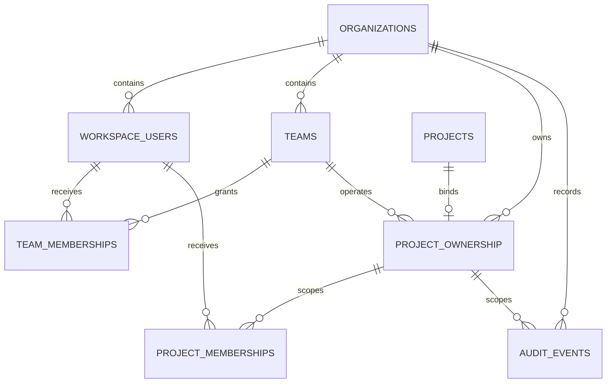

# Knowledge Agent M7：多人服务器版结构记录

## 1. 文档目的

本文记录 M7 的迁移顺序、代码职责、权限不变量和暂未接线的边界。后续重构可以替换内部实现，但不能丢失这些业务语义。

M7 不一次性切换整个应用。采用 expand/contract：

1. 先扩展组织、用户、团队、项目归属、成员授权与审计底座；
2. 再迁移 Task/Job 和身份会话；
3. 再让 API、检索、对象下载与 Worker 强制执行 RBAC；
4. 验证服务器端闭环后，才收缩 SQLite 正式写入路径和临时兼容层。

## 2. 当前完成范围：M7-A

本阶段已实现：

- Alembic `20260730_0008`；
- `organizations`、`workspace_users`、`teams`、`team_memberships`；
- `project_ownership`、`project_memberships`；
- append-only `audit_events`；
- SQLAlchemy Core Schema；
- 从 PostgreSQL 解析事实的 `PostgresProjectAccessRepository`；
- 不依赖数据库的 `ProjectAccessService` 权限策略；
- 必须加入调用方业务事务的 `PostgresAuditEventWriter`；
- 跨组织、禁用用户、角色矩阵、复合外键和审计不可变测试。

当前明确未做：

- 不把现有 `APP_PASSWORD` Cookie 假装成 User；
- 不在 `app.py` 中启用服务器 RBAC；
- 不给旧项目自动补一个虚构 Organization；
- 不迁移 SQLite Task/Job；
- 不改变 `knowledge_agent_enabled` 默认关闭；
- 不接前端成员管理；
- 不接 S3、生产部署或密钥服务。

因此，M7-A 是可验证的权限底座，不代表多人服务器版已经上线。

## 3. 为什么使用 `project_ownership`

现有 `projects` 是 M1 知识边界，历史数据没有可信的 `organization_id`。直接给它增加非空组织字段，需要选择以下坏结果之一：

- 给所有旧项目填一个虚构默认组织；
- 在不知道真实归属时猜测租户；
- 让一次大迁移同时修改知识、任务、认证和前端。

M7 使用独立的 `project_ownership` 显式绑定：

```text
projects
  1
  |
  0..1
project_ownership -> organizations
                  -> teams (optional owning team)
```

语义：

- 有 `project_ownership`：服务器 RBAC 可以授权；
- 没有 `project_ownership`：仍可由现有本地模式使用；
- 服务器 RBAC 模式遇到未绑定项目必须 fail closed；
- 后续确认全部正式项目已绑定后，可把组织归属收缩进最终 Project 模型。

`project_ownership` 不是永久承诺的表名；它是防止错误回填租户的显式迁移边界。

## 4. 数据模型和隔离规则



关键约束：

1. User ID 只在 Organization 内唯一，主键为
   `(organization_id, user_id)`。
2. Team、TeamMembership、ProjectMembership 都使用复合外键，不能把另一组织的 User 或 Project 拼进当前组织。
3. `project_ownership.project_id` 唯一，一个 Project 同一时刻只能属于一个 Organization。
4. `owning_team_id` 可空；空值表示组织拥有但暂未分配运营 Team。
5. 禁用 User、暂停 Organization 和归档 Team 不再产生继承权限。
6. `audit_events` 的 Actor 与 Project 外键也带 `organization_id`。
7. PostgreSQL Trigger 禁止更新或删除审计事件；保留和归档策略以后只能通过分区/受控运维设计，不允许业务代码改历史。

## 5. 权限矩阵

| 权限 | org_admin | team_lead | editor | reviewer | viewer |
|---|---:|---:|---:|---:|---:|
| `project.view` | 是 | 是 | 是 | 是 | 是 |
| `article.edit` | 是 | 是 | 是 | 否 | 否 |
| `article.review` | 是 | 是 | 是 | 是 | 否 |
| `article.deliver` | 是 | 是 | 是 | 否 | 否 |
| `knowledge.edit` | 是 | 是 | 是 | 否 | 否 |
| `knowledge.publish` | 是 | 是 | 是 | 否 | 否 |
| `project.members.manage` | 是 | 是 | 否 | 否 | 否 |
| `knowledge.delete` | 是 | 否 | 否 | 否 | 否 |
| `project.delete` | 是 | 否 | 否 | 否 | 否 |

继承优先级：

1. Organization 内的 `org_admin`；
2. Project 所属 Team 的 `team_lead`；
3. 显式 `editor/reviewer/viewer` ProjectMembership；
4. 普通 Team `member` 不继承项目访问。

如果一个人同时有多个角色，当前实现返回优先级最高的有效角色。矩阵是向下包含关系，所以不会丢失较低角色能力。

`editor` 可以完成自助复核、导出和交付，但不能管理成员、删除已发布知识或删除项目。`reviewer` 是可选质量角色，不是默认交付门槛。

## 6. 授权调用链

未来所有服务器入口统一走以下链路：

```text
认证层解析签名会话
  -> ActorIdentity(organization_id, user_id)
  -> ProjectAccessRepository 从数据库读取事实
  -> ProjectAccessService.require(permission)
  -> 业务 Repository / Retriever / Object Store / Worker
```

安全要求：

- Actor 的 Organization/User 必须来自服务器验证过的会话，不能来自请求 Body；
- Role 永远从 PostgreSQL 读取，不能信任前端；
- 拒绝消息统一为 `project access denied`，不泄露目标项目是否存在或属于哪个组织；
- 列表查询不能先返回全量再在 Python 过滤，必须在 SQL 中按 Actor Scope 过滤；
- Worker 启动和真正执行前都要重新检查，成员被移除后不能继续获得新数据；
- Knowledge Retriever 现有 `project_id + published + current snapshot` 门禁继续保留，RBAC 是额外一层，不替代知识发布门。

## 7. 审计事务边界

`PostgresAuditEventWriter` 不自行开启事务，必须接收调用方已经打开事务的 SQLAlchemy `Connection`：

```python
with engine.begin() as connection:
    membership_repository.grant(connection, ...)
    audit_writer.append(connection, event)
```

这样“成员授权”和“审计事件”要么同时提交，要么同时回滚。未来禁止出现：

```text
先提交权限修改 -> 再单独写审计
```

当前尚未提供正式 Membership 写 API，所以还不存在绕过审计的业务写入口。测试夹具可直接插入，但生产代码新增权限写操作时必须组合 Audit Writer。

## 8. 代码地图

| 文件 | 作用 | 重构时必须保留 |
|---|---|---|
| `backend/server_schema.py` | M7 服务器实体的 SQLAlchemy Core 定义 | 复合租户外键、显式项目归属、审计关联 |
| `backend/migrations/versions/20260730_0008_multitenant_access.py` | Schema 唯一迁移准源 | 无虚构组织回填、可升降级、审计 Trigger |
| `backend/services/access_control.py` | Actor、权限契约、纯策略和 PostgreSQL 事实查询 | 不信任客户端 Role、统一拒绝、未绑定项目 fail closed |
| `backend/services/audit_log.py` | 业务事务内追加审计事件 | 调用方事务、稳定 Event ID、无更新/删除接口 |
| `backend/tests/test_m7_access_control.py` | 权限矩阵单元测试 | 自助交付与管理操作边界 |
| `backend/tests/test_m7_access_control_postgres.py` | 真实数据库隔离测试 | 跨组织攻击、禁用身份、复合 FK、append-only |

## 9. 后续 M7 迁移顺序

### M7-B：身份会话与管理写服务

1. 选择正式身份来源并建立外部 Subject 到 Workspace User 的映射；
2. 签名会话携带不可篡改的 Organization/User 身份；
3. 实现 Organization/Team/ProjectMembership 管理服务；
4. 所有授权变更和状态变更与 Audit Event 同事务；
5. 在显式 server mode 下接入 API，缺失 Actor 时 fail closed；
6. 本地模式继续使用现有单密码入口，不把它映射成生产用户。

### M7-C：Task/Job PostgreSQL 准源

1. 先定义 PostgreSQL Task、Job、Attempt 和状态事件表；
2. 建立 SQLite -> PostgreSQL 一次性导入器和校验报告；
3. 增加双读比对，仍由旧路径写入；
4. 切换服务器模式为 PostgreSQL 单写；
5. 观察并验证后移除服务器 SQLite 写入；
6. 本地模式继续保留 SQLite，不做双向同步。

所有 Task/Job 必须带 `organization_id + project_id`，Worker Claim 不能跨组织；幂等键和状态机语义必须与现有实现逐项对照。

### M7-D：对象存储与部署

对象 Key 至少按以下前缀隔离：

```text
organizations/{organization_id}/projects/{project_id}/...
```

数据库只保存不可变对象 URI、哈希、媒体类型、大小和创建者。产品原图、抓取快照、私有文件、标准化产物、AI 检测截图和 DOCX 都迁入 S3 兼容存储。下载通过短期签名 URL 或授权后的后端流式响应，不能暴露长期公共 URL。

之后补齐备份恢复演练、密钥轮换、迁移前检查、部署健康门和回滚方案，再讨论受控云端或公司私有部署。

## 10. 重构检查清单

1. 是否仍能区分未绑定本地项目与服务器正式项目？
2. 是否仍由数据库事实决定角色，而非前端字段或请求 Body？
3. 普通 Team Member 是否仍不会自动看到本组全部项目？
4. 跨 Organization 的 User/Team/Project 组合是否仍被数据库拒绝？
5. 禁用 User、暂停 Organization、归档 Team 是否立即失去继承权限？
6. `editor` 是否仍能自助交付但不能执行管理删除？
7. API、Retriever、对象下载和 Worker 是否分别重新授权？
8. 权限修改与 Audit Event 是否仍在一个事务？
9. 审计历史是否仍不可由普通业务代码修改或删除？
10. Task/Job 切换后，SQLite 是否仍只属于明确的本地模式？
11. 对象 Key、数据库行和签名下载是否都同时带 Organization/Project Scope？
12. 是否有迁移、回滚、跨组织攻击和旧项目 fail-closed 自动测试？
