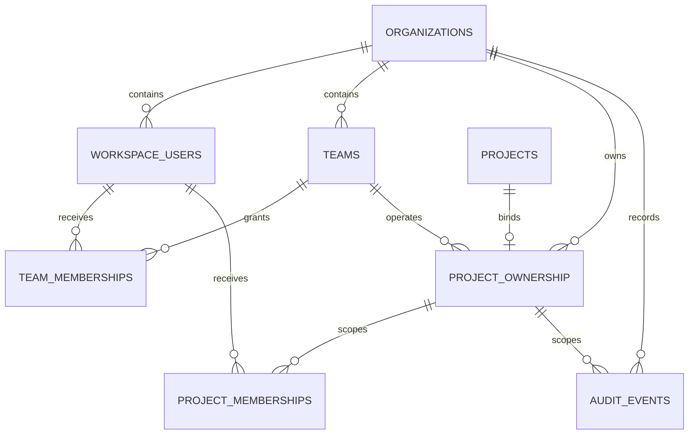

# Knowledge Agent M7：多人服务器版结构记录

## 1. 文档目的

本文记录 M7 的迁移顺序、代码职责、权限不变量和暂未接线的边界。后续重构可以替换内部实现，但不能丢失这些业务语义。

M7 不一次性切换整个应用。采用 expand/contract：

1. 先扩展组织、用户、团队、项目归属、成员授权与审计底座；
2. 再迁移 Task/Job 和身份会话；
3. 再让 API、检索、对象下载与 Worker 强制执行 RBAC；
4. 验证服务器端闭环后，才收缩 SQLite 正式写入路径和临时兼容层。

## 2. 当前完成范围：M7-A / M7-B / M7-C1-C2 / M7-D1

本阶段已实现：

- Alembic `20260730_0008`；
- `organizations`、`workspace_users`、`teams`、`team_memberships`；
- `project_ownership`、`project_memberships`；
- append-only `audit_events`；
- SQLAlchemy Core Schema；
- 从 PostgreSQL 解析事实的 `PostgresProjectAccessRepository`；
- 不依赖数据库的 `ProjectAccessService` 权限策略；
- 必须加入调用方业务事务的 `PostgresAuditEventWriter`；
- 跨组织、禁用用户、角色矩阵、复合外键和审计不可变测试。
- 显式 `ARTICLE_AGENT_SERVER_MODE` 门禁；
- 只签名 Organization/User、不缓存 Role 的 `ServerActorSessionCodec`；
- 使用独立 `ARTICLE_AGENT_SERVER_SESSION_SECRET`，不回退到旧本地 Session Secret；
- `PostgresProjectMembershipService` 的授权、撤销和同事务审计。
- Alembic `20260730_0009` 的项目级 Task/Job 表；
- 兼容现有 `TaskStore` 的 `PostgresTaskRepository`；
- SQLite Task -> PostgreSQL 的一次性摘要校验导入器；
- PostgreSQL Revision compare-and-swap，避免多进程丢更新；
- 使用部分唯一索引、`FOR UPDATE SKIP LOCKED` 和 Worker Lease 的
  `PostgresJobQueue`。
- Active Job 排空门禁和 SQLite Terminal Job 历史迁移；
- Batch/Job 稳定 ID、数量、状态分布和内容 SHA-256 摘要复核。
- S3 兼容 `ObjectStore` 协议与 boto3 适配器；
- Organization/Project/内容哈希组成的不可变对象 Key；
- M2 `ArtifactStore` 到 S3 的项目绑定适配器；
- 产品图片等知识资产的授权上传、数据库登记和短期签名下载；
- localhost-only、显式 profile 的 MinIO 开发兼容服务和真实往返测试。

当前明确未做：

- 不把现有 `APP_PASSWORD` Cookie 假装成 User；
- 不在 `app.py` 中启用服务器 RBAC；
- 不给旧项目自动补一个虚构 Organization；
- 尚未把 `app.py` 的 Task/Job 正式写路径切换到 PostgreSQL；
- 不改变 `knowledge_agent_enabled` 默认关闭；
- 不接前端成员管理；
- 不接 S3、生产部署或密钥服务。

因此，M7-A/B/C1-C2 是可验证的服务器持久层，不代表多人服务器版已经上线。

## 3. 为什么使用 `project_ownership`

现有 `projects` 是 M1 知识边界，历史数据没有可信的 `organization_id`。直接给它增加非空组织字段，需要选择以下坏结果之一：

- 给所有旧项目填一个虚构默认组织；
- 在不知道真实归属时猜测租户；
- 让一次大迁移同时修改知识、任务、认证和前端。

M7 使用独立的 `project_ownership` 显式绑定：

```text
projects
  1
  |
  0..1
project_ownership -> organizations
                  -> teams (optional owning team)
```

语义：

- 有 `project_ownership`：服务器 RBAC 可以授权；
- 没有 `project_ownership`：仍可由现有本地模式使用；
- 服务器 RBAC 模式遇到未绑定项目必须 fail closed；
- 后续确认全部正式项目已绑定后，可把组织归属收缩进最终 Project 模型。

`project_ownership` 不是永久承诺的表名；它是防止错误回填租户的显式迁移边界。

## 4. 数据模型和隔离规则



关键约束：

1. User ID 只在 Organization 内唯一，主键为
   `(organization_id, user_id)`。
2. Team、TeamMembership、ProjectMembership 都使用复合外键，不能把另一组织的 User 或 Project 拼进当前组织。
3. `project_ownership.project_id` 唯一，一个 Project 同一时刻只能属于一个 Organization。
4. `owning_team_id` 可空；空值表示组织拥有但暂未分配运营 Team。
5. 禁用 User、暂停 Organization 和归档 Team 不再产生继承权限。
6. `audit_events` 的 Actor 与 Project 外键也带 `organization_id`。
7. PostgreSQL Trigger 禁止更新或删除审计事件；保留和归档策略以后只能通过分区/受控运维设计，不允许业务代码改历史。

## 5. 权限矩阵

| 权限 | org_admin | team_lead | editor | reviewer | viewer |
|---|---:|---:|---:|---:|---:|
| `project.view` | 是 | 是 | 是 | 是 | 是 |
| `article.edit` | 是 | 是 | 是 | 否 | 否 |
| `article.review` | 是 | 是 | 是 | 是 | 否 |
| `article.deliver` | 是 | 是 | 是 | 否 | 否 |
| `knowledge.edit` | 是 | 是 | 是 | 否 | 否 |
| `knowledge.publish` | 是 | 是 | 是 | 否 | 否 |
| `project.members.manage` | 是 | 是 | 否 | 否 | 否 |
| `knowledge.delete` | 是 | 否 | 否 | 否 | 否 |
| `project.delete` | 是 | 否 | 否 | 否 | 否 |

继承优先级：

1. Organization 内的 `org_admin`；
2. Project 所属 Team 的 `team_lead`；
3. 显式 `editor/reviewer/viewer` ProjectMembership；
4. 普通 Team `member` 不继承项目访问。

如果一个人同时有多个角色，当前实现返回优先级最高的有效角色。矩阵是向下包含关系，所以不会丢失较低角色能力。

`editor` 可以完成自助复核、导出和交付，但不能管理成员、删除已发布知识或删除项目。`reviewer` 是可选质量角色，不是默认交付门槛。

## 6. 授权调用链

未来所有服务器入口统一走以下链路：

```text
认证层解析签名会话
  -> ActorIdentity(organization_id, user_id)
  -> ProjectAccessRepository 从数据库读取事实
  -> ProjectAccessService.require(permission)
  -> 业务 Repository / Retriever / Object Store / Worker
```

安全要求：

- Actor 的 Organization/User 必须来自服务器验证过的会话，不能来自请求 Body；
- Role 永远从 PostgreSQL 读取，不能信任前端；
- 拒绝消息统一为 `project access denied`，不泄露目标项目是否存在或属于哪个组织；
- 列表查询不能先返回全量再在 Python 过滤，必须在 SQL 中按 Actor Scope 过滤；
- Worker 启动和真正执行前都要重新检查，成员被移除后不能继续获得新数据；
- Knowledge Retriever 现有 `project_id + published + current snapshot` 门禁继续保留，RBAC 是额外一层，不替代知识发布门。

## 7. 审计事务边界

`PostgresAuditEventWriter` 不自行开启事务，必须接收调用方已经打开事务的 SQLAlchemy `Connection`：

```python
with engine.begin() as connection:
    membership_repository.grant(connection, ...)
    audit_writer.append(connection, event)
```

这样“成员授权”和“审计事件”要么同时提交，要么同时回滚。未来禁止出现：

```text
先提交权限修改 -> 再单独写审计
```

当前尚未提供正式 Membership 写 API，所以还不存在绕过审计的业务写入口。测试夹具可直接插入，但生产代码新增权限写操作时必须组合 Audit Writer。

`PostgresProjectMembershipService` 已提供两层接口：

- `grant/revoke`：自行建立单个 PostgreSQL 事务；
- `grant_in_transaction/revoke_in_transaction`：加入调用方已有业务事务。

稳定 `event_id` 若重复会触发唯一约束；数据库错误会使同一事务内的成员变更一起回滚，不会出现“权限已变但审计没写”的状态。

## 8. 代码地图

| 文件 | 作用 | 重构时必须保留 |
|---|---|---|
| `backend/server_schema.py` | M7 服务器实体的 SQLAlchemy Core 定义 | 复合租户外键、显式项目归属、审计关联 |
| `backend/migrations/versions/20260730_0008_multitenant_access.py` | Schema 唯一迁移准源 | 无虚构组织回填、可升降级、审计 Trigger |
| `backend/services/access_control.py` | Actor、权限契约、纯策略和 PostgreSQL 事实查询 | 不信任客户端 Role、统一拒绝、未绑定项目 fail closed |
| `backend/services/audit_log.py` | 业务事务内追加审计事件 | 调用方事务、稳定 Event ID、无更新/删除接口 |
| `backend/services/server_auth.py` | 服务器 Actor Session 的签名与解析 | Token 不带 Role、独立 Secret、默认不开启 |
| `backend/services/project_memberships.py` | 受授权且带审计的 ProjectMembership 变更 | 授权/写入/审计同事务、跨组织目标不泄露 |
| `backend/services/postgres_task_repository.py` | 项目级 Task JSONB 持久化 | Scope 注入、顺序、扩展字段、Revision CAS |
| `backend/services/task_store_migration.py` | SQLite Task 一次性导入与摘要比对 | 非空差异目标绝不覆盖、导入后再校验 |
| `backend/services/postgres_job_queue.py` | PostgreSQL Batch/Job Queue | 活跃任务唯一、SKIP LOCKED、Worker Lease、旧返回契约 |
| `backend/services/job_queue_migration.py` | SQLite Terminal Job 历史迁移 | Active 排空门、稳定 ID、状态与内容摘要复核 |
| `backend/services/task_repository.py` | 本地/服务器 Task Repository Protocol 与 SQLite 实现 | 本地模式保持可用 |
| `backend/services/job_queue.py` | Queue Protocol、SQLite Queue 与通用 Runner | 本地模式语义和 Runner 兼容 |
| `backend/services/object_store.py` | 私有 S3 对象、配置、Key 和签名下载边界 | Secret 独立、Key 带组织/项目、默认私有、下载限时 |
| `backend/knowledge_agent/object_storage.py` | M2 资产接入 S3 及授权后的知识对象服务 | 解析器适配与权限分离、下载重新授权、数据库只存 URI/证据 |
| `backend/services/deployment_readiness.py` | 服务器发布前只读门禁与安全报告 | 代码能力显式列举、默认 no-go、输出不带 Secret/URL |
| `backend/knowledge_agent/m7_deployment_preflight.py` | Preflight CLI | 非零即停止发布、备份恢复只能显式证明 |
| `docs/runbooks/knowledge-agent-m7-server-cutover.md` | 备份、恢复、轮换、发布和回滚操作准源 | 新实例恢复、跨系统恢复点、禁止默认 Actor/Project |
| `backend/tests/test_m7_access_control.py` | 权限矩阵单元测试 | 自助交付与管理操作边界 |
| `backend/tests/test_m7_access_control_postgres.py` | 真实数据库隔离测试 | 跨组织攻击、禁用身份、复合 FK、append-only |
| `backend/tests/test_m7_server_auth.py` | Actor Token 与服务器模式测试 | 防篡改、过期、未来签发、Secret 隔离 |
| `backend/tests/test_m7_postgres_tasks.py` | Task/Job PostgreSQL 集成测试 | Scope、迁移、CAS、并发 Claim、Lease、Retry |
| `backend/tests/test_m7_object_store.py` | S3 适配器单元契约 | 私有对象、加密参数、大小门禁、Secret 不泄露 |
| `backend/tests/test_m7_knowledge_object_storage.py` | 产品/知识资产授权与 M2 适配测试 | 上传和下载分别授权、跨项目适配拒绝 |
| `backend/tests/test_m7_object_store_s3.py` | 可选真实 S3 兼容往返测试 | 专用测试 Bucket、Put/Get/Sign/Delete、对象清理 |

## 9. 后续 M7 迁移顺序

### M7-B：身份会话与管理写服务

当前已完成第 2、3、4 项的底层接口，其余顺序：

1. 选择正式身份来源并建立外部 Subject 到 Workspace User 的映射；
2. 在显式 server mode 下接入 API，缺失 Actor 时 fail closed；
3. 逐一给项目列表、文章、知识检索、对象下载和 Worker 增加权限依赖；
4. 全部项目级入口覆盖前，不开放服务器登录；
5. 本地模式继续使用现有单密码入口，不把它映射成生产用户。

### M7-C：Task/Job PostgreSQL 准源

当前 C1-C2 已完成：

1. PostgreSQL Task、Batch、Job 表及项目复合外键；
2. Task JSONB 兼容 Repository；
3. SQLite Task -> PostgreSQL 一次性导入、数量和 SHA-256 摘要校验；
4. Task Revision compare-and-swap；
5. Job 活跃唯一索引、并发 Claim、Worker Lease 和状态变更。
6. SQLite 全量 Batch 导出和 Active Job 排空门；
7. Terminal Job 历史导入，保留 Batch/Job ID 并验证数量、状态分布和内容摘要。

后续 C3 顺序：

1. 先做只读双读比对，仍由旧路径写入；
2. 正式身份和项目路由覆盖后，切换服务器模式为 PostgreSQL 单写；
3. 观察并验证后移除服务器 SQLite 写入；
4. 本地模式继续保留 SQLite，不做双向同步。

所有 Task/Job 必须带 `organization_id + project_id`，Worker Claim 不能跨组织；幂等键和状态机语义必须与现有实现逐项对照。

Task 正文仍保存完整 JSONB，避免把当前工作流上百个字段一次拆表；同时提升以下列用于约束和查询：

```text
organization_id / project_id / task_id / customer / topic_index
revision / position / record_updated_at
```

Job 不保存为不透明 JSON，而是结构化保存状态、Attempt、可运行时间、取消标记、Worker 和 Lease。只有 Lease 过期的 `running` Job 才可恢复；一个 Worker 不能提交另一个 Worker 已接管的结果。

当前 `app.py` 仍构造 SQLite `TaskStore/JobQueue`。在请求还没有可信
`ActorIdentity + project_id` 前，不允许用一个全局“默认项目”强行切换 PostgreSQL。

### M7-D：对象存储与部署

对象 Key 至少按以下前缀隔离：

```text
organizations/{organization_id}/projects/{project_id}/...
```

数据库只保存不可变对象 URI、哈希、媒体类型、大小和创建者。产品原图、抓取快照、私有文件、标准化产物、AI 检测截图和 DOCX 都迁入 S3 兼容存储。下载通过短期签名 URL 或授权后的后端流式响应，不能暴露长期公共 URL。

#### D1 已实现：对象存储边界

```text
已授权的 knowledge.edit 请求
  -> 解析/抓取图片 bytes
  -> SHA-256 校验和内容寻址
  -> organizations/{org}/projects/{project}/blobs/{prefix}/{sha256}
  -> 私有 S3 对象
  -> knowledge_assets (URI/hash/type/size/dimensions/metadata)
  -> snapshot_assets (图片在某个来源快照中的位置和文案)
  -> knowledge_product_asset_evidence (图片属于哪个产品及其角色)
```

产品图片不是 Product 表上的一个可变 URL 字段，也不会复制进文章 JSON。三个层次分别保存：

1. `knowledge_assets` 表示项目内按内容去重的不可变图片；
2. `snapshot_assets` 保留图片出现在哪个网页快照、顺序、源 URL、alt、caption；
3. `knowledge_product_asset_evidence` 记录它与产品的 `primary/gallery/...` 证据关系。

文章或前端只保存 `asset_id`/证据选择。真正展示时先校验
`project.view`，再签发最长一小时的临时下载 URL。上传要求
`knowledge.edit`。S3 Key 和数据库查询同时锁定 Organization/Project，任一层
Scope 不一致都拒绝。

现有 M2 解析器不感知 boto3。`ScopedS3ArtifactStore` 实现原来的
`ArtifactStore.put()`，并在构造时固定 Organization/Project；后期替换存储供应商时，
产品解析、图片证据和产品目录不需要一起重写。

对象采用内容寻址，因此同一项目重复抓取相同字节只得到同一个物理 Key。源站图片变化会
产生新哈希和新对象，旧快照继续引用旧对象，支持审计和回滚。删除/生命周期管理必须先证明
没有任何快照或产品证据引用，不允许由抓取重试直接删除。

S3 Put 与 PostgreSQL Insert 无法组成一个 ACID 事务。当前顺序是“先写确定性对象 Key，
再幂等登记资产”；数据库失败时不会覆盖其他内容，但可能留下未引用对象。D2 必须增加按
数据库引用集合对账的 orphan 扫描和延迟清理，并为正式上传动作补业务审计，不能在请求失败
时立即删除对象（并发请求可能已经复用同一个 Key）。

配置只读取独立的 `ARTICLE_AGENT_OBJECT_STORE_*` 环境变量，不回退到
LLM/Embedding Key；Access Key/Secret 不进入公开配置或异常消息。默认请求服务端
加密 `AES256`，`none` 只允许本地兼容目标显式使用。开发 MinIO profile 仅用于
S3 契约验证，不是生产供应商选择。

#### D2 已实现底座、待真实演练：运维与部署门禁

`DeploymentPreflightReport` 已把 Server Mode、Actor Session、Knowledge 配置、
Alembic/pgvector、S3 Bucket、代码切换能力和备份恢复证明拆成稳定 Check ID。报告不返回
URL、密钥或供应商错误正文。

`CURRENT_SERVER_CUTOVER_CAPABILITIES` 是代码事实，不是运维环境变量。当前正式身份、
项目路由、Task/Job 单写和 Worker 重新授权尚未接线，所以它明确保持 no-go；不能靠设置
一个环境变量把未实现能力标成通过。

备份恢复、对象版本/生命周期、密钥轮换、发布健康门和回滚步骤已经记录在
`docs/runbooks/knowledge-agent-m7-server-cutover.md`。真实受控环境的恢复演练、
RPO/RTO、供应商选择和证据仍未完成。正式身份和 API 全覆盖之前，不把对象服务开放为
公共入口。

## 10. 重构检查清单

1. 是否仍能区分未绑定本地项目与服务器正式项目？
2. 是否仍由数据库事实决定角色，而非前端字段或请求 Body？
3. 普通 Team Member 是否仍不会自动看到本组全部项目？
4. 跨 Organization 的 User/Team/Project 组合是否仍被数据库拒绝？
5. 禁用 User、暂停 Organization、归档 Team 是否立即失去继承权限？
6. `editor` 是否仍能自助交付但不能执行管理删除？
7. API、Retriever、对象下载和 Worker 是否分别重新授权？
8. 权限修改与 Audit Event 是否仍在一个事务？
9. 审计历史是否仍不可由普通业务代码修改或删除？
10. Task/Job 切换后，SQLite 是否仍只属于明确的本地模式？
11. 对象 Key、数据库行和签名下载是否都同时带 Organization/Project Scope？
12. 是否有迁移、回滚、跨组织攻击和旧项目 fail-closed 自动测试？
13. 产品图片是否仍拆分为不可变对象、快照出现证据和产品关系，而非退化成可覆盖 URL？
14. S3 供应商或 SDK 替换后，M2 Parser/Ingester 是否仍只依赖 ArtifactStore 契约？
