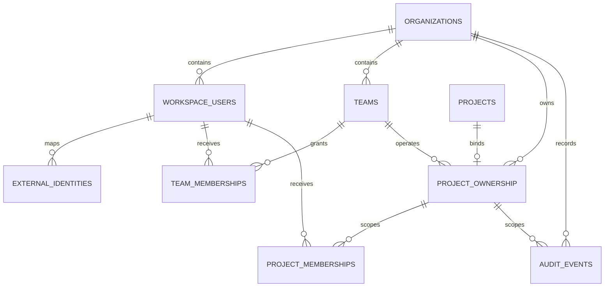

# Knowledge Agent M7：多人服务器版结构记录

## 1. 文档目的

本文记录 M7 的迁移顺序、代码职责、权限不变量和暂未接线的边界。后续重构可以替换内部实现，但不能丢失这些业务语义。

M7 不一次性切换整个应用。采用 expand/contract：

1. 先扩展组织、用户、团队、项目归属、成员授权与审计底座；
2. 再迁移 Task/Job 和身份会话；
3. 再让 API、检索、对象下载与 Worker 强制执行 RBAC；
4. 验证服务器端闭环后，才收缩 SQLite 正式写入路径和临时兼容层。

## 2. 当前完成范围：M7-A / M7-B / M7-C1-C2 / M7-D1

本阶段已实现：

- Alembic `20260730_0008`；
- `organizations`、`workspace_users`、`teams`、`team_memberships`；
- `project_ownership`、`project_memberships`；
- append-only `audit_events`；
- SQLAlchemy Core Schema；
- 从 PostgreSQL 解析事实的 `PostgresProjectAccessRepository`；
- 不依赖数据库的 `ProjectAccessService` 权限策略；
- 必须加入调用方业务事务的 `PostgresAuditEventWriter`；
- 跨组织、禁用用户、角色矩阵、复合外键和审计不可变测试。
- 显式 `ARTICLE_AGENT_SERVER_MODE` 门禁；
- 只签名 Organization/User、不缓存 Role 的 `ServerActorSessionCodec`；
- 使用独立 `ARTICLE_AGENT_SERVER_SESSION_SECRET`，不回退到旧本地 Session Secret；
- `PostgresProjectMembershipService` 的授权、撤销和同事务审计。
- Alembic `20260730_0009` 的项目级 Task/Job 表；
- 兼容现有 `TaskStore` 的 `PostgresTaskRepository`；
- SQLite Task -> PostgreSQL 的一次性摘要校验导入器；
- PostgreSQL Revision compare-and-swap，避免多进程丢更新；
- 使用部分唯一索引、`FOR UPDATE SKIP LOCKED` 和 Worker Lease 的
  `PostgresJobQueue`。
- Active Job 排空门禁和 SQLite Terminal Job 历史迁移；
- Batch/Job 稳定 ID、数量、状态分布和内容 SHA-256 摘要复核。
- S3 兼容 `ObjectStore` 协议与 boto3 适配器；
- Organization/Project/内容哈希组成的不可变对象 Key；
- M2 `ArtifactStore` 到 S3 的项目绑定适配器；
- 产品图片等知识资产的授权上传、数据库登记和短期签名下载；
- localhost-only、显式 profile 的 MinIO 开发兼容服务和真实往返测试。
- `ServerRequestSecurity` 的签名 Actor 解析、项目规范化和数据库事实授权；
- Knowledge Router 全路由统一依赖，以及按操作语义区分
  `project.view / knowledge.edit / knowledge.publish / knowledge.delete`；
- Server Mode 下未完成 Scope 迁移的旧 API、研究队列、上传和原始对象下载 fail closed；
- 真实 Lifespan 中独立构建服务器安全服务，本地模式仍沿用原单密码入口。
- Server Mode 不构造、不启动便携版 SQLite JobQueue/Worker，且全局
  `store()/batch_queue()` 直接拒绝调用；
- `app.py` 中兼容性的 retrieval-plan 路由也显式进入 Knowledge 授权依赖，并在
  PostgreSQL Task Scope 接线前保持 503；
- 新增只在 Server Mode 开放的
  `GET /api/projects/{project}/tasks[/{task_id}]`，请求先按 `project.view`
  重新授权，再读取固定 Organization/Project 的 PostgreSQL TaskStore；
- 新增 `GET /api/projects` Project Directory：只在 SQL 中返回 Actor 可见的 Active
  Project，并给出按既有优先级计算的 Effective Role；
- Server Task 兼容适配器禁用 JSON/SQLite Legacy Import，构造时也不创建本地数据目录；
- 新增第一个 PostgreSQL-only Task 写操作
  `POST /api/projects/{project}/tasks/{task_id}/rewrite-from-scratch`：
  `article.edit`、Project Scope 与 Revision CAS 全部通过后才清空下游派生状态，不写
  本地 Artifact；
- 新增第二个 PostgreSQL-only Task 写操作
  `PUT /api/projects/{project}/tasks/{task_id}/products`：请求只接收 Revision 和
  1–3 个 Product ID；服务端从同 Project 的正式产品目录投影已确认、且有 Published
  Current Snapshot 主详情证据的产品，再用 Revision CAS 替换 Task 产品快照；
- Server 产品投影不接受客户端上传的名称、URL、事实或图片地址；图片只复制稳定
  `asset_id`，不复制对象 URI、源站 URL 或本地路径；
- 新增第三个 PostgreSQL-only 受限 Task 写操作
  `PUT /api/projects/{project}/tasks/{task_id}/article/sections`：只接受当前 Revision、
  唯一 Heading Path 和已审阅的 Replacement Body；在同一次 Task CAS 中保存修改前/
  修改后版本快照，只替换目标 Markdown 章节并使全部下游产物失效；
- 新增 `GET /api/projects/{project}/assets/{asset_id}/download`：路由授权后，
  Object Service 在签名前再次读取 `project.view`，核对数据库 URI 的 Bucket 与
  Organization/Project Key 前缀，并签发最长一小时的临时 URL；
- Alembic `20260730_0010` 的供应商无关 External Identity 映射；
- 只接收“已验证 issuer/subject”的本地 Actor 映射和 Session Exchange；
- Org Admin 才能执行且与 Audit Event 同事务的 Identity Link/Revoke。
- Alembic `20260730_0011` 为新 PostgreSQL Job 增加同 Organization 复合外键约束的
  `requested_by_user_id`；旧 SQLite 历史迁移时允许为空；
- `AuthorizedPostgresJobQueue` 在读取 Request Payload 前只检查 Job ID、Operation 和
  Requester，撤权或无 Requester 的 Job 直接变为通用 conflict；
- `ReauthorizingJobHandler` 在进入业务 Handler 前再次授权，覆盖 Claim 后撤权竞态。

当前明确未做：

- 不把现有 `APP_PASSWORD` Cookie 假装成 User；
- 不开放正式外部身份登录；现有 `app.py` 只接入服务器请求安全底座；
- 不给旧项目自动补一个虚构 Organization；
- 尚未把 `app.py` 的 Task/Job 正式写路径切换到 PostgreSQL；
- 不改变 `knowledge_agent_enabled` 默认关闭；
- 不接前端成员管理；
- 不把已完成的 S3 适配器接入旧 Raw Artifact HTTP 路由；
- 不接生产对象存储、生产部署或密钥服务。

因此，当前结果是可验证的服务器持久层与部分请求安全底座，不代表多人服务器版已经上线。

## 3. 为什么使用 `project_ownership`

现有 `projects` 是 M1 知识边界，历史数据没有可信的 `organization_id`。直接给它增加非空组织字段，需要选择以下坏结果之一：

- 给所有旧项目填一个虚构默认组织；
- 在不知道真实归属时猜测租户；
- 让一次大迁移同时修改知识、任务、认证和前端。

M7 使用独立的 `project_ownership` 显式绑定：

```text
projects
  1
  |
  0..1
project_ownership -> organizations
                  -> teams (optional owning team)
```

语义：

- 有 `project_ownership`：服务器 RBAC 可以授权；
- 没有 `project_ownership`：仍可由现有本地模式使用；
- 服务器 RBAC 模式遇到未绑定项目必须 fail closed；
- 后续确认全部正式项目已绑定后，可把组织归属收缩进最终 Project 模型。

`project_ownership` 不是永久承诺的表名；它是防止错误回填租户的显式迁移边界。

## 4. 数据模型和隔离规则



关键约束：

1. User ID 只在 Organization 内唯一，主键为
   `(organization_id, user_id)`。
2. Team、TeamMembership、ProjectMembership 都使用复合外键，不能把另一组织的 User 或 Project 拼进当前组织。
3. `project_ownership.project_id` 唯一，一个 Project 同一时刻只能属于一个 Organization。
4. `owning_team_id` 可空；空值表示组织拥有但暂未分配运营 Team。
5. 禁用 User、暂停 Organization、归档 Project 和归档 Team 不再产生访问权限。
6. `audit_events` 的 Actor 与 Project 外键也带 `organization_id`。
7. PostgreSQL Trigger 禁止更新或删除审计事件；保留和归档策略以后只能通过分区/受控运维设计，不允许业务代码改历史。
8. External Identity 以 `(issuer, subject)` 全局唯一，并通过
   `(organization_id, user_id)` 复合外键绑定 Workspace User；同一 User 在同一
   Issuer 下最多一个 Subject。

## 5. 权限矩阵

| 权限 | org_admin | team_lead | editor | reviewer | viewer |
|---|---:|---:|---:|---:|---:|
| `project.view` | 是 | 是 | 是 | 是 | 是 |
| `article.edit` | 是 | 是 | 是 | 否 | 否 |
| `article.review` | 是 | 是 | 是 | 是 | 否 |
| `article.deliver` | 是 | 是 | 是 | 否 | 否 |
| `knowledge.edit` | 是 | 是 | 是 | 否 | 否 |
| `knowledge.publish` | 是 | 是 | 是 | 否 | 否 |
| `project.members.manage` | 是 | 是 | 否 | 否 | 否 |
| `knowledge.delete` | 是 | 否 | 否 | 否 | 否 |
| `project.delete` | 是 | 否 | 否 | 否 | 否 |

继承优先级：

1. Organization 内的 `org_admin`；
2. Project 所属 Team 的 `team_lead`；
3. 显式 `editor/reviewer/viewer` ProjectMembership；
4. 普通 Team `member` 不继承项目访问。

如果一个人同时有多个角色，当前实现返回优先级最高的有效角色。矩阵是向下包含关系，所以不会丢失较低角色能力。

`editor` 可以完成自助复核、导出和交付，但不能管理成员、删除已发布知识或删除项目。`reviewer` 是可选质量角色，不是默认交付门槛。

## 6. 授权调用链

未来所有服务器入口统一走以下链路：

```text
认证层解析签名会话
  -> ActorIdentity(organization_id, user_id)
  -> ProjectAccessRepository 从数据库读取事实
  -> ProjectAccessService.require(permission)
  -> 业务 Repository / Retriever / Object Store / Worker
```

安全要求：

- Actor 的 Organization/User 必须来自服务器验证过的会话，不能来自请求 Body；
- Role 永远从 PostgreSQL 读取，不能信任前端；
- 拒绝消息统一为 `project access denied`，不泄露目标项目是否存在或属于哪个组织；
- 列表查询不能先返回全量再在 Python 过滤，必须在 SQL 中按 Actor Scope 过滤；
- Worker 启动和真正执行前都要重新检查，成员被移除后不能继续获得新数据；
- Knowledge Retriever 现有 `project_id + published + current snapshot` 门禁继续保留，RBAC 是额外一层，不替代知识发布门。

## 7. 审计事务边界

`PostgresAuditEventWriter` 不自行开启事务，必须接收调用方已经打开事务的 SQLAlchemy `Connection`：

```python
with engine.begin() as connection:
    membership_repository.grant(connection, ...)
    audit_writer.append(connection, event)
```

这样“成员授权”和“审计事件”要么同时提交，要么同时回滚。未来禁止出现：

```text
先提交权限修改 -> 再单独写审计
```

当前尚未提供正式 Membership 写 API，所以还不存在绕过审计的业务写入口。测试夹具可直接插入，但生产代码新增权限写操作时必须组合 Audit Writer。

`PostgresProjectMembershipService` 已提供两层接口：

- `grant/revoke`：自行建立单个 PostgreSQL 事务；
- `grant_in_transaction/revoke_in_transaction`：加入调用方已有业务事务。

稳定 `event_id` 若重复会触发唯一约束；数据库错误会使同一事务内的成员变更一起回滚，不会出现“权限已变但审计没写”的状态。

## 8. 代码地图

| 文件 | 作用 | 重构时必须保留 |
|---|---|---|
| `backend/server_schema.py` | M7 服务器实体的 SQLAlchemy Core 定义 | 复合租户外键、显式项目归属、审计关联 |
| `backend/migrations/versions/20260730_0008_multitenant_access.py` | Schema 唯一迁移准源 | 无虚构组织回填、可升降级、审计 Trigger |
| `backend/services/access_control.py` | Actor、权限契约、纯策略和 PostgreSQL 事实查询 | 不信任客户端 Role、统一拒绝、未绑定项目 fail closed |
| `backend/services/audit_log.py` | 业务事务内追加审计事件 | 调用方事务、稳定 Event ID、无更新/删除接口 |
| `backend/services/server_auth.py` | 服务器 Actor Session 的签名与解析 | Token 不带 Role、独立 Secret、默认不开启 |
| `backend/services/external_identity.py` | 已验证外部身份到本地 Actor 的解析与 Session Exchange | 不接受原始 Token、不信任外部 Role、禁用/暂停/撤销立即失效 |
| `backend/services/external_identity_provisioning.py` | External Identity Link/Revoke | Org Admin、Subject 哈希审计目标、业务写入与审计同事务 |
| `backend/migrations/versions/20260730_0010_external_identities.py` | External Identity Schema 准源 | Issuer/Subject 唯一、复合租户 FK、可升降级 |
| `backend/services/server_request_security.py` | 请求 Actor、Knowledge 权限映射和服务器路由可用性 | 先认证再查数据库 Role、项目规范化、未迁移路由 fail closed |
| `backend/knowledge_agent/security.py` | Knowledge Router 的 FastAPI 授权适配器 | 全路由依赖、统一 401/403、授权结果只放 Request State |
| `backend/app.py` Server Mode Lifespan | 服务器请求安全装配与本地运行时隔离 | 不启动 SQLite Worker、不允许全局 TaskStore/JobQueue、兼容 Knowledge 路由不得绕过依赖 |
| `backend/services/project_memberships.py` | 受授权且带审计的 ProjectMembership 变更 | 授权/写入/审计同事务、跨组织目标不泄露 |
| `backend/services/postgres_task_repository.py` | 项目级 Task JSONB 持久化 | Scope 注入、顺序、扩展字段、Revision CAS |
| `backend/services/server_project_tasks.py` | 已授权请求到 PostgreSQL TaskStore 的兼容适配器 | 固定 Organization/Project、禁用 Legacy Import、不创建本地存储 |
| `backend/server_project_http.py` | Server Mode Project Directory、Task 读/确定性重写与私有资产下载 API | 路径必须含 Project、每次请求查数据库权限、写入用 Revision CAS、跨项目只返回 403/404、URL 短期有效 |
| `backend/services/project_directory.py` | Actor 可见 Project 的 SQL Directory | 先验证 Active Actor/Organization、SQL 内过滤 Scope、不读取全量后再过滤 |
| `backend/services/task_store_migration.py` | SQLite Task 一次性导入与摘要比对 | 非空差异目标绝不覆盖、导入后再校验 |
| `backend/services/postgres_job_queue.py` | PostgreSQL Batch/Job Queue | 活跃任务唯一、SKIP LOCKED、Worker Lease、旧返回契约 |
| `backend/services/authorized_job_queue.py` | Server Worker 的两阶段重新授权适配器 | Claim 前只看最小元数据、Handler 前二次授权、无可信 Requester 不读取 Payload |
| `backend/migrations/versions/20260730_0011_job_request_actor.py` | Job Requester Schema 准源 | Nullable 历史兼容、同 Organization User 复合 FK、Requester 查询索引 |
| `backend/services/job_queue_migration.py` | SQLite Terminal Job 历史迁移 | Active 排空门、稳定 ID、状态与内容摘要复核 |
| `backend/services/server_cutover_report.py` | SQLite/PG Task 与 Job 只读双读报告 | 只读连接、同一 Scope、顺序/ID/摘要、正文不出报告 |
| `backend/knowledge_agent/m7_cutover_report.py` | C3 冻结窗口比对 CLI | ready 为 0、差异为 2、数据库 URL 只读环境注入 |
| `backend/services/task_repository.py` | 本地/服务器 Task Repository Protocol 与 SQLite 实现 | 本地模式保持可用 |
| `backend/services/job_queue.py` | Queue Protocol、SQLite Queue 与通用 Runner | 本地模式语义和 Runner 兼容 |
| `backend/services/object_store.py` | 私有 S3 对象、配置、Key 和签名下载边界 | Secret 独立、Key 带组织/项目、默认私有、下载限时 |
| `backend/knowledge_agent/object_storage.py` | M2 资产接入 S3 及授权后的知识对象服务 | 解析器适配与权限分离、下载重新授权、数据库只存 URI/证据 |
| `backend/services/deployment_readiness.py` | 服务器发布前只读门禁与安全报告 | 代码能力显式列举、默认 no-go、输出不带 Secret/URL |
| `backend/knowledge_agent/m7_deployment_preflight.py` | Preflight CLI | 非零即停止发布、备份恢复只能显式证明 |
| `docs/runbooks/knowledge-agent-m7-server-cutover.md` | 备份、恢复、轮换、发布和回滚操作准源 | 新实例恢复、跨系统恢复点、禁止默认 Actor/Project |
| `backend/tests/test_m7_access_control.py` | 权限矩阵单元测试 | 自助交付与管理操作边界 |
| `backend/tests/test_m7_access_control_postgres.py` | 真实数据库隔离测试 | 跨组织攻击、禁用身份、复合 FK、append-only |
| `backend/tests/test_m7_server_auth.py` | Actor Token 与服务器模式测试 | 防篡改、过期、未来签发、Secret 隔离 |
| `backend/tests/test_m7_server_request_security.py` | 请求授权和真实 Lifespan 接线测试 | 旧 API 阻断、Knowledge 全局依赖、权限语义、本地兼容 |
| `backend/tests/test_m7_external_identity.py` | Identity 映射、交换与 PostgreSQL 集成测试 | HTTPS Issuer、跨组织拒绝、状态失效、Link/Revoke 审计 |
| `backend/tests/test_m7_postgres_tasks.py` | Task/Job PostgreSQL 集成测试 | Scope、迁移、CAS、并发 Claim、Lease、Retry |
| `backend/tests/test_m7_object_store.py` | S3 适配器单元契约 | 私有对象、加密参数、大小门禁、Secret 不泄露 |
| `backend/tests/test_m7_knowledge_object_storage.py` | 产品/知识资产授权与 M2 适配测试 | 上传和下载分别授权、跨项目适配拒绝 |
| `backend/tests/test_m7_object_store_s3.py` | 可选真实 S3 兼容往返测试 | 专用测试 Bucket、Put/Get/Sign/Delete、对象清理 |

## 9. 后续 M7 迁移顺序

### M7-B：身份会话与管理写服务

当前已完成 Actor Session、成员写服务和 Knowledge Router 请求授权底座：

1. 已建立供应商无关的外部 Issuer/Subject 到 Workspace User 映射；
2. 显式 server mode 已接入应用 Lifespan；缺失/篡改 Actor 为 401，数据库拒绝为
   统一 403；
3. Knowledge Router 已统一要求项目授权；读操作默认 `project.view`，普通写操作
   默认 `knowledge.edit`，发布/产品确认为 `knowledge.publish`；
4. 尚未迁移的 `/api/tasks`、文章、Project、Prompt、Batch 等旧 API 在 Server Mode
   返回 503，不会退回本地全局数据；
5. 依赖 SQLite Queue 或本地 ArtifactStore 的 WordPress、上传、Research Run
   Start/Resume 和原始对象打开，在 Server Mode 单独返回 503；
6. Project Directory、Task 列表/单条读取和完全重写已新增显式 Actor/Project
   Scope；继续给 Project 管理写入、其他文章写入、
   Batch、对象下载和 Worker 增加 Scope 与权限依赖；
7. 全部项目级入口覆盖前，不开放服务器登录；
8. 本地模式继续使用现有单密码入口，不把它映射成生产用户。

上面的最后两项仍是硬门禁。`/api/auth/login` 在 Server Mode 明确返回 503，
因为当前没有正式 IdP；它绝不使用 `APP_PASSWORD` 签发 Actor。`/api/auth/status`
只报告模式和当前 Cookie 是否可解析，不返回 Organization/User/Role。

外部身份边界为：

```text
未来 OIDC/JWKS Adapter 验证原始 Token
  -> VerifiedExternalIdentity(issuer, subject)
  -> PostgresExternalIdentityRepository
  -> ActorIdentity(organization_id, user_id)
  -> ServerActorSessionCodec
```

`ExternalActorSessionService` 不接收原始 Bearer Token，也不解析 Email、Group 或 Role；
这些外部 Claims 不能直接变成权限。Mapping、Organization 和 Workspace User 必须同时
Active。撤销 Mapping、禁用 User 或暂停 Organization 后，下一次 Exchange 立即失败；
现有短期 Actor Session 仍按其原有效期处理，直到后续实现 Session Revocation/Version。

Identity Link/Revoke 只允许当前 Organization 的 Active `org_admin`，并与
append-only Audit Event 同事务。审计 `target_id` 使用 `issuer + subject` 的 SHA-256，
Details 只保留 Issuer 和目标本地 User，不写入原始 Subject。

尚未实现具体 OIDC Discovery/JWKS 验签、Authorization Code/PKCE Callback、State/Nonce
校验和登录 UI。因此 `trusted_identity_source` Preflight 仍保持 false。

请求授权链为：

```text
SERVER_AUTH_COOKIE_NAME
  -> ServerActorSessionCodec.parse()
  -> ActorIdentity(org, user)
  -> normalized project path
  -> PostgresProjectAccessRepository
  -> ProjectAccessService.require(permission)
  -> Knowledge route business code
```

Router 级依赖保证后续新增 Knowledge 路由默认也进入授权层；写权限映射集中在
`knowledge_permission_for()`，避免各路由复制判断。任何依赖尚未完成服务器迁移的路由，
还必须同时通过 `server_knowledge_route_ready()` 才能进入业务代码。

### M7-C：Task/Job PostgreSQL 准源

当前 C1-C2 已完成：

1. PostgreSQL Task、Batch、Job 表及项目复合外键；
2. Task JSONB 兼容 Repository；
3. SQLite Task -> PostgreSQL 一次性导入、数量和 SHA-256 摘要校验；
4. Task Revision compare-and-swap；
5. Job 活跃唯一索引、并发 Claim、Worker Lease 和状态变更。
6. SQLite 全量 Batch 导出和 Active Job 排空门；
7. Terminal Job 历史导入，保留 Batch/Job ID 并验证数量、状态分布和内容摘要。

C3 第 1 步已经实现：

1. `ReadOnlySQLiteTaskSource` 和 `ReadOnlySQLiteJobSource` 使用 SQLite
   `mode=ro + query_only`，不初始化 Schema、不恢复 Running Job；
2. Task 同时比较数量、列表顺序、全内容摘要、仅源/仅目标/内容变化 ID；
3. 空 ID、重复 ID、Task/Job 目标 Scope 不一致都会阻止切换；
4. Job 同时比较 Batch/Job 数量、状态分布、稳定 ID 和内容摘要；
5. SQLite 仍有 `queued/running/retry_wait` Job 时，即使两边历史相同也不允许切换；
6. `public_values()` 只返回 Scope、数量、ID 和 SHA-256，不返回文章正文或 Job Request。

执行双读必须在冻结窗口：先停止旧写入口和 Worker、完成一次迁移/同步，再立即运行
`m7_cutover_report`。它不是持续复制器；旧 SQLite 在报告后又产生写入，报告立即失效，
必须重新冻结、同步和比对。

后续 C3 顺序：

1. 为每个正式 Organization/Project 保存带时间和 Commit 的 matched 报告；
2. 正式身份和 Project/Article/Worker 路由覆盖后，切换服务器模式为 PostgreSQL 单写；
3. 观察并验证后移除服务器 SQLite 写入；
4. 本地模式继续保留 SQLite，不做双向同步。

所有 Task/Job 必须带 `organization_id + project_id`，Worker Claim 不能跨组织；幂等键和状态机语义必须与现有实现逐项对照。

Task 正文仍保存完整 JSONB，避免把当前工作流上百个字段一次拆表；同时提升以下列用于约束和查询：

```text
organization_id / project_id / task_id / customer / topic_index
revision / position / record_updated_at
```

Job 不保存为不透明 JSON，而是结构化保存状态、Attempt、可运行时间、取消标记、Worker 和 Lease。只有 Lease 过期的 `running` Job 才可恢复；一个 Worker 不能提交另一个 Worker 已接管的结果。

本地模式的 `app.py` 仍构造 SQLite `TaskStore/JobQueue`。Server Mode 已明确不创建
SQLite Queue、不启动本地 Worker，并让全局 `store()/batch_queue()` fail closed；
项目级 PostgreSQL Task 列表/单条读取和不依赖 Artifact 的“完全重写”“选择已确认产品”
以及“快照后替换一个已审阅章节”已经接线，但其余 Article 写入、Batch 和 Worker 尚未
接线。因此不能用一个全局“默认项目”强行切换 PostgreSQL，也不能把“三个受限确定性
写操作已接线”描述成“服务器单写已完成”，或把
“已停止旧 Worker”描述成“新 Worker 已就绪”。

Worker 授权组件已完成但尚未进入 Server Mode Lifespan：新 Job 可在数据库中保存
`requested_by_user_id`，Claim Adapter 在返回私有 Request 前按 Operation 权限检查，
Handler Adapter 在业务执行前再次检查。旧历史 Job 的 Requester 为空是有意的迁移兼容；
SQLite 扩展字段也不会被提升为可信 Requester。它们只能作为 Terminal History 保留，
不能被服务器 Worker 重新执行。只有 Server Batch
API 强制写入 Requester 且 Lifespan 启动 PostgreSQL Runner 后，才能把
`worker_reauthorizes` 与 `postgres_job_single_write` 标为 true。

当前 Task API 复用 `TaskStore` 的模型迁移与校验语义，底层 Repository 已是
PostgreSQL；这是迁移兼容层，不是最终服务器领域模型。`TaskStore` 现有进程级锁会串行化
同进程内不同项目的兼容操作，后续重构可改成 Repository 原子命令，但必须保留 Revision
CAS、扩展字段和项目 Scope。

Server 产品选择采用“身份输入、服务端投影”接口，而不是复用旧
`ProductsUpdateRequest`：

```text
PUT /api/projects/{project}/tasks/{task_id}/products
body: { revision, product_ids[1..3] }
  -> project.view + article.edit
  -> 固定 Project 的 PostgreSQL Task
  -> knowledge_products.status = confirmed
  -> primary_detail evidence 属于 Published Source 的 Current Snapshot
  -> 读取该不可变 Evidence 的 selection_projection v1
  -> 只读取同一 Source/Snapshot 的当前图片证据
  -> 投影为 Task Product snapshot
  -> invalidate_downstream("products")
  -> Task Revision CAS
```

这样可防止客户端把伪造的产品 URL、规格或图片地址直接写入服务器 Task。Task 中仍保存
一次选择时的产品事实快照，保证后续生成可复现；产品目录继续是候选身份和证据准源。
若产品目录后来更新，不会静默改写已经生成中的 Task，必须由操作者再次提交新 Revision
显式选择。

`knowledge_products.metadata` 是可刷新的目录投影，刷新抓取时可能先于人工发布更新，
因此 Server Task 明确不从该字段复制产品事实。新抓取会在不可变
`ProductSourceEvidence.metadata.selection_projection` 中保存版本化名称、Canonical URL、
简介、事实和规格；只有该 Evidence 正好属于 Published Source 的 Current Snapshot 才能
选择。旧 Evidence 没有 `selection_projection v1` 时 fail closed，必须重新抓取并审核，
不能回退到可变目录 Metadata。图片也只从同一个 Source/Snapshot 的
`knowledge_product_asset_evidence` 中选择。

该操作目前还没有事务内 Audit Event，因此它仍属于 M7 迁移切片，不足以把
全部项目写路由或 `postgres_task_single_write` 标为完成。

Server 章节替换同样采用“生成/审阅”和“提交”分离的接口：

```text
PUT /api/projects/{project}/tasks/{task_id}/article/sections
body: { revision, heading_path, replacement_body }
  -> project.view + article.edit
  -> 固定 Project 的 PostgreSQL Task
  -> ACTION_UPDATE_ARTICLE
  -> Markdown Fence-aware Heading Parser
  -> 唯一 Heading Path；禁止 Replacement 引入同级/更高级标题
  -> 完整文章结构、H3、过渡段和官网链接验证
  -> ArticleVersion(before_section_rewrite)
  -> 只替换目标 Section Body
  -> invalidate_downstream("initial_article")
  -> ArticleVersion(section_rewrite)
  -> Task Revision CAS
```

Heading Path 不含 H1；例如 `["Buyer Guide", "Material"]` 可定位某个 H2 下的 H3。
目标不存在或重复时都 fail closed，不能用“第一个同名标题”猜测。Parser 忽略 fenced
code block 中的 `#`，Replacement Body 可以保留更深层子标题，但不能创建目标同级或
更高级标题，防止一次请求越界覆盖相邻章节。目标 Heading 本身、目标前缀和后续兄弟章节
保持不变；完整文章验证如果需要自动修改目标外内容，也会拒绝提交。

当前接口提交的是操作者或上游 Agent 已审阅的 Replacement Body，本身不调用 LLM，也不
开放 Server Batch Runner。后续接对话式章节生成时，模型只能产出候选 Body，最终仍必须
经过本命令的 Scope、版本快照、验证和 Revision CAS；不能让模型直接覆盖完整文章。
该写操作同样尚未补事务内 Audit Event，因此整体 Task 单写能力继续为 false。

### M7-D：对象存储与部署

对象 Key 至少按以下前缀隔离：

```text
organizations/{organization_id}/projects/{project_id}/...
```

数据库只保存不可变对象 URI、哈希、媒体类型、大小和创建者。产品原图、抓取快照、私有文件、标准化产物、AI 检测截图和 DOCX 都迁入 S3 兼容存储。下载通过短期签名 URL 或授权后的后端流式响应，不能暴露长期公共 URL。

#### D1 已实现：对象存储边界

```text
已授权的 knowledge.edit 请求
  -> 解析/抓取图片 bytes
  -> SHA-256 校验和内容寻址
  -> organizations/{org}/projects/{project}/blobs/{prefix}/{sha256}
  -> 私有 S3 对象
  -> knowledge_assets (URI/hash/type/size/dimensions/metadata)
  -> snapshot_assets (图片在某个来源快照中的位置和文案)
  -> knowledge_product_asset_evidence (图片属于哪个产品及其角色)
```

产品图片不是 Product 表上的一个可变 URL 字段，也不会复制进文章 JSON。三个层次分别保存：

1. `knowledge_assets` 表示项目内按内容去重的不可变图片；
2. `snapshot_assets` 保留图片出现在哪个网页快照、顺序、源 URL、alt、caption；
3. `knowledge_product_asset_evidence` 记录它与产品的 `primary/gallery/...` 证据关系。

文章或前端只保存 `asset_id`/证据选择。Server 产品替换接口会按
`primary -> hero -> gallery -> detail -> candidate`、置信度降序和 `asset_id`
稳定顺序选出与产品选择投影相同的 Published Current Snapshot 首张图片，并把当前证据中的去重图片数保存为
`asset_count`；没有图片时保留产品但标记 `asset_status=missing`，不伪造占位 URL。

正式 Server Mode 下载路由已经接线：真正展示时先在路由校验 `project.view`，对象服务
在签名前再校验一次，并签发最长一小时的临时下载 URL。上传要求
`knowledge.edit`。S3 Key 和数据库查询同时锁定 Organization/Project，任一层
Scope 不一致都拒绝。

现有 M2 解析器不感知 boto3。`ScopedS3ArtifactStore` 实现原来的
`ArtifactStore.put()`，并在构造时固定 Organization/Project；后期替换存储供应商时，
产品解析、图片证据和产品目录不需要一起重写。

对象采用内容寻址，因此同一项目重复抓取相同字节只得到同一个物理 Key。源站图片变化会
产生新哈希和新对象，旧快照继续引用旧对象，支持审计和回滚。删除/生命周期管理必须先证明
没有任何快照或产品证据引用，不允许由抓取重试直接删除。

S3 Put 与 PostgreSQL Insert 无法组成一个 ACID 事务。当前顺序是“先写确定性对象 Key，
再幂等登记资产”；数据库失败时不会覆盖其他内容，但可能留下未引用对象。D2 必须增加按
数据库引用集合对账的 orphan 扫描和延迟清理，并为正式上传动作补业务审计，不能在请求失败
时立即删除对象（并发请求可能已经复用同一个 Key）。

配置只读取独立的 `ARTICLE_AGENT_OBJECT_STORE_*` 环境变量，不回退到
LLM/Embedding Key；Access Key/Secret 不进入公开配置或异常消息。默认请求服务端
加密 `AES256`，`none` 只允许本地兼容目标显式使用。开发 MinIO profile 仅用于
S3 契约验证，不是生产供应商选择。

#### D2 已实现底座、待真实演练：运维与部署门禁

`DeploymentPreflightReport` 已把 Server Mode、Actor Session、Knowledge 配置、
Alembic/pgvector、S3 Bucket、代码切换能力和备份恢复证明拆成稳定 Check ID。报告不返回
URL、密钥或供应商错误正文。

`CURRENT_SERVER_CUTOVER_CAPABILITIES` 是代码事实，不是运维环境变量。私有资产下载的
HTTP 入口和签名前二次授权已经接线，因此 `object_download_reauthorizes=true`。当前正式
身份、全部项目写路由、Task/Job 单写和 Worker 重新授权尚未接线，所以整体仍明确保持
no-go；不能靠设置一个环境变量把未实现能力标成通过。

备份恢复、对象版本/生命周期、密钥轮换、发布健康门和回滚步骤已经记录在
`docs/runbooks/knowledge-agent-m7-server-cutover.md`。真实受控环境的恢复演练、
RPO/RTO、供应商选择和证据仍未完成。正式身份和 API 全覆盖之前，不把对象服务开放为
公共入口。

## 10. 重构检查清单

1. 是否仍能区分未绑定本地项目与服务器正式项目？
2. 是否仍由数据库事实决定角色，而非前端字段或请求 Body？
3. 普通 Team Member 是否仍不会自动看到本组全部项目？
4. 跨 Organization 的 User/Team/Project 组合是否仍被数据库拒绝？
5. 禁用 User、暂停 Organization、归档 Team 是否立即失去继承权限？
6. `editor` 是否仍能自助交付但不能执行管理删除？
7. API、Retriever、对象下载和 Worker 是否分别重新授权？
8. 权限修改与 Audit Event 是否仍在一个事务？
9. 审计历史是否仍不可由普通业务代码修改或删除？
10. Task/Job 切换后，SQLite 是否仍只属于明确的本地模式？
11. 对象 Key、数据库行和签名下载是否都同时带 Organization/Project Scope？
12. 是否有迁移、回滚、跨组织攻击和旧项目 fail-closed 自动测试？
13. 产品图片是否仍拆分为不可变对象、快照出现证据和产品关系，而非退化成可覆盖 URL？
14. S3 供应商或 SDK 替换后，M2 Parser/Ingester 是否仍只依赖 ArtifactStore 契约？
15. Server 产品替换是否仍只接受 Product ID，并只投影 Confirmed + Published Current
    Snapshot 证据，而不信任客户端产品字段？
16. Task 是否只保存 `asset_id`，且图片展示仍通过重新授权的短期下载 URL？
17. 章节重写是否仍按唯一 Heading Path 限制作用域，并拒绝同级/更高级标题注入？
18. 修改前后 ArticleVersion、下游失效和 Task CAS 是否仍属于同一个 PostgreSQL Task
    写入，而非先写文件再更新数据库？
19. 后续 LLM 是否仍只生成候选 Section Body，而不能绕过本命令覆盖整篇文章？
