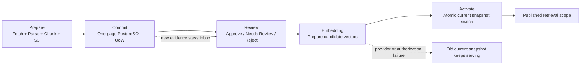
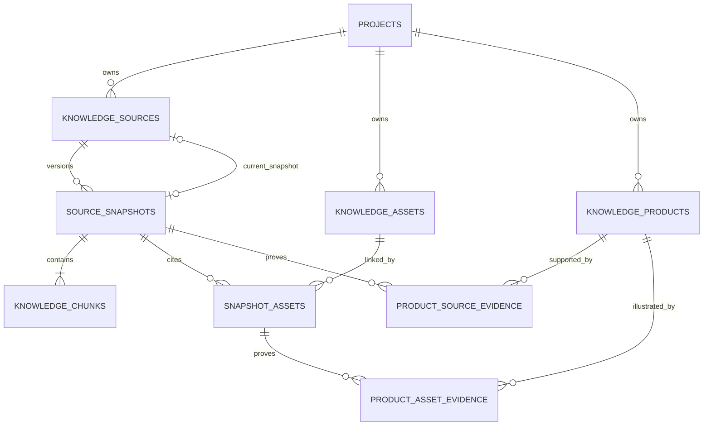

# M7 Server Web Evidence Ingestion：结构与接口痕迹

## 1. 目的与状态

本文记录官方网页证据进入 Server Knowledge Store 时的真实事务边界、Evidence Graph、
Local/Server 分流和后续重构接缝。它用于后期重构导航，不替代数据库约束、RBAC、对象
存储策略或发布 Runbook。

本切片的目标是把原来由多个 Repository 各自提交的网页关系记录收敛成一个
Project-scoped PostgreSQL Unit of Work，同时保持 M2 Local 行为和调用接口兼容。

这里的“原子入库”只指：**一个已分类网页的关系图和对应 Audit 在一个 PostgreSQL
事务中提交**。它不表示整个分类页抓取、整个 Research Attempt、S3 与 PostgreSQL，或
Embedding Provider 与 PostgreSQL 可以组成一个原子事务。

## 2. 五阶段状态机

正式发布链明确分为五个阶段，任一阶段都不能跳过或伪装成另一个阶段：

| 阶段 | 输入与主要工作 | 持久化结果 | 不负责 |
|---|---|---|---|
| Prepare | 下载同站页面、确定性分类、解析、分块、提取产品与图片证据，把 Raw/Normalized/Image 写入内容寻址对象存储 | `PreparedWebPageIngestion`（含独立 `normalized_content_hash`）和可能已经存在的 S3 对象 | 不写 PostgreSQL 关系记录，不改变发布状态 |
| Commit | 重新授权并锁定 Project/Source，把 Source、Snapshot、Chunk、Product、Asset 和 Evidence Link 一次提交 | 一张完整、可审阅的 Inbox Evidence Graph 和脱敏 Audit | 不批准来源，不生成向量，不切换 Current Snapshot |
| Review | 人工或受控自动门根据来源类型、信任层级和分类置信度作出 `approve / needs_review / reject` | 当前实现为 Source-scoped Review 状态和 Audit | 不调用 Embedding，不激活 Snapshot |
| Embedding | 对明确候选 Snapshot 的全部 Chunk 调用独立 Embedding Provider，校验模型、数量、维度、NaN 与零向量后写 Candidate Vector | 尚未服务的 Chunk Embedding | 不把外部调用伪装成数据库事务，不改变 Current Snapshot |
| Activate | 在事务中重新授权、锁定 Source、确认 Review、Snapshot、模型和全部向量匹配，再切换 Current Snapshot | `knowledge_sources.status=published`、精确 `current_snapshot_id` 和发布 Audit | 不重新抓取页面，不重新解释 Review |



阶段不变量：

- Prepare 或 Commit 成功不等于 Published；
- Review Approval 不授权尚未绑定的未来字节；
- Embedding 成功只产生 Candidate Vector；
- 只有 Activate 可以修改 `current_snapshot_id`；
- Embedding、撤权、Audit 或 Activate 失败时，旧 Current Snapshot 继续服务。

## 3. 真实原子边界

### 3.1 PostgreSQL 原子单位是一个页面

`PostgresServerWebEvidenceIngestion` 每次只提交一个 `PreparedWebPageIngestion`。这个事务
包含该页面直接产生的全部关系记录和 `knowledge.web_snapshot.ingested` Audit。

分类页同步可以先提交分类页，再逐个提交产品详情页；Research 可以逐个提交获批候选页。
因此后一个页面失败、撤权或取消时，前面已经提交的不可变页面仍然存在。它们停在 Inbox，
不会自动发布，也不会替换文章当前产品。

这不是半事务，而是有意选择的业务原子粒度：外部网络请求和多页面批处理无法安全地保持
一个长时间数据库事务。

### 3.2 S3 与 PostgreSQL 不原子

Prepare 在数据库事务外写入内容寻址对象。Commit 随后可能因为撤权、项目归档、精确重试
冲突、数据库约束或 Audit 故障而失败。此时允许留下尚未被 PostgreSQL 引用的对象，不能
把它描述成已提交 Evidence。

系统不实现 S3/PostgreSQL 分布式事务，也不在失败请求中立即删除对象。恢复策略见第 9 节。

### 3.3 Review、Embedding 与 Activate 不属于 Commit

Commit 只建立可审阅的 Evidence Graph。Review 是独立业务命令；Embedding 是外部调用；
Activate 是最终服务切换。把三者塞进网页入库事务会导致长事务、撤权竞态、Provider 重试
歧义，以及“旧审批授权新内容”的安全错误。

## 4. Evidence Graph

所有节点和边都带 `project_id`，Source、Snapshot、Chunk、Asset 和 Product Evidence 使用
复合外键保证不能跨项目拼接。



表与职责：

| 表 | 证据职责 |
|---|---|
| `knowledge_sources` | 稳定来源身份、Canonical URL、来源类型、信任层级、Review/发布状态和 Current Snapshot 指针 |
| `source_snapshots` | 按 Content Hash + Parser 身份保存不可变版本和 Raw/Normalized Artifact URI |
| `knowledge_chunks` | Snapshot 内的可检索正文单元；Embedding 在后续阶段补齐 |
| `knowledge_assets` | Project 内按 Content Hash 去重的私有对象身份 |
| `snapshot_assets` | 图片/附件在精确 Source Snapshot 中的位置、顺序与证据类型 |
| `knowledge_products` | 稳定产品候选身份；确认状态不能代替 Source Snapshot Evidence |
| `knowledge_product_source_evidence` | Product 到精确 Source Snapshot 的主详情或其他关系 |
| `knowledge_product_asset_evidence` | Product 到精确 Snapshot Asset 的图片角色与置信度 |

检索只读取 `published` Source 的 `current_snapshot_id`；Product Catalog 只投影当前 Published
Snapshot 的有效 Evidence。仅存在 Product 或 Asset 记录不足以进入正式目录。

## 5. Local façade 与 Server Unit of Work

### 5.1 共享接口

`knowledge_agent.web_ingestion.WebPageIngestion` 是 Product Sync 和 Research Adapter 共享的
窄接口，只暴露：

- `ingest_url(...)`
- `ingest_resource(...)`

调用方不根据 Local/Server 类型读取内部 Repository，也不直接决定事务方式。

`WebPagePreparation` 是 Server Unit of Work 依赖的另一个窄接口，只暴露
`prepare_url(...)` 和 `prepare_resource(...)`。事务提交器不依赖具体的
`OfficialWebPageIngestionService` 类型；以后替换 Parser Router、抓取器或页面准备实现时，
只要继续产生相同的 `PreparedWebPageIngestion`，无需改动授权、锁、Repository 或 Audit
提交逻辑。

### 5.2 Local façade

`OfficialWebPageIngestionService` 负责确定性的 Fetch、Classify、Parse、Chunk 和对象准备，
并提供：

- `prepare_url()` / `prepare_resource()`：无数据库副作用；
- `ingest_url()` / `ingest_resource()`：调用 Prepare 后通过 `_persist_prepared()` 保留 M2
  Local Repository 行为。

Local façade 可以继续使用现有便携式 Repository 和文件 ArtifactStore。它不获得 Server
Actor，不承担 Server RBAC、Audit 或单事务承诺。

### 5.3 Server Unit of Work

`PostgresServerWebEvidenceIngestion` 包装同一个 Prepare Service，但把关系写入改为：

```text
ServerWebEvidenceContext
  -> initial project authorization
  -> Prepare outside SQL
  -> lock authorization facts + active Project + Source identity
  -> validate exact retry and object scope
  -> commit complete Evidence Graph + redacted Audit
```

`ServerWebEvidenceContext` 是服务端从可信 Job/请求上下文创建的身份，包含 Actor、Project、
Operation、Target 和最小权限。它不能从 HTTP Body 反序列化，也不能接受客户端提交的
Organization、Role 或 Permission。

## 6. Server Commit 顺序

一个页面的提交顺序固定为：

1. 确认 Prepared Source 属于 Context Project；
2. 开启 PostgreSQL 事务；
3. 锁定 Actor 的可撤权 Project Access Facts，并重新判定 `knowledge.edit` 或
   `knowledge.publish`；
4. `FOR UPDATE` 锁定 Active Project；
5. 对 `(organization_id, project_id, source_id)` 获取 transaction advisory lock；
6. `FOR UPDATE` 读取同 Project/Source，复核 Canonical URL 不漂移；
7. 在锁内按 Content Hash + Parser Name + Parser Version 查询 Canonical Snapshot；
8. 应用第 8 节的精确重试/新版本门禁；
9. 用 Raw Hash、Normalized Hash 和各 Asset Hash 精确校验对象 Key，同时确认 URI 属于当前
   Bucket 与 `organizations/{organization}/projects/{project}` 前缀；
10. 依次写 Source、Snapshot、Chunks、Product、Product Source Evidence、Assets、
    Snapshot Asset Links 和 Product Asset Evidence；
11. 仅当关系图产生真实变化时追加脱敏 Audit；
12. 一次提交或一次回滚。

Asset 按 Project + Content Hash 去重后，必须重新验证数据库返回的 Artifact URI 仍属于
当前 Organization/Project。不能因为 Hash 相同就复用其他 Bucket 或其他租户对象。

## 7. 权限、锁与 Audit 白名单

### 7.1 权限

- Product Rediscovery 写 Inbox Evidence 使用 `knowledge.edit`；
- Research Resume 可能自动 Review/Publish，当前保守使用 `knowledge.publish`；
- Prepare 前的快速授权避免已撤权 Actor 继续消耗网络与对象存储；
- `CheckpointingOfficialSiteFetcher` 在每次页面/图片请求前后执行可信 Checkpoint；
- `ScopedS3ArtifactStore` 在每次对象 Put 前后执行同一 Checkpoint；Put 后撤权会留下
  内容寻址 Orphan，但不会继续提交 PostgreSQL Evidence；
- Commit 事务内的锁定授权才是最终准源；
- Review、Publish/Activate 仍在各自命令事务中重新授权。

Job Claim 与 Handler 前授权不能被本 Unit of Work 取代。它负责的是“正在提交这个页面时”
的最终权限事实。

### 7.2 锁

- Access Facts Lock：消除 check-then-revoke 窗口；
- Active Project Row Lock：归档后 fail closed；
- Source Advisory Lock：序列化同一 Source 的并发新建、重试和刷新；
- Source Row Lock：保护 Canonical URL、状态和 Current Snapshot 身份；
- 数据库复合 FK/Unique/CHECK：作为最后一道租户和不可变证据约束。

不得用进程锁代替这些数据库锁，也不得先读全量数据再在 Python 中过滤 Project。

### 7.3 Audit 白名单

首次关系图使用 `knowledge.web_snapshot.ingested`；已有 canonical Snapshot 的受控补全使用
`knowledge.web_snapshot.reconciled`，避免复用首次 Audit ID 使修复事务回滚。两种事件都只允许
记录：

- `operation`
- `context_type`
- `context_id`
- `source_kind`
- `page_type`
- `chunk_count`
- `asset_count`
- `product_evidence_count`
- `warning_count`

Audit 不得包含 Canonical/Source/Image URL、页面正文、Content Hash、Bucket、Object Key、
Artifact URI、分类 Reason、Provider Error、Requester 私有 Job Request 或 Secret。Audit 写入
失败时整个 PostgreSQL Evidence Graph 回滚。

## 8. Exact Retry 与当前 Source 刷新限制

### 8.1 Exact Retry

Source ID 由 Canonical URL 稳定派生；Snapshot 的内容身份为：

```text
project_id + source_id + content_hash + parser_name + parser_version
```

在 Source Lock 内，如果数据库已经存在完全相同的内容身份，Server Unit of Work 使用该
Canonical Snapshot，并同步修正 Prepared Chunk、Source Evidence、Snapshot Asset 和 Asset
Evidence 的 Snapshot ID。随后每一条不可变记录都必须与已存记录完全一致。

完全相同的重试：

- 返回同一 Source/Snapshot/Evidence Graph；
- 不创建第二份关系记录；
- 不追加第二条成功 Audit；
- 内容寻址 S3 Put 可以安全重复；
- 任一不可变字段不同都返回 Conflict，而不是覆盖历史。

若 canonical Snapshot 来自旧的逐步提交路径并缺少可安全补全的下游关系，补全会作为
`knowledge.web_snapshot.reconciled` 单独审计；它不复用首次 Ingest Audit ID。Product Upsert
只有聚合字段发生真实变化才更新 `updated_at` 并进入 `changed`，完全 no-op 的 retry 不产生
隐蔽写入。返回值中的 Source/Product 从事务内数据库聚合行重读，因此 Published/Confirmed
状态不会被 Prepared Inbox 对象伪装覆盖。

上述自动补全只允许尚未发布的 Inbox/Review 图。Published Source 的 canonical Snapshot
只能做完全 no-op 验证；一旦 retry 试图增加或修复 Product/Asset/Evidence 关系，事务返回
`published web evidence requires explicit reconciliation`，避免未绑定图片字节或旧 Source
Approval 在发布后获得新事实。

### 8.2 当前限制：同一 Source 不接受新字节版本

当前 Review 记录保存在 `knowledge_sources.metadata`，是 Source-scoped，不是
Snapshot-scoped。为了防止旧 Snapshot 的 Approval 自动授权新网页字节，Server Commit
当前只允许：

1. 新建一个从未有 Snapshot 的 Source；或
2. 对已有 Source 提交完全相同 Content Hash + Parser 身份的精确重试。

只要同一 Source 已存在 Snapshot，而本次没有匹配到完全相同的 Canonical Snapshot，提交
就返回 `web source refresh requires snapshot-bound review` Conflict。即使 Source 尚未发布，
也不在当前模型中静默追加第二个待审 Snapshot。

这项限制比底层 M1 多 Snapshot 能力更严格，是当前 Review 数据模型的安全门，不应通过
放宽 Upsert 或沿用旧 Source Metadata 绕过。

## 9. 对象 Orphan

Prepare 已经写入的 Raw、Normalized 或图片对象可能因为以下原因变成 Orphan：

- Prepare 后撤权；
- Project 被归档；
- Source/Exact Retry 冲突；
- PostgreSQL FK/Unique/CHECK 冲突；
- Audit 故障；
- 进程在 Commit 前终止。

处理规则：

- 对象 Key 必须内容寻址并带 Organization/Project 前缀；
- 请求失败路径不即时删除对象，避免并发重试正在复用同一内容；
- PostgreSQL 没有引用的对象不进入公开下载、Catalog 或 Retriever；
- 使用已有双观察、保留窗口、清理前重算和显式 Project 确认的 Reconciler 延迟清理；
- Orphan 数量可以进入运维指标，但输出不得包含 Bucket、Key、URI 或客户内容。

## 10. Product 与 Research 的共享接缝

两条链只共用“一个官方页面的 Prepare + Server Commit”边界：

```text
Product Rediscovery
  -> WordPress Probe / Category Discovery / bounded product loop
  -> shared WebPageIngestion
  -> Inbox Product Evidence

Knowledge Research
  -> Candidate/Attempt validation / human approval
  -> shared WebPageIngestion
  -> classification gate
  -> Review -> Embedding -> Activate
```

应共用：

- `WebPageIngestion` 协议；
- Fetch/Classify/Parse/Chunk 与内容寻址对象 Prepare；
- Project-scoped 对象校验；
- 每页面 PostgreSQL Unit of Work；
- Exact Retry、Conflict 映射和脱敏 Ingestion Audit。

不能共用：

- Product Category Probe、链接发现、最大产品数和逐产品警告；
- Research Candidate ID、Gap Attempt、Thread/Checkpoint 和 Resume 身份；
- Research 的置信度门、人工 Review、Embedding 与 Activate；
- 两种 Operation 的权限和 Job Audit；
- 整批取消/恢复语义。

当前 `create_product_sync_factory()` 和 `ServerCandidateIngestionAdapter.ingest()` 分别装配
自己的 Fetcher、Prepare Service 与 `PostgresServerWebEvidenceIngestion`，但二者使用同一组
窄协议和同一个 Server Unit of Work；没有复制 Commit SQL。后续可把这段重复装配收敛为共享
工厂，由工厂创建绑定可信 `ServerWebEvidenceContext` 的 `WebPageIngestion`。该重构不能让
Product 调用 Research Adapter，也不能让 Research 调用完整的 WordPress Product Sync。

取消仍是调用方 Job 生命周期的一部分：Product 与 Research 都把可信 Job Cancel Callback
传到每次页面/图片 Fetch、对象 Put 和页面 Commit；Research 在 Review 与 Publish 前再次检查。
相同边界还会重新授权。Server Unit of Work 只承诺页面级提交。若取消发生在页面 Commit
之后，该页面的不可变 Inbox Evidence 保留；若发生在 Review/Publish 或下一页面之前，不再
开始对应下游动作。

Research Execution 把 `JobCancelled` 配置为显式 passthrough exception：不写 `failed` Run，
而是把 PostgreSQL Run 投影恢复到本次执行前的 `queued/running/waiting_for_review` 状态，并在
同一事务追加 `interrupted` Event，再让 Batch Runner 执行其受控 interrupted/requeue 语义。
普通 Provider/Graph 异常仍走脱敏 `failed` 路径，二者不能合并。

## 11. 未来 Snapshot-bound Review Receipt

解除“一个 Source 只能新建或精确重试”限制前，必须先增加不可变 Snapshot Review Receipt。
推荐语义：

- Receipt 身份至少包含 `project_id + source_id + snapshot_id`；
- 保存 Decision、Source Kind、Trust Tier、Reviewer、时间和安全 Reason 摘要；
- Receipt append-only，修改裁决产生新 Version/Event，不覆盖历史；
- Publish 必须读取目标 Snapshot 的有效 `approve` Receipt，不能读取 Source 的旧 Approval；
- 新 Snapshot 可以作为 Pending/Needs Review 与旧 Published Current Snapshot 并存；
- Embedding 只针对目标 Snapshot；Activate 再次确认 Receipt、向量模型和目标 Snapshot；
- Rejected/Needs Review 新 Snapshot 不影响旧 Current Snapshot 服务；
- Source 级展示状态可以是 Receipt 的投影，但不能继续作为授权准源。

完成该模型后，刷新流程才可以变为：

```text
existing Source
  -> append immutable Snapshot
  -> create Snapshot Review Receipt
  -> review exact Snapshot
  -> embed exact Snapshot
  -> atomically activate exact Snapshot
```

## 12. Research ContextVar 后续重构方向

当前 Server Research 使用 `_ACTIVE_RESEARCH_EXECUTION` ContextVar，把 Handler 从私有 Job
恢复的 Actor 与 Cancel Callback 暂时传给 Graph 内的 Candidate Ingestion Adapter。Fetcher、
Object Put、页面 Commit、Review 和 Publish 都复用该 Callback。它避免把 Actor/取消函数写入
Graph State，但仍是进程上下文隐式依赖。

后续应使用显式上下文：

```text
ResearchExecutionContext
  = Actor + Organization + Project + Job ID + Task ID
    + Source Revision + Operation + cancellation checkpoint
```

推荐接缝：

1. Handler 从可信 PostgreSQL Job 创建 `ResearchExecutionContext`；
2. 用它创建 per-execution Candidate Ingestion 和 Server Web Evidence UoW；
3. `ResearchGraphSessionFactory.open()` 接受本次 Execution 的 Ingestion Override；
4. Graph 内部继续只依赖 `CandidateIngestionPort`，不把 Actor、Role、Secret 或私有 Job
   Request 写入 LangGraph State/Checkpoint；
5. 并发 Job 不共享可变 Actor Context，测试可以显式注入撤权和取消检查点。

替换 ContextVar 时必须保留 Claim 前、Handler 前、每候选抓取前、Commit 事务内以及最终
Review/Publish 的分层授权，不能因为上下文变显式而减少授权次数。

## 13. 重构不变量清单

1. Prepare 是否仍不写 PostgreSQL？
2. Server Commit 是否仍只以单页面为事务单位？
3. S3 与 PostgreSQL 是否仍明确允许可对账 Orphan，而没有伪分布式事务？
4. Source/Snapshot/Chunk/Product/Asset/Evidence/Audit 是否仍在同一页面事务提交？
5. Product 和 Research 是否只共用 Web Evidence 接缝，而不混合各自状态机？
6. Local 是否仍通过 façade 保留原行为，Server 是否没有回退 Local Repository/File？
7. Prepare 前和 Commit 内是否都重新检查权限，Commit 内是否锁定可撤权事实？
8. Source Advisory Lock 是否仍包含 Organization、Project 与 Source Identity？
9. 去重对象是否仍复核 Bucket、Organization、Project 和 Content Hash？
10. Exact Retry 是否仍验证完整不可变记录且不重复 Audit？
11. Snapshot-bound Review 上线前，新的同 Source 字节是否仍 fail closed？
12. Review、Embedding、Activate 是否仍是三个独立阶段？
13. Embedding 或 Activate 失败时，旧 Current Snapshot 是否仍继续服务？
14. Audit 是否仍只包含白名单计数和稳定 ID，不包含 URL、Hash、URI、正文或 Secret？
15. ContextVar 被替换后，Actor 是否仍不进入 Graph State/Checkpoint？
16. Job 取消或停机是否只阻止后续页面，不删除已经提交的不可变 Inbox Evidence？
