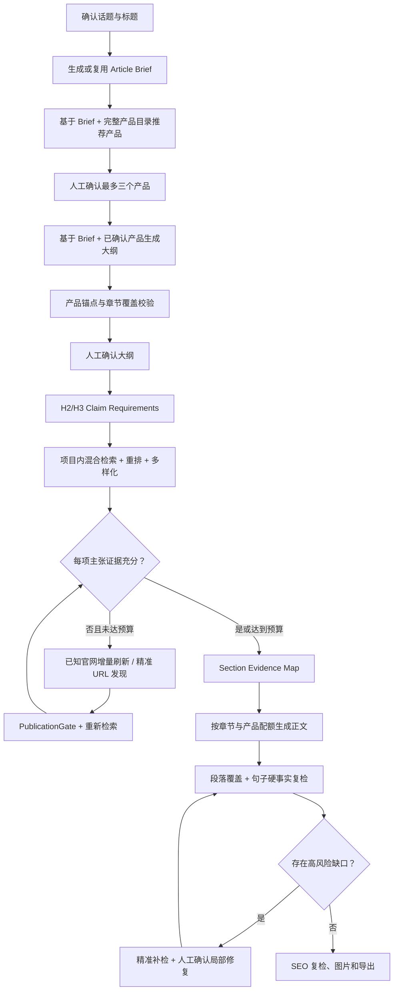

# Article Agent 知识利用与产品推荐工作流 V2 实施方案

> 状态：待实施
> 文档用途：后续开启 Codex 目标模式时的唯一实施入口
> 目标基线：实施前先获取并基于最新 `origin/main` 创建全新、干净、永久 Worktree
> 编写日期：2026-08-21
> 范围：Server-only；知识检索、产品推荐、大纲研究、正文证据路由、知识复检闭环

## 0. 目标模式启动指令

后续开启目标模式时，使用以下目标：

> 按 `D:\Project\article\article-agent-formal\docs\article-knowledge-product-flow-v2-plan.md` 实施 Article Agent 知识利用与产品推荐工作流 V2。先获取最新 `origin/main`，创建新的永久 Worktree 和 `codex/` 分支；不要在当前迁移修复分支或带有未提交覆盖率改动的 Worktree 上开发。严格按 Milestone 顺序执行，每完成一个 Milestone 就更新本文的实施台账并运行该阶段验收；未达到验收标准不得进入下一阶段。最终完成后执行后端全量测试、前端 lint/build、真实 PostgreSQL 集成验证和固定文章样本回归。未经明确授权，不合并、Push 或部署。

目标模式开始后第一轮必须完成：

1. `git fetch origin`。
2. 核对 `origin/main` 当前提交。
3. 审计现有 Worktree、分支和未提交改动。
4. 从最新 `origin/main` 创建新的永久 Worktree 与 `codex/knowledge-product-flow-v2` 分支。
5. 在新 Worktree 中重新核对本文列出的代码现状，记录与基线之间的漂移。
6. 更新本文“实施台账”，然后才开始修改业务代码。

## 1. 总目标

把当前以“标题相关片段 + 大纲后 Evidence Pack”为主的流程，升级为共享同一证据地图的闭环：

1. 知识在大纲前决定“文章应该写什么”。
2. 产品推荐依据采购意图、项目规则、产品事实和证据完备度，而不主要依赖标题字面。
3. 知识在大纲后决定“每个 H2/H3 凭什么写”。
4. 正文生成按章节和产品路由证据，不能把所有 Evidence Pack 压缩成全局少量 Chunk。
5. 正文完成后只针对高风险缺口精准补检和局部修复，不全量重扫官网。
6. 检索、产品推荐、人工确认、大纲版本、正文版本、EvidenceLink 和修复动作全部可追踪、可重放、可审计。

## 2. 当前问题结论

### 2.1 大纲前知识利用过于宽泛

当前标题和大纲生成使用话题、标题、主关键词进行 PostgreSQL 全文检索，最多读取少量原始 Chunk。它没有：

- 按采购意图拆解查询；
- 使用混合检索和重排；
- 生成结构化事实清单；
- 标记知识库不能支持的方向；
- 把本次检索结果作为产品推荐和大纲生成的共享上下文。

### 2.2 产品推荐不是只看标题，但仍接近标题驱动

当前产品推荐实际读取：

- `task.topic`；
- `task.selected_title`；
- 主关键词；
- 项目注意事项；
- 全部 Confirmed、Published、Current、Primary Detail 产品投影；
- 每个产品的名称、分类、简述和最多三条关键事实。

当前没有读取或利用：

- `topic_notes`；
- 文章采购意图与目标买家；
- 大纲前检索到的项目知识；
- 产品证据强度、硬事实完备度和可用图片状态；
- 每个产品在文章中的角色和建议章节；
- 推荐完成后大纲是否真正覆盖全部已选产品。

### 2.3 大纲后检索粒度和充分性判断不足

当前 RetrievalPlan 主要按 H2 和产品建立 Scope：

- H2 查询主要由 `topic + H2 title` 和 `H2 title` 组成；
- 没有把 H3 和章节准备表达的主张转成检索需求；
- 产品 Scope 主要依赖名称和 Canonical URL，没有充分使用既有 `product_ids` 过滤能力；
- Evidence Pack 的首版充分性主要依据命中数、来源数和是否存在 Hard Fact；
- 两个数量足够但语义覆盖不完整的 Chunk 也可能被判为 `sufficient`；
- Gap Fill 收到的原因偏向“命中数不足”等通用描述，不是明确缺失的业务事实。

### 2.4 检索成果在正文生成前被大量丢弃

当前大纲研究可以为多个 H2、FAQ 和产品产生多个 Evidence Pack，但正文生成会把它们合并并压缩为全局最多少量非博客 Chunk。

当文章包含五个 H2、FAQ 和二至三个产品时，后面的产品 Scope 很可能没有任何证据进入正文 Prompt。这是当前知识利用率偏低和产品锚点缺失的最高优先级原因。

### 2.5 复检只发现问题，没有形成修复闭环

当前知识覆盖复检能够判断句子是否被 Evidence Pack 支撑，但它不会自动区分：

- 应删除的空泛营销句；
- 可以通过现有知识库精准补检的事实；
- 需要官网按需补抓的缺失资料；
- 根本没有依据、必须弱化或删除的硬事实。

## 3. 目标工作流



## 4. 必须保持的不变量

### 4.1 Server 与多租户边界

- PostgreSQL 继续作为 Task、Job、Prompt、Audit、Knowledge Metadata 的唯一准源。
- 所有读写必须绑定 Organization、Project、User、Role 和当前授权会话。
- Worker 在 Claim、执行和提交时继续重新授权。
- Task 更新继续使用 Revision/CAS；冲突必须向用户展示，不能静默覆盖。
- 数据库结构只能由 Alembic 迁移，应用启动不能改表。
- 不恢复 SQLite、Local Mode、旧无项目作用域 API 或双写兼容层。

### 4.2 知识与证据边界

- 只检索当前 Project 中 `published` 且属于 Source 当前 Snapshot 的 Chunk。
- 官方博客只可作为正文写作参考，不能进入 Evidence Pack、Hard Fact、产品证明或事实裁决。
- Tavily 只发现同一客户官网 URL；搜索结果摘要不能直接作为证据。
- Product Recommendation 只使用 Confirmed、Published、Current、Primary Detail 产品投影。
- AI 产品推荐继续只是建议；`PUT .../products` 的人工提交才是正式选择。
- 无证据硬事实必须省略、弱化或由人工补充资料，不能由模型猜测。

### 4.3 写作与产物边界

- 所有知识库、产品官网和详情页中的可用事实直接陈述，禁止元叙事。
- 文章中的 `img` 索引标签块必须原样保留。
- 最多三个确认产品、最多三张不同图片。
- ZeroGPT 继续人工操作；本方案不自动访问或伪造 AI 率结果。
- 知识段落覆盖率不能替代硬事实句子级验证。

## 5. 核心数据契约

### 5.1 ArticleBrief

新增服务器生成、可复用、可失效的 `ArticleBrief`：

```json
{
  "brief_id": "brief_...",
  "task_id": "tsk_...",
  "title_hash": "...",
  "input_hash": "...",
  "knowledge_snapshot_fingerprint": "...",
  "article_intent": "...",
  "target_buyers": ["..."],
  "buyer_problems": ["..."],
  "required_capabilities": ["..."],
  "selection_dimensions": ["..."],
  "recommended_product_roles": ["primary_solution", "alternative", "specialized"],
  "available_facts": [
    {"fact": "...", "chunk_ids": ["..."]}
  ],
  "missing_evidence": ["..."],
  "context_chunk_ids": ["..."],
  "created_at": "..."
}
```

要求：

- `input_hash` 至少覆盖话题、标题、主关键词、项目介绍、项目注意事项和本话题注意事项。
- `knowledge_snapshot_fingerprint` 覆盖本次使用的 Source Current Snapshot 身份。
- 标题、话题或适用写作要求变化时失效。
- 只允许 Server 生成，客户端不能提交 Brief 正文或 Chunk ID。
- Product Recommendation 和 Outline Generation 必须固定同一 Brief ID/Hash。
- 第一版优先存入 Task JSONB 的强类型字段，避免为单一任务中间态新增独立准源；若真实数据量证明不适合，再单独迁表。

### 5.2 ProductCandidateDetail

扩展产品候选的内部结构：

```json
{
  "product_id": "...",
  "reason": "...",
  "article_role": "primary_solution",
  "suggested_section": "...",
  "evidence_status": "ready",
  "evidence_summary": {
    "reference_fact_count": 5,
    "hard_fact_available": true,
    "published_asset_count": 3
  }
}
```

要求：

- `reason` 与 `article_role` 可由模型产生，但必须使用允许的 Product ID。
- `evidence_status` 和数量由服务器根据当前证据确定，不能信任模型输出。
- 仍保留现有 `product_candidate_ids` 和 `product_candidate_reasons` 的兼容读取期。
- 正式产品仍只由人工提交生成，推荐 Job 不得修改 `task.products`。

### 5.3 ClaimRequirement

每个 H2 Scope 必须包含 H3 和主张需求：

```json
{
  "requirement_id": "req_...",
  "scope_id": "scope_...",
  "h2_title": "...",
  "h3_title": "...",
  "claim_type": "selection_logic",
  "query_variants": ["..."],
  "required_product_ids": ["..."],
  "require_hard_fact": false,
  "minimum_support": 1
}
```

证据充分性必须从“Scope 命中数量”升级为：

- 必填 Requirement 是否均有支持；
- 需要 Hard Fact 的 Requirement 是否命中 Hard Fact Source；
- 需要指定产品的 Requirement 是否命中该 Product ID 的当前证据；
- 是否存在重复模板 Chunk 冒充多个独立证据；
- 是否达到来源和章节多样化要求。

### 5.4 SectionEvidenceMap

正文生成不再接收无结构的全局 Top-K，而接收：

```json
{
  "global_context": ["chunk-id"],
  "sections": [
    {
      "scope_id": "scope-01",
      "h2": "...",
      "requirements": ["req-01", "req-02"],
      "chunk_ids": ["..."],
      "product_ids": ["..."]
    }
  ],
  "product_facts": {
    "product-id": ["chunk-id"]
  },
  "warnings": []
}
```

## 6. Milestone 实施计划

### M0：基线、固定样本与新 Worktree

目标：建立可比较的真实基线，防止只凭主观判断修改检索。

任务：

- 从最新 `origin/main` 创建干净 Worktree。
- 保存当前后端测试、前端 lint/build、数据库迁移头和生产能力清单。
- 固定至少十篇已导出文章，覆盖 BJY、JADDUO、YEHUI、SORO 等项目。
- 为样本保存：确认产品、大纲、Evidence Pack、传入正文的 Chunk、最终 EvidenceLink 和覆盖率。
- 建立“召回 -> Evidence Pack -> 进入 Prompt -> 正文使用”的漏斗报告。
- 为每个样本标记至少一组人工确认的相关 Source/Chunk，供 Recall@K、MRR 和最终使用率评测。

验收：

- 基线数据可重复生成且不修改真实文章。
- 能明确区分“检索没找到”“Evidence Pack 没选中”“Prompt 没传入”“模型没使用”。
- 项目隔离、博客排除和当前 Snapshot 校验均有测试。

### M1：共享 Article Brief

目标：把现有大纲前宽泛检索提前到标题确认后，并让产品推荐与大纲共用。

任务：

- 新增 `ArticleBrief` 强类型模型和失效规则。
- 新增 `ServerArticleBriefService`，使用标题、话题、主关键词、项目介绍、项目注意事项和本话题注意事项。
- 将一次宽泛查询拆成多个意图查询：定义/场景、目标买家、采购痛点、选型维度、风险、项目能力和可用产品方向。
- 使用现有 Basic Hybrid Retriever，不再只用全文搜索。
- 对结果去重并保证来源/Heading 多样化。
- 由 LLM 将检索结果压缩为结构化 Brief；Chunk ID 由服务器验证并固定。
- Product Recommendation 和 Outline Generation 都必须加载或生成当前 Brief。
- 用户手动跳过 AI 标题、手动选择产品时仍可生成 Brief。

UX 决策：

- 不增加一个强制独立页面。
- 用户点击“推荐产品”时自动先确保 Brief 当前有效。
- 用户跳过 AI 推荐时，生成大纲前自动确保 Brief 当前有效。
- 工作台只显示一个可折叠的“文章意图与资料简报”卡片。

验收：

- 同一输入与同一 Snapshot Fingerprint 复用同一 Brief，不重复调用模型。
- 标题或 Topic Notes 修改后旧 Brief 明确失效。
- Brief 中每条 `available_fact` 的 Chunk 均属于当前项目、已发布当前快照，且不是官方博客。

### M2：产品推荐 V2

目标：产品推荐由“标题相关”升级为“采购意图 + 产品适配 + 证据可写性”。

任务：

- 产品 Prompt 加入 Article Brief 和 `topic_notes`。
- 保留完整 Confirmed 产品池，不用硬 Top-K 排除产品。
- 所有产品提供紧凑卡片；高相关候选可以提供更丰富的事实，但任何产品仍可被选择。
- 服务器计算每个产品的证据状态：Primary Detail、Reference Facts、Hard Fact、公开产品页、可用图片数量。
- 模型从一至三个产品中分配角色：`primary_solution`、`alternative`、`specialized`。
- 增加产品多样性规则：除非文章明确比较同系列型号，否则不要推荐三个没有文章角色差异的产品。
- 推荐结果自动勾选，但继续要求用户显式保存。
- 推荐理由直接说明适配性，禁止提及资料、知识库、官网页面或推荐过程。

兼容策略：

- 第一阶段保留现有接口 Path、Job Operation 和人工 `PUT .../products` 契约。
- 新字段以兼容扩展方式加入 Task DTO；旧 Task 没有详情时继续展示 ID 与旧理由。
- Provider 非法输出继续 Fail Closed，不能自动回退到随机或旧候选。

验收：

- 推荐 Prompt 同时包含 Title、Topic、Project Notes、Topic Notes 和当前 Brief。
- 推荐 Product ID 只能来自本 Job 固定的完整允许集合。
- 推荐失败不修改正式产品、Workflow Status 或下游产物。
- 每个推荐显示理由、文章角色和证据状态。
- 三产品样本中角色不重复堆叠；一个产品确实更合适时允许只推荐一个。

### M3：大纲产品覆盖与 Claim-aware RetrievalPlan

目标：确保全部确认产品进入大纲，并让检索覆盖具体 H3 主张。

任务：

- Outline Prompt 接收 Article Brief 和 ProductCandidateDetail/正式 Product Snapshot。
- 每个确认产品必须至少映射到一个自然的 H2/H3；不得为了植入产品破坏主题结构。
- 大纲生成后执行确定性校验：产品名称、产品 URL、建议章节和产品数量必须完整。
- 校验失败时返回结构化错误或大纲修复建议，不静默丢失第二/第三产品。
- RetrievalPlan 解析 H2 及其 H3，而不只读取 H2 标题。
- 每个 H3 生成 ClaimRequirement 和查询变体。
- 产品 Scope 使用 `product_ids` 作为主绑定；Canonical URL 只作为优先条件或附加过滤，不作为唯一事实范围。
- Product ID、Outline Hash、Brief Hash 和 Product Selection Hash 全部进入 Plan Identity。
- 产品或大纲变化后旧 Plan/Evidence Pack 明确失效，新 Plan 可以覆盖旧 Plan 作为当前版本，但保留历史审计。

验收：

- 选择两个或三个产品时，大纲中每个产品都有独立可定位锚点。
- 每个非 FAQ H2 至少关联其 H3 Claim Requirements。
- 产品手册、私有资料或案例中的产品事实可通过 Product ID 被召回，不受产品详情页 URL 限制。

### M4：检索质量、重排与证据充分性

目标：从“相关片段数量够了”升级为“准备写的主张都有依据”。

任务：

- 保留 PostgreSQL FTS + pgvector + RRF 基础方案。
- 接入真实可选 Reranker：只重排已经通过 Project/Publication/Snapshot 门禁的候选。
- 默认流程：向量候选 + FTS 候选 -> RRF -> Rerank -> 来源/Heading/产品多样化 -> Scope Top-K。
- 按 Scope 类型调整权重：
  - 产品型号、规格、认证偏向精确词和 Hard Fact；
  - 选型逻辑、应用场景偏向语义检索；
  - FAQ 只补充真正需要项目事实的部分。
- Evidence Pack 记录每个 ClaimRequirement 的 `supported/weak/missing`。
- Gap Reason 必须描述缺失事实，例如“缺少产品 A 的闭合尺寸”，不能只写“命中数不足”。
- Tavily 查询使用 Scope、产品名和缺失事实，只发现客户官网 URL。
- 相同 Project Snapshot Fingerprint、Query、Filters、Embedding Model 的检索结果可缓存复用。

低优先级入库改进，只有固定评测证明需要时实施：

- 为检索构造 `文档标题 + Heading Path + 产品名/分类 + Chunk Text` 的上下文化搜索文本。
- 小 Chunk 负责命中，命中后加载父章节作为写作上下文。
- 对表格、参数、尺寸、认证、材料和应用提取结构化字段。
- 对官网模板、导航和重复产品文案进行近重复去重。
- 任何 Embedding 文本变化都必须有版本化 Profile 和受控重嵌入方案，不能悄悄混用旧向量。

验收：

- Reranker 不能注入未知 Chunk。
- 充分性报告能够指出具体缺失 Requirement。
- 固定评测集的 Recall@K/MRR 不低于基线，且 Claim Coverage 显著改善。
- 官方博客始终无法进入 Evidence Pack。

### M5：Section Evidence Router 与正文生成

目标：让研究成果真正进入对应正文，先解决全局少量 Chunk 截断。

任务：

- 新增 `SectionEvidenceRouter`，从全部当前 Evidence Pack 构建 SectionEvidenceMap。
- 取消“所有 Pack 合并后全局只取少量 Chunk”的策略。
- 为每个实质 H2 分配至少一个高质量证据位置；为每个确认产品至少分配一个产品事实位置。
- 使用字符/Token 总预算动态裁剪，而不是固定全局 Chunk 数。
- 同一 Chunk 可以跨 Scope 复用缓存，但每个 Scope 保留独立关联和解释。
- 正文 Prompt 按 H2 展示相应事实，不让模型自行猜测 Chunk 属于哪个章节。
- 官方博客继续作为单独的 `reference_material`，不能混入 Evidence Map。
- 一次性全文生成作为第一版；只有固定样本仍无法达到验收时，才升级为“逐 H2 生成 + 全文连贯性整合”，避免提前扩大复杂度。

验收：

- 所有确认产品对应的事实均进入 Prompt，并在正文中有自然锚点。
- 五个 H2 + 三个产品的样本不因全局截断丢失后部 Scope。
- Prompt 中每个事实保留 Chunk ID 供后续 EvidenceLink 对齐，但正文禁止输出该 ID 或来源元叙事。
- `img` 索引标签块原样保留。

### M6：知识覆盖复检与精准修复闭环

目标：把复检结果变成受控的修复动作，而不是只显示低百分比。

任务：

- 继续以段落覆盖率作为运营主指标，以句子级 Hard Fact Coverage 作为硬门禁。
- 将不受支持句子分类为：
  - `generic_marketing`：删除或收紧；
  - `retrieval_gap`：当前知识库可能存在，重新检索；
  - `source_gap`：精准发现/补抓官网资料；
  - `unsupported_hard_fact`：必须删除、弱化或等待人工资料；
  - `acceptable_general_reasoning`：真实通用逻辑，不强制伪造证据。
- 只对 `retrieval_gap` 和 `source_gap` 触发精准检索。
- 生成 `EvidenceGap` 时固定 Article Revision、Paragraph/Sentence Hash、Claim 和当前 Evidence Pack 身份。
- 修复先生成建议 Diff，由用户确认后使用 CAS 提交。
- 修复时保持标题、大纲、已确认产品、产品锚文本、链接、图片标签和总体词数基本稳定。
- 修复后重新计算当前版本覆盖率；旧 EvidenceLink 不能沿用到新 Hash。

验收：

- 所有数字、单位、认证、标准、产品规格和明确性能主张达到 100% 有效 Hard Fact Coverage，否则阻止“证据通过”状态。
- 段落覆盖率只表示段落使用了项目知识，不宣称整段全部被证明。
- 精准补检不会触发整站扫描。
- 用户拒绝修复时文章保持原样并保留审计记录。

### M7：前端、可观察性、评测和灰度上线

目标：运营人员能理解推荐、证据和缺口，同时保证多人使用与上线安全。

前端：

- 标题确认后显示可折叠 Article Brief 卡片。
- 产品推荐卡显示：推荐理由、文章角色、证据状态和建议章节。
- AI 推荐继续自动勾选，但必须进入产品子页面显式保存。
- 大纲页显示产品覆盖校验；缺少锚点时不能误导用户继续。
- 研究页按 H2/H3 Requirement 展示 `supported/weak/missing`。
- 知识详情页继续按句子标绿并提供证据链接；段落比例只作摘要。
- 修复页显示原句、缺口类型、候选证据和建议改写，支持逐项接受。

可观察性：

- 记录检索候选数、RRF 排名、Reranker 分数、最终 Evidence Pack、进入 Prompt 的 Chunk 和最终 EvidenceLink。
- 记录每个产品是否经历“推荐 -> 确认 -> 大纲锚点 -> Evidence -> 正文出现 -> 图片锚点”。
- 记录 Gap Fill 查询、发现 URL、PublicationGate 结果和是否补齐 Requirement。
- 不记录密钥、完整私有 Prompt、跨项目正文或未经授权的对象地址。

灰度：

- 使用服务器 Feature Flag 和项目白名单先对一个测试项目启用。
- 保留 V1 只读回归对照，但不新增双写准源。
- 数据迁移由 Alembic 显式执行；若仅扩展 Task JSONB，则仍需兼容旧 Payload 测试。
- 通过固定文章样本后，再扩大到 BJY、JADDUO、YEHUI、SORO。
- Git Push、GitHub Actions 和生产部署分别验证并分别报告。

验收：

- 多用户同时处理不同 Project 时没有候选、Brief、Plan、Evidence 或模型设置串扰。
- 固定样本全部完成标题/产品/大纲/研究/正文/复检流程。
- 前端 lint/build、后端全量测试和真实 PostgreSQL 集成测试通过。

## 7. 主要代码改动地图

目标模式启动时必须按最新 `origin/main` 重新核对，以下为当前预计位置：

| 能力 | 主要位置 |
|---|---|
| Article Brief 模型与失效 | `backend/models.py`、`backend/services/server_task_commands.py` |
| Article Brief 服务与 Job | 新建 `backend/services/server_article_brief.py`，接入 `backend/app.py`、`backend/server_project_http.py` |
| 产品候选上下文与 Prompt | `backend/services/server_product_generation.py`、`backend/prompts/products.txt` |
| 人工产品提交 | `backend/services/server_product_selection.py`、`backend/server_project_http.py` |
| 大纲知识上下文 | `backend/services/server_outline_generation.py`、`backend/prompts/outline.txt` |
| RetrievalPlan | `backend/knowledge_agent/retrieval_plan_generation.py`、`backend/knowledge_agent/contracts.py` |
| 混合检索与 Reranker | `backend/knowledge_agent/hybrid_retriever.py`、`backend/services/server_knowledge_research.py` |
| Evidence Pack 充分性 | `backend/knowledge_agent/evidence.py`、`backend/knowledge_agent/scope_evidence.py` |
| LangGraph Gap Fill | `backend/knowledge_agent/research_graph.py`、`backend/knowledge_agent/research_adapters.py` |
| 正文证据路由 | `backend/services/server_article_generation.py` |
| 知识覆盖与修复 | `backend/services/server_knowledge_coverage.py`、新建受控修复服务 |
| 前端工作台 | `frontend/src/components/server-article-workbench.tsx` 及拆分后的 Brief/Product/Evidence 组件 |
| 前端 API/类型 | `frontend/src/lib/api.ts`、`frontend/src/types.ts` |
| 数据迁移 | `backend/migrations/versions/`，仅在确有结构变更时新增 |

## 8. 测试矩阵

### 8.1 单元测试

- Article Brief 输入 Hash、Snapshot Fingerprint、失效和复用。
- Product Prompt 包含 Topic Notes 与 Brief，且不泄露内部来源叙述。
- Provider 输出未知/重复 Product ID、非法角色、超量结果时 Fail Closed。
- H2/H3 解析、ClaimRequirement、Product ID 过滤和 Plan Identity。
- RRF、Reranker、结果多样化和未知 Chunk 拒绝。
- Requirement 级充分性与具体 Gap Reason。
- SectionEvidenceRouter 的章节/产品最低配额和 Token 预算。
- 段落覆盖、Hard Fact Coverage、旧 Hash 失效。
- 修复 Diff 对 `img` 块、产品锚文本和链接的保护。

### 8.2 PostgreSQL 集成测试

- Organization/Project 隔离。
- Published Current Snapshot 门禁。
- Official Blog 排除。
- Product ID -> Source Evidence 过滤。
- Brief/Plan/Evidence 身份漂移冲突。
- Revision/CAS、Audit 原子性和 Worker 重授权。
- Gap Fill 发布新 Snapshot 后重新检索。

### 8.3 前端与端到端测试

- AI 标题与自定义标题两条路径。
- AI 推荐、手动选择、一个产品和三个产品路径。
- 推荐理由、角色、证据状态和自动勾选。
- 产品变化后大纲/Plan/正文的正确失效。
- 大纲覆盖所有产品并为每个产品提供可定位锚点。
- 低覆盖文章进入精准修复，不触发整站扫描。
- Revision Conflict 展示差异，不静默覆盖。

### 8.4 固定语料验收指标

不以“模型感觉更好”作为验收。至少记录：

- Retrieval Recall@K / MRR；
- Requirement Coverage；
- 每个确认产品的 Evidence Presence；
- Retrieved-to-Prompt Ratio；
- Prompt-to-EvidenceLink Usage Ratio；
- 段落知识覆盖率；
- Hard Fact Coverage；
- 产品锚点与图片锚点完整率；
- 每篇文章模型调用、Embedding、Tavily 查询和耗时。

V2 最低发布门槛：

1. 所有确认产品 100% 进入大纲并拥有证据路由位置。
2. 所有硬事实要么有有效 EvidenceLink，要么被删除/弱化，Hard Fact Coverage 为 100%。
3. 固定样本的段落支持率中位数相对 V1 提升至少 15 个百分点，或达到项目设定目标；不能靠复制资料提高。
4. 任何项目隔离、博客排除、当前 Snapshot、CAS 或人工确认测试不得回归。
5. SORO 等当前相对较好的样本不能因新路由明显退化。

## 9. 不做的事情

- 不在本阶段把整条写作状态机交给 LangGraph。
- 不新增 Pi Agent、自治代码修复 Agent 或无界自主搜索。
- 不优先切换 LightRAG/GraphRAG；先完成证据路由、Claim 充分性和产品绑定。
- 不为了提高覆盖率强制每个通用常识句都绑定证据。
- 不把第三方搜索结果、竞品博客或官方博客升级为 Hard Fact。
- 不重新引入全站扫描作为每篇文章的固定步骤。
- 不静默替换用户已经确认的产品。
- 不在未完成固定语料评测前直接全量上线。

## 10. 实施台账

目标模式每完成一个 Milestone，必须更新本表并附上提交、测试与真实验证证据。

| Milestone | 状态 | 分支/提交 | 测试结果 | 真实验证 | 备注 |
|---|---|---|---|---|---|
| M0 基线与新 Worktree | 待开始 |  |  |  |  |
| M1 Article Brief | 待开始 |  |  |  |  |
| M2 产品推荐 V2 | 待开始 |  |  |  |  |
| M3 Claim-aware Plan | 待开始 |  |  |  |  |
| M4 检索重排与充分性 | 待开始 |  |  |  |  |
| M5 Section Evidence Router | 待开始 |  |  |  |  |
| M6 精准修复闭环 | 待开始 |  |  |  |  |
| M7 UI、评测与灰度 | 待开始 |  |  |  |  |

## 11. 完成定义

只有同时满足以下条件，目标才能标记完成：

- M0–M7 台账全部完成并附验证证据。
- 后端全量测试通过。
- 前端 `npm.cmd run lint` 和 `npm.cmd run build` 通过。
- `git diff --check` 通过，无密钥、对象 URI、真实私有产物或无关 Worktree 文件进入提交。
- Alembic 升级、重复升级和必要的降级边界已验证。
- 固定十篇文章回归达到最低发布门槛。
- 至少一个灰度项目完成真实标题、产品、大纲、研究、正文和知识复检闭环。
- 多用户/多项目隔离验证通过。
- Git Push、CI 和生产部署均在获得明确授权后分别完成并分别验证。
