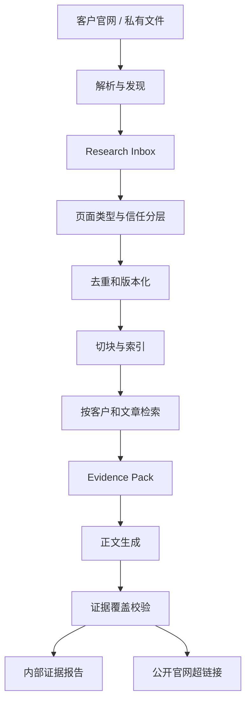
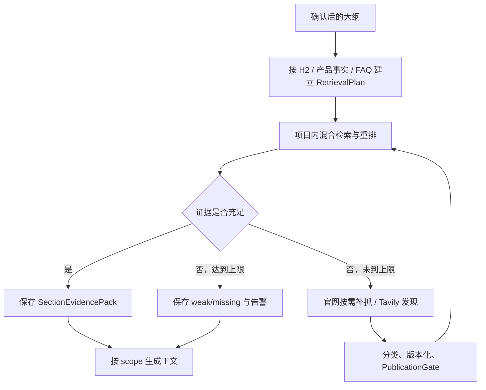

# 客户知识库领域模型

## 目标

为多客户文章工作台增加可追溯的知识检索能力，同时保持现有状态机、人工审核、产品选图、链接恢复和 Word 导出流程为确定性代码。

当前 `backend/services/knowledge.py` 会读取 `Knowledge/<customer>` 下的文件，拼接后按字符截断。这可以作为原型输入，但无法支持按话题检索、来源追踪、内容版本、证据覆盖率和跨文章复用。

## 已确认的业务原则

1. 知识来源优先级为：硬事实 > 参考素材 > 写作规则。
2. 私有文件只在内部证据报告中显示来源；公开官网页面可作为正文可见超链接。
3. 知识库正文占比默认自动评估，允许项目级和单篇文章自定义目标；默认只告警，不因未达到目标而强制失败。
4. 产品规格、认证、材料、交期、产能等硬事实必须有来源支撑；找不到依据时不得编造。
5. 资料不足时先查询客户知识库，再搜索客户官网/Tavily；仍不足时继续生成可支撑内容、显示告警，并删除无法支撑的硬事实。
6. 产品自动选择宁缺毋滥。精确分类不足三个产品时允许少于三个；相关分类产品只能作为待确认候选。
7. 首次建立客户知识时集中抓取产品目录；写文章时再增量发现 Blog、Guide 和缺失资料。
8. 创建项目后自动执行低成本、只读的官网探测；完整产品目录同步必须在用户查看探测结果并确认后启动。
9. 强验证产品详情页自动发布到硬事实库，明确的官网 Blog 自动发布到参考素材库；普通 Page、自定义 post type 和模糊页面进入待审核区。
10. 多人协作时采用服务器端共享工作台与项目知识库；受控公有云和公司私有部署都可接受，员工本机不作为正式知识库的权威存储位置。
11. 项目权限采用分层 RBAC：编辑只能访问被分配的客户项目，组长可以访问本组项目，组织管理员可以访问全部项目。
12. 文章采用编辑自助交付模式：被分配项目的编辑可以完成复核确认、Word 导出和交付打包，不强制另一位复核人员批准。
13. 首期按小规模负载部署，但数据库、对象存储、任务队列和 Worker 保持可替换、可横向扩展；不在缺少真实负载数据时提前微服务化。
14. 云端版上线后保留本地单机版，但仅用于开发、演示和紧急导出；生产业务的权威数据只保存在服务器端，本地版不参与双向同步。
15. 知识库支撑率按合格正文句统计，不按复用词数或段落是否命中统计；硬事实仍单独执行逐句 100% 证据校验。
16. 官网知识默认每周执行一次增量刷新，写文章时只按需补抓缺失或超过新鲜度窗口的相关页面；内容未变化时不重复解析、Embedding 或下载图片。
17. 员工上传的 DOCX、PDF、Excel 等私有资料先自动解析、摘要和建议分类，员工按整份文件确认信任层级后才发布；不要求逐个知识片段人工确认。
18. 大纲确认后按每个 H2 分别检索知识，产品事实和 FAQ 使用独立检索范围；资料缺口最多执行有限轮官网/Tavily 补查，不允许 Agent 无上限循环。
19. 第一版引入 LangGraph，但只编排资料研究子图；现有文章状态机、爬虫安全、权限、知识发布门、人工 ZeroGPT、图片和交付流程继续使用确定性代码。
20. 实施顺序采用单项目垂直切片优先：先以 Docker PostgreSQL + pgvector 跑通资料入库、分章节检索、LangGraph 研究、证据正文和前端展示，再迁移完整任务存储、多人 RBAC 与云端部署。
21. 文档解析采用分层路由：普通文件使用轻量解析器，复杂 PDF、扫描件、图片和 PPTX 使用独立 MinerU 服务；所有解析器输出统一 ParsedDocument。
22. 第一版实现 PostgreSQL 全文/关键词 + pgvector + 元数据过滤的基础混合 RAG；LightRAG 仅作为后续统一接口下的对照实验，通过评测后才可能进入正式检索链路。

## 来源分层

| 层级 | 类型 | 用途 | 信任与引用规则 |
| --- | --- | --- | --- |
| 1 | `hard_fact` | 产品规格、认证、公司能力、材料、尺寸 | 事实性表述必须绑定证据 |
| 2 | `reference_material` | 官网 Blog、Guide、案例、历史文章 | 其中 `official_blog` 仅在正文写作时作为可引用素材，不得进入 Evidence Pack、事实覆盖率或事实裁决；其他参考资料也不能覆盖硬事实 |
| 3 | `writing_instruction` | 品牌语气、禁用词、项目/话题注意事项 | 作为确定性指令注入，不参与普通向量检索 |

## 核心实体

### Organization

使用工作台的公司级租户边界。

- `organization_id`
- `name`
- `data_residency_policy`
- `created_at`

不同 Organization 之间的用户、客户项目、知识来源、文章和导出文件必须完全隔离。

### Team

运营组或项目小组。

- `team_id`
- `organization_id`
- `name`
- `manager_user_id`

一个 Team 可以负责多个客户项目；用户也可以根据公司管理方式加入一个或多个 Team。

### User

工作台操作者。

- `user_id`
- `organization_id`
- `display_name`
- `status`
- `organization_role`: `org_admin | member`

`org_admin` 可以访问并管理 Organization 内全部 Team 和 CustomerProject；普通成员还需通过 TeamMembership 或 ProjectMembership 获得项目访问权。

### TeamMembership

用户在运营小组中的身份。

- `team_id`
- `user_id`
- `role`: `team_lead | member`

`team_lead` 可以访问该 Team 负责的全部客户项目，并管理本组的项目成员分配；`member` 不会因为加入 Team 自动获得所有项目内容。

### CustomerProject

一个客户官网及其文章生产空间，是主要权限和知识隔离单位。

- `project_id`
- `organization_id`
- `customer_name`
- `official_domain`
- `owning_team_id`
- `status`

### ProjectMembership

用户对客户项目的访问授权。

- `project_id`
- `user_id`
- `role`: `editor | reviewer | viewer`
- `granted_by`
- `granted_at`

用户只能检索、编辑和导出其 ProjectMembership 允许访问的客户项目。

默认访问继承顺序：

1. `org_admin`：Organization 内全部项目。
2. `team_lead`：所属 Team 负责的全部项目。
3. `editor/reviewer/viewer`：仅 ProjectMembership 明确分配的项目。

所有后端查询、知识检索、对象存储下载和后台任务执行都必须重新校验项目权限，不能只依赖前端隐藏入口。

`editor` 的默认工作流权限覆盖标题、产品、大纲、正文、AI 检测确认、降 AI 文本、链接恢复、图片、TDK、Word 导出和交付打包。`reviewer` 可以检查证据、版本和交付结果并提出修改，但不是导出前的强制审批者。

### CustomerKnowledgeBase

一个 CustomerProject 独立的知识边界。

- `project_id`
- `customer_id`
- `official_domain`
- `default_policy`
- `last_catalog_sync_at`
- `index_version`

任何检索必须同时按 `organization_id` 和 `project_id` 隔离，不能跨客户项目返回资料。

### DeploymentProfile

同一套应用的数据与运行环境配置。

- `profile`: `managed_cloud | private_cloud | on_prem`
- `database_url`
- `object_storage_endpoint`
- `object_storage_bucket`
- `public_base_url`
- `private_network_required`

DeploymentProfile 只能改变基础设施连接方式，不能改变 Organization、CustomerProject、ProjectMembership 和知识隔离规则。

### KnowledgeSource

一个逻辑来源，例如私有 DOCX、公开产品页或官网 Blog。

- `source_id`
- `customer_id`
- `source_kind`: `private_file | product_detail | product_category | official_blog | knowledge_page`
- `trust_tier`: `hard_fact | reference_material | writing_instruction`
- `proposed_trust_tier`
- `canonical_url`
- `local_path`
- `public_source`
- `page_type_confidence`
- `status`: `inbox | published | needs_review | rejected | stale`
- `reviewed_by` / `reviewed_at`
- `published_by` / `published_at`
- `last_checked_at`
- `next_refresh_at`
- `consecutive_failure_count`

### SourceSnapshot

某个来源在一次解析或抓取时的不可变版本。

- `snapshot_id`
- `source_id`
- `content_hash`
- `fetched_at`
- `http_etag`
- `http_last_modified`
- `http_status`
- `parser_version`
- `raw_artifact_path`
- `normalized_artifact_path`

相同 Canonical URL 内容未变化时不重复入库；内容变化时创建新快照并保留旧版本。

### KnowledgeChunk

可被检索的最小知识片段。

- `chunk_id`
- `snapshot_id`
- `heading_path`
- `text`
- `page_number` / `sheet_name`
- `product_category_ids`
- `embedding`
- `search_text`

### EvidenceLink

把生成正文中的具体句子与知识片段绑定。普通知识支撑和硬事实都使用句子级绑定；硬事实还必须使用 `hard_fact` 来源。

- `article_id`
- `paragraph_id`
- `sentence_id`: 可选；硬事实必填
- `chunk_id`
- `support_scope`: `paragraph | sentence`
- `claim_type`: `reference | hard_fact`
- `support_type`: `direct | paraphrase | contextual`
- `visible_words`
- `public_citation_url`
- `validation_status`

### KnowledgePolicy

知识使用策略，支持项目默认值和文章覆盖值。

- `ratio_mode`: `auto | custom`
- `target_ratio`: `0.0..1.0 | null`
- `ratio_basis`: 固定为 `supported_sentences`
- `enforcement`: `warning | strict`
- `hard_fact_coverage_required`: 默认 `1.0`
- `private_source_visibility`: `internal`
- `public_source_visibility`: `hyperlink`

优先级：文章设置 > 项目设置 > 系统默认。

### RetrievalPlan

大纲确认后为一篇文章生成的结构化检索计划。

- `article_id`
- `outline_version`
- `scopes`: `introduction | h2_section | product_fact | faq`
- `max_gap_fill_rounds`: 默认 `2`，允许项目级降低
- `max_tavily_queries_per_scope`
- `created_at`

每个 H2 对应一个独立 `h2_section` scope；产品规格、产品选型证据和 FAQ 不与普通章节共用同一个证据包。

### SectionEvidencePack

供某个检索范围生成内容使用的、带来源和版本信息的证据包。

- `evidence_pack_id`
- `article_id`
- `outline_version`
- `scope_type`
- `scope_key`: H2 标识、产品 ID 或 FAQ 标识
- `query_variants`
- `chunk_ids`
- `source_snapshot_ids`
- `hard_fact_candidates`
- `public_citation_urls`
- `sufficiency`: `sufficient | weak | missing`
- `gap_reasons`
- `created_at`

Evidence Pack 有独立的模型输入预算，不能把整个客户知识库或全部抓取页面拼进提示词。大纲改变后，只重建受影响 scope 的证据包。

### GapFillAttempt

某个检索范围因资料不足触发的一次受控补查。

- `evidence_pack_id`
- `round_number`
- `reason`
- `channel`: `official_site | tavily_discovery`
- `query`
- `discovered_urls`
- `published_source_ids`
- `result`: `improved | no_change | blocked`
- `cost_usage`

### RefreshPolicy

控制官网来源的周期刷新和文章生成前补抓。

- `schedule_mode`: 默认 `weekly`
- `interval_days`: 默认 `7`，允许项目级调整
- `freshness_window_days`: 默认 `7`
- `article_gap_fill_enabled`: 默认 `true`
- `max_requests_per_run`
- `max_concurrency_per_domain`
- `failure_backoff_policy`
- `respect_robots_txt`: 默认 `true`

### CrawlRun

一次集中或增量资料发现任务。

- `crawl_run_id`
- `customer_id`
- `mode`: `site_probe | catalog_bootstrap | article_incremental | scheduled_refresh`
- `query`
- `started_at` / `finished_at`
- `discovered_count`
- `published_count`
- `needs_review_count`

### ResearchCandidate

爬虫或 Tavily 发现但尚未发布到知识库的候选。

- `candidate_id`
- `url`
- `discovery_source`
- `page_type`: `product_detail | product_category | official_blog | knowledge_page | unknown`
- `classification_evidence`
- `topic_relevance`
- `category_relevance`
- `review_reason`

### PublicationGate

控制 ResearchCandidate 能否发布到客户知识库。

- `auto_publish_hard_fact`：必须是同域名、强验证产品详情页，并保留分类和页面类型证据。
- `auto_publish_reference`：必须是同域名且明确识别为官网 Blog、Guide、News 或案例文章。
- `needs_review`：普通 Page、自定义 post type、仅由宽松规则或模型判断的页面，以及存在冲突的来源。
- `rejected`：跨域、重复垃圾页、索引/筛选页、抓取错误页或无法安全解析的内容。

自动发布不等于不可撤销。每次发布必须保留来源快照、分类证据和发布原因，并支持把来源标记为 `rejected` 或回滚到先前快照。

### PrivateUploadReview

员工上传私有资料后的文件级确认记录。

- `source_id`
- `detected_file_type`
- `extraction_status`: `parsed | partial | failed | password_protected`
- `proposed_title`
- `proposed_trust_tier`: `hard_fact | reference_material | writing_instruction`
- `document_summary`
- `extraction_warnings`
- `included_pages_or_sheets`
- `decision`: `pending | published | rejected`
- `reviewed_by` / `reviewed_at`

员工确认的是整份文件的用途和范围，不必逐个确认 KnowledgeChunk。若一份文件混合硬事实、写作规则和参考内容，系统必须提示拆分上传，或允许按页码、章节、工作表划分为多个 KnowledgeSource，不能让一个来源同时拥有互相冲突的信任层级。

### 私有资料发布流程

1. 上传后先保存原始文件并计算哈希，重复文件不重复解析。
2. 文件进入 `inbox`，执行安全扫描、格式解析、OCR（如需要）、摘要和信任层级建议。
3. 系统展示文件名、摘要、建议分类、页数/工作表和解析警告。
4. 拥有该项目编辑权限的员工确认或修改分类，并可排除无关页或工作表。
5. 确认后才创建可检索 KnowledgeChunk 和 Embedding，并把 KnowledgeSource 标记为 `published`。
6. 解析不完整、密码保护、OCR 置信度过低或内容类型混杂时保持 `needs_review`，不得静默发布。
7. 文件内容发生变化后重新上传会创建新的 SourceSnapshot，并要求重新确认；旧快照保留供历史证据追踪。

`hard_fact` 是对来源用途的确认，不代表文件中的每个数字自动可信。正文中的具体硬事实仍必须保留页码、工作表或段落定位，并通过句子级 EvidenceLink 关联。详细决定见 ADR-0008。

## WordPress 优先发现模型

客户网站大多使用 WordPress，因此发现顺序为：

1. 请求 `/wp-json/` 路由索引并识别可用命名空间。
2. 若存在 WooCommerce Store API，优先读取公开的：
   - `/wp-json/wc/store/v1/products/categories`
   - `/wp-json/wc/store/v1/products`
   - `/wp-json/wc/store/v1/products/<id>`
3. 使用 `/wp-json/wp/v2/search` 的 `subtype` 区分 `post`、`page` 和自定义 post type。
4. `posts` 默认进入官网参考素材候选；`pages` 必须继续分类，不能直接当产品。
5. `media` 只作为图片资产来源，不能证明某 URL 是产品详情页。
6. REST 不可用时回退到 Sitemap、产品分类页和 HTML 解析。

### Site Probe

项目创建后的 Site Probe 只进行少量只读请求，不下载完整产品资产。探测结果至少包括：

- 是否识别为 WordPress。
- `/wp-json/` 是否可用及公开命名空间。
- 是否存在 WooCommerce Store API。
- 可见的 post type、产品分类和 Sitemap。
- 预计产品数量、分类数量和分页规模。
- REST 被禁用、请求被阻断或疑似反爬等风险。
- 建议的完整同步入口和预计请求量。

探测完成后状态为 `awaiting_sync_confirmation`。用户确认后才创建 `catalog_bootstrap` CrawlRun；取消或暂缓不会阻止手工录入知识文件和继续现有文章流程。

### 增量刷新

完整目录首次同步后，每个项目默认每 7 天创建一次 `scheduled_refresh` CrawlRun，并允许用户手动“立即刷新”。不同项目的执行时间加入抖动，避免同一时刻集中请求多个客户网站。

刷新优先使用 Sitemap `lastmod`、WordPress/WooCommerce 修改时间、HTTP `ETag` 和 `Last-Modified` 判断候选变化。对于不提供可靠修改时间的页面，执行受限条件请求并比较规范化内容哈希。只有内容哈希变化时才创建新的 SourceSnapshot、重新切块和生成 Embedding；图片 URL 或文件哈希未变化时不重复下载。

文章生成前不重抓整个网站。资料研究流程只对与当前话题相关且满足以下任一条件的页面创建 `article_incremental` CrawlRun：知识库没有相关来源、来源超过项目新鲜度窗口、已知页面抓取失败，或官网/Tavily 发现新的强相关候选。

页面返回 404/410、持续解析失败或从产品目录中消失时，旧快照继续保留用于审计，但 KnowledgeSource 标记为 `stale` 并退出新的检索结果。引用该来源的未交付文章进入证据重校验；已经导出的历史文章不被静默改写。

周期和按需刷新都必须遵守单域名并发限制、请求预算、robots.txt 及指数退避。详细决定见 ADR-0007。

页面类型使用确定性信号优先判断：

- 产品强信号：WooCommerce 产品响应、JSON-LD `Product`、`og:type=product`、SKU、产品图库、规格表、产品面包屑。
- 文章强信号：JSON-LD `Article/BlogPosting/NewsArticle`、`og:type=article`、作者、发布日期、Blog/Guide 面包屑。
- 分类强信号：`ItemList/CollectionPage`、分页、筛选器、多个产品卡片。
- 无法明确分类时标记为 `unknown`，不得自动进入产品列表。

## 数据流



## 分章节检索与补查

大纲确认后，确定性编排器根据 H2、选定产品和 FAQ 生成 RetrievalPlan。每个 scope 先在当前 CustomerProject 内执行混合检索：PostgreSQL 全文/关键词检索 + pgvector 语义检索，再按信任层级、产品分类、来源状态、新鲜度和主题相关性重排。

检索顺序：

1. 当前项目已发布的 `hard_fact`、`reference_material` 和适用的 `writing_instruction`。
2. 已知客户官网来源的按需刷新或相关页面发现。
3. Tavily 只用于发现客户官网上的候选 URL，不把第三方搜索结果直接当作客户硬事实。
4. 新发现页面经过页面分类、版本化和 PublicationGate 后，重新检索当前 scope。
5. 达到证据要求，或达到默认两轮补查上限后停止。

普通 H2、产品事实和 FAQ 分别生成 SectionEvidencePack。某个 scope 仍为 `weak` 或 `missing` 时，正文可以继续生成有依据的通用内容并显示告警；缺乏依据的硬事实必须省略，不能为了填满章节而编造。



## 知识占比

```text
知识库支撑率 = 有有效证据的合格正文句数 / 全部合格正文句数
```

引言、普通正文、列表项、FAQ 回答和表格事实项进入句子切分；H1/H2/H3 标题、单独的 FAQ 问题标签、Markdown 图片、`img` 索引块、URL、代码块和空内容不计入。少于 5 个可见英文词的片段不构成合格正文句。

一个句子至少存在一条有效的句子级 EvidenceLink，且证据审核确认其能够支撑该句的主要观点时，才计为支撑句。该 EvidenceLink 必须指向当前项目中已发布、未失效且非官网博客的 KnowledgeChunk；关键词或向量相似度、无关公开链接都不能单独计入。

该指标衡量“有多少合格正文句使用了项目知识”，不衡量原文复制率。产品规格、认证、尺寸、材料、产能、交期等硬事实继续单独检查，并要求 `hard_fact_coverage_required = 1.0`。详细决定见 ADR-0014。

## Agent 边界

爬取、同域名限制、URL 安全、页面分类硬规则、去重、版本化和文件保存继续使用普通代码。

资料研究采用受限控制器，用于：

- 根据文章话题制定检索计划。
- 判断现有证据是否充足。
- 在知识库、WordPress 官网和 Tavily 之间选择下一步检索。
- 对 `unknown` 候选提出分类建议。
- 在达到证据要求、两轮补查上限或请求预算时停止。

该控制器不得绕过安全校验，也不得自行把未知页面发布为硬事实来源。第一版使用 LangGraph 编排 RetrievalPlan -> 检索 -> 证据判断 -> GapFillAttempt -> 人工中断 -> SectionEvidencePack，并为每次运行保存检查点。现有确定性爬虫、权限、PublicationGate、文章状态机、人工 ZeroGPT、图片和导出流程不迁入 LangGraph。详细决定见 ADR-0009。

## 部署边界（Accepted）

多人分别负责不同客户项目时，推荐把工作台后端、任务数据、客户知识索引和原始资料放在同一个受控服务器环境中。本地电脑只作为浏览器、上传入口和可选缓存，不作为知识库的权威存储位置。

推荐部署形态：

- Next.js 前端：云端或公司私有服务器。
- FastAPI 后端：与数据服务处于同一受控网络。
- PostgreSQL：用户、团队、项目、任务、权限、来源元数据和作业状态。
- `pgvector` 或可替换的 KnowledgeIndex：客户知识向量检索。
- S3 兼容对象存储：私有原始文件、抓取快照、图片、DOCX 和 AI 检测截图。
- Worker：执行抓取、解析、Embedding、文章生成和导出等长任务。

首期容量基线：

- 单个 FastAPI 服务实例。
- 单个 Next.js 前端实例。
- 单套 PostgreSQL + pgvector。
- 单个 S3 兼容对象存储 Bucket，按 Organization/Project 前缀隔离。
- 一个或少量 Worker，并对模型调用、官网抓取和文档解析分别设置并发上限。
- 先通过队列等待时间、任务失败率、数据库大小、知识片段数量和模型并发量观测真实负载。

达到容量阈值后按瓶颈扩展：先增加 Worker，再调整 PostgreSQL/pgvector，只有检索规模或延迟证明有必要时才迁移到独立向量服务。首期不要求 Kubernetes、独立 Qdrant、Redis 集群或多服务拆分。

受控公有云与公司内网服务器、私有云或受控 VPC 都是允许的部署目标。实现应通过 DeploymentProfile 外置基础设施配置，默认优先选择运维成本较低的受控云端部署，并保留私有部署能力。

不采用“云端工作台 + 每个员工本地知识库”作为正式方案。该形态需要本地连接器、在线状态检测、双向同步、冲突解决和设备密钥管理，第一版复杂度高且容易产生知识版本不一致。

当前本地单机版继续保留，但角色限定为开发、演示和紧急导出工具。它可以使用测试数据，或读取从服务器明确导出的只读项目包；不得把本地 SQLite、文件目录或本地知识索引当作生产准源，也不提供自动双向同步。紧急导出产生的正式结果必须在服务器恢复后通过显式上传或导入进入服务器审计链，不能静默覆盖云端记录。详细边界见 ADR-0005。

## 尚待确认

- 生产环境默认使用哪一家云服务或哪种公司服务器。
- 研究助手的对话是否允许执行写操作，以及写操作需要何种确认级别。
- 何时引入 GSC、Semrush 等 SEO 数据源，以及首个 SEO Agent 子图的业务目标。

## 文档解析边界（Accepted）

知识库的领域模型、来源版本、切块、证据映射、检索、发布门和前端由本项目实现，不引入另一套完整知识库/RAG 应用。底层数据库、向量扩展、Agent 编排和文档解析器使用成熟组件，并通过接口隔离。

建议定义统一 `DocumentParser` 接口和规范化 `ParsedDocument`。TXT/Markdown/CSV、普通 DOCX 和 XLSX 使用轻量本地解析器；普通文本型 PDF 先走快速解析；扫描件、复杂多栏 PDF、表格密集文档、图片型资料和解析质量不足的文件再路由到独立 MinerU 服务。

MinerU 的 Markdown、JSON、图片和布局调试结果作为 SourceSnapshot 的解析产物保存，但 KnowledgeChunk 不直接依赖 MinerU 私有字段。Adapter 把页面、区块类型、文本、表格、图片、页码、bbox 和置信度转换为项目自己的稳定结构，从而允许以后替换或升级解析器。详细建议见 ADR-0012。

## 第一实施切片（Accepted）

第一阶段仍以当前本地工作台和单一操作者为入口。现有标题、产品、大纲、正文、人工处理、图片和交付状态继续使用当前 SQLite Repository 与 Job Queue，避免知识库开发同时改写成熟生产流程。

新增知识来源、快照、切块、Embedding、Evidence Pack 和 LangGraph Checkpoint 从第一天开始使用 Docker 中的 PostgreSQL + pgvector，并通过现有 `customer/task_id/outline_version` 与文章任务关联。所有知识查询即使处于单用户阶段也必须显式带 `project_id`，不允许写成全库检索。

垂直切片验收后再把用户、团队、ProjectMembership、文章任务、后台作业和对象文件逐步迁移到服务器端正式架构，并启用 RBAC。详细顺序见 ADR-0011 和实施路线图。

## 未来 SEO 数据源边界（Deferred）

GSC、Semrush 和后续 SEO 服务通过 `SeoDataProvider`/`ToolRegistry` 接口接入，不直接写死在 LangGraph 节点中。连接器输出先保存为带时间范围、抓取时间和项目隔离字段的 `SeoObservation`，而不是直接混入产品硬事实 KnowledgeChunk。

GSC 类数据主要描述网站自身的搜索表现；Semrush 类数据主要作为关键词、竞品和市场研究信号。它们可以影响选题优先级、内容更新建议和研究查询，但不能替代客户官网对产品规格的事实证据。

未来每类目标建立独立有界子图，例如“关键词机会分析”“内容衰退诊断”“竞品内容缺口”，共享权限、ToolRegistry、预算和审计能力，不构建一个可以任意调用所有外部系统的超级 Agent。详细边界见 ADR-0010。
