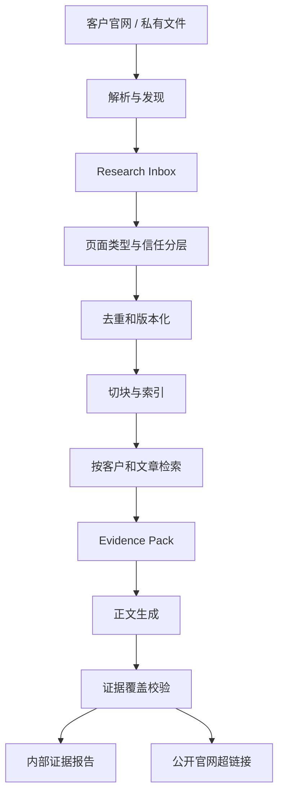

# 客户知识库领域模型

## 目标

为多客户文章工作台增加可追溯的知识检索能力，同时保持现有状态机、人工审核、产品选图、链接恢复和 Word 导出流程为确定性代码。

当前 `backend/services/knowledge.py` 会读取 `Knowledge/<customer>` 下的文件，拼接后按字符截断。这可以作为原型输入，但无法支持按话题检索、来源追踪、内容版本、证据覆盖率和跨文章复用。

## 已确认的业务原则

1. 知识来源优先级为：硬事实 > 参考素材 > 写作规则。
2. 私有文件只在内部证据报告中显示来源；公开官网页面可作为正文可见超链接。
3. 知识库正文占比默认自动评估，允许项目级和单篇文章自定义目标；默认只告警，不因未达到目标而强制失败。
4. 产品规格、认证、材料、交期、产能等硬事实必须有来源支撑；找不到依据时不得编造。
5. 资料不足时先查询客户知识库，再搜索客户官网/Tavily；仍不足时继续生成可支撑内容、显示告警，并删除无法支撑的硬事实。
6. 产品自动选择宁缺毋滥。精确分类不足三个产品时允许少于三个；相关分类产品只能作为待确认候选。
7. 首次建立客户知识时集中抓取产品目录；写文章时再增量发现 Blog、Guide 和缺失资料。
8. 创建项目后自动执行低成本、只读的官网探测；完整产品目录同步必须在用户查看探测结果并确认后启动。
9. 强验证产品详情页自动发布到硬事实库，明确的官网 Blog 自动发布到参考素材库；普通 Page、自定义 post type 和模糊页面进入待审核区。

## 来源分层

| 层级 | 类型 | 用途 | 信任与引用规则 |
| --- | --- | --- | --- |
| 1 | `hard_fact` | 产品规格、认证、公司能力、材料、尺寸 | 事实性表述必须绑定证据 |
| 2 | `reference_material` | 官网 Blog、Guide、案例、历史文章 | 用于丰富正文，不能覆盖硬事实 |
| 3 | `writing_instruction` | 品牌语气、禁用词、项目/话题注意事项 | 作为确定性指令注入，不参与普通向量检索 |

## 核心实体

### Organization

使用工作台的公司级租户边界。

- `organization_id`
- `name`
- `data_residency_policy`
- `created_at`

不同 Organization 之间的用户、客户项目、知识来源、文章和导出文件必须完全隔离。

### Team

运营组或项目小组。

- `team_id`
- `organization_id`
- `name`
- `manager_user_id`

一个 Team 可以负责多个客户项目；用户也可以根据公司管理方式加入一个或多个 Team。

### User

工作台操作者。

- `user_id`
- `organization_id`
- `display_name`
- `status`

### CustomerProject

一个客户官网及其文章生产空间，是主要权限和知识隔离单位。

- `project_id`
- `organization_id`
- `customer_name`
- `official_domain`
- `owning_team_id`
- `status`

### ProjectMembership

用户对客户项目的访问授权。

- `project_id`
- `user_id`
- `role`: `project_manager | editor | reviewer | viewer`
- `granted_by`
- `granted_at`

用户只能检索、编辑和导出其 ProjectMembership 允许访问的客户项目。角色的最终权限矩阵仍待确认。

### CustomerKnowledgeBase

一个 CustomerProject 独立的知识边界。

- `project_id`
- `customer_id`
- `official_domain`
- `default_policy`
- `last_catalog_sync_at`
- `index_version`

任何检索必须同时按 `organization_id` 和 `project_id` 隔离，不能跨客户项目返回资料。

### KnowledgeSource

一个逻辑来源，例如私有 DOCX、公开产品页或官网 Blog。

- `source_id`
- `customer_id`
- `source_kind`: `private_file | product_detail | product_category | official_blog | knowledge_page`
- `trust_tier`: `hard_fact | reference_material | writing_instruction`
- `canonical_url`
- `local_path`
- `public_source`
- `page_type_confidence`
- `status`: `inbox | published | needs_review | rejected | stale`

### SourceSnapshot

某个来源在一次解析或抓取时的不可变版本。

- `snapshot_id`
- `source_id`
- `content_hash`
- `fetched_at`
- `http_last_modified`
- `parser_version`
- `raw_artifact_path`
- `normalized_artifact_path`

相同 Canonical URL 内容未变化时不重复入库；内容变化时创建新快照并保留旧版本。

### KnowledgeChunk

可被检索的最小知识片段。

- `chunk_id`
- `snapshot_id`
- `heading_path`
- `text`
- `page_number` / `sheet_name`
- `product_category_ids`
- `embedding`
- `search_text`

### EvidenceLink

把生成正文中的句子与知识片段绑定。

- `article_id`
- `sentence_id`
- `chunk_id`
- `support_type`: `direct | paraphrase | contextual`
- `visible_words`
- `public_citation_url`
- `validation_status`

### KnowledgePolicy

知识使用策略，支持项目默认值和文章覆盖值。

- `ratio_mode`: `auto | custom`
- `target_ratio`: `0.0..1.0 | null`
- `enforcement`: `warning | strict`
- `hard_fact_coverage_required`: 默认 `1.0`
- `private_source_visibility`: `internal`
- `public_source_visibility`: `hyperlink`

优先级：文章设置 > 项目设置 > 系统默认。

### CrawlRun

一次集中或增量资料发现任务。

- `crawl_run_id`
- `customer_id`
- `mode`: `site_probe | catalog_bootstrap | article_incremental | scheduled_refresh`
- `query`
- `started_at` / `finished_at`
- `discovered_count`
- `published_count`
- `needs_review_count`

### ResearchCandidate

爬虫或 Tavily 发现但尚未发布到知识库的候选。

- `candidate_id`
- `url`
- `discovery_source`
- `page_type`: `product_detail | product_category | official_blog | knowledge_page | unknown`
- `classification_evidence`
- `topic_relevance`
- `category_relevance`
- `review_reason`

### PublicationGate

控制 ResearchCandidate 能否发布到客户知识库。

- `auto_publish_hard_fact`：必须是同域名、强验证产品详情页，并保留分类和页面类型证据。
- `auto_publish_reference`：必须是同域名且明确识别为官网 Blog、Guide、News 或案例文章。
- `needs_review`：普通 Page、自定义 post type、仅由宽松规则或模型判断的页面，以及存在冲突的来源。
- `rejected`：跨域、重复垃圾页、索引/筛选页、抓取错误页或无法安全解析的内容。

自动发布不等于不可撤销。每次发布必须保留来源快照、分类证据和发布原因，并支持把来源标记为 `rejected` 或回滚到先前快照。

## WordPress 优先发现模型

客户网站大多使用 WordPress，因此发现顺序为：

1. 请求 `/wp-json/` 路由索引并识别可用命名空间。
2. 若存在 WooCommerce Store API，优先读取公开的：
   - `/wp-json/wc/store/v1/products/categories`
   - `/wp-json/wc/store/v1/products`
   - `/wp-json/wc/store/v1/products/<id>`
3. 使用 `/wp-json/wp/v2/search` 的 `subtype` 区分 `post`、`page` 和自定义 post type。
4. `posts` 默认进入官网参考素材候选；`pages` 必须继续分类，不能直接当产品。
5. `media` 只作为图片资产来源，不能证明某 URL 是产品详情页。
6. REST 不可用时回退到 Sitemap、产品分类页和 HTML 解析。

### Site Probe

项目创建后的 Site Probe 只进行少量只读请求，不下载完整产品资产。探测结果至少包括：

- 是否识别为 WordPress。
- `/wp-json/` 是否可用及公开命名空间。
- 是否存在 WooCommerce Store API。
- 可见的 post type、产品分类和 Sitemap。
- 预计产品数量、分类数量和分页规模。
- REST 被禁用、请求被阻断或疑似反爬等风险。
- 建议的完整同步入口和预计请求量。

探测完成后状态为 `awaiting_sync_confirmation`。用户确认后才创建 `catalog_bootstrap` CrawlRun；取消或暂缓不会阻止手工录入知识文件和继续现有文章流程。

页面类型使用确定性信号优先判断：

- 产品强信号：WooCommerce 产品响应、JSON-LD `Product`、`og:type=product`、SKU、产品图库、规格表、产品面包屑。
- 文章强信号：JSON-LD `Article/BlogPosting/NewsArticle`、`og:type=article`、作者、发布日期、Blog/Guide 面包屑。
- 分类强信号：`ItemList/CollectionPage`、分页、筛选器、多个产品卡片。
- 无法明确分类时标记为 `unknown`，不得自动进入产品列表。

## 数据流



## 知识占比

```text
知识库支撑占比 = 有 EvidenceLink 的可见正文英文词数 / 全部可见正文英文词数
```

标题、Markdown 标记、图片标记和 URL 不计入；引言、正文和 FAQ 计入。该比例衡量证据支撑，不衡量原文复制率。

## Agent 边界

爬取、同域名限制、URL 安全、页面分类硬规则、去重、版本化和文件保存继续使用普通代码。

后续可增加一个受限的资料研究 Agent，用于：

- 根据文章话题制定检索计划。
- 判断现有证据是否充足。
- 在知识库、WordPress 官网和 Tavily 之间选择下一步检索。
- 对 `unknown` 候选提出分类建议。
- 在达到证据要求或预算上限时停止。

Agent 不得绕过安全校验，也不得自行把未知页面发布为硬事实来源。只有形成多轮检索、判断、重试和人工暂停后，才考虑用 LangGraph 编排该子流程。

## 部署边界（Proposed）

多人分别负责不同客户项目时，推荐把工作台后端、任务数据、客户知识索引和原始资料放在同一个受控服务器环境中。本地电脑只作为浏览器、上传入口和可选缓存，不作为知识库的权威存储位置。

推荐部署形态：

- Next.js 前端：云端或公司私有服务器。
- FastAPI 后端：与数据服务处于同一受控网络。
- PostgreSQL：用户、团队、项目、任务、权限、来源元数据和作业状态。
- `pgvector` 或可替换的 KnowledgeIndex：客户知识向量检索。
- S3 兼容对象存储：私有原始文件、抓取快照、图片、DOCX 和 AI 检测截图。
- Worker：执行抓取、解析、Embedding、文章生成和导出等长任务。

如果客户资料不允许进入公有云，部署目标应改为公司内网服务器、私有云或受控 VPC，而不是使用“云端工作台 + 每个员工本地知识库”。后者需要本地连接器、在线状态检测、双向同步、冲突解决和设备密钥管理，第一版复杂度高且容易产生知识版本不一致。

## 尚待确认

- 客户私有资料是否允许上传到受控公有云，还是只能进入公司内网/私有云。
- 用户、Team 和 ProjectMembership 的具体权限矩阵。
- 客户级知识索引采用本地向量库、SQLite 扩展还是独立向量服务。
- 默认自动知识占比的估算规则。
