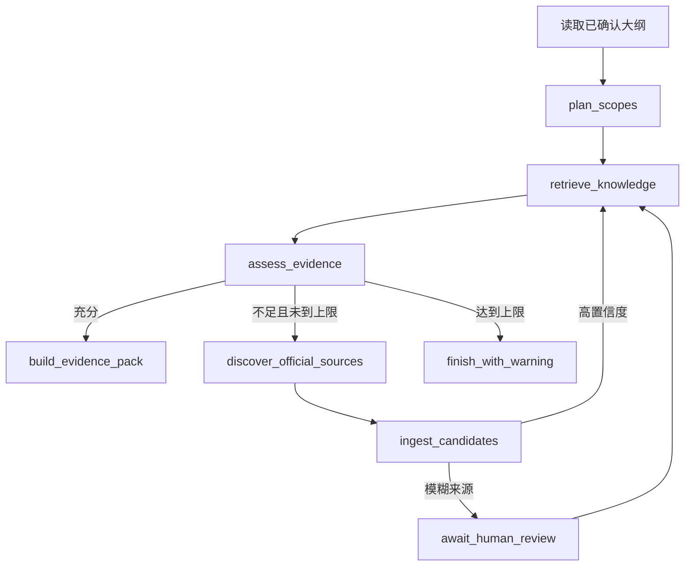

# LangGraph 资料研究 Agent 前端方案

## 设计结论

保留当前“内容准备 -> 写作 -> 人工质检 -> 图片 -> 交付”五阶段工作台。新增项目级“知识库”页面，并在单篇文章的“写作”阶段加入“资料研究”子步骤。对话作为研究面板的辅助入口，不能替代现有确定性按钮和人工确认。

LangGraph 只在大纲确认后运行资料研究子图，不接管标题、产品保存、大纲确认、正文版本、ZeroGPT、链接恢复、图片和交付状态。

## 项目级页面

项目导航从：

```text
文章任务 | 批量处理 | 交付记录 | 项目设置
```

扩展为：

```text
文章任务 | 知识库 | 批量处理 | 交付记录 | 项目设置
```

“知识库”页面包含四个区域：

1. 概览：已发布来源、待确认来源、产品页、Blog/Guide、过期来源、最近同步时间。
2. 来源：搜索和筛选 KnowledgeSource，查看原始快照、摘要、信任层级和引用文章。
3. 待确认：私有文件分类、未知 WordPress 页面和模糊产品候选。
4. 同步：Site Probe、首次目录同步、每周增量刷新、失败页面和手动立即刷新。

## 单篇文章工作台

当前“写作”阶段包含“大纲”和“第一版”。修改为：

```text
写作
  ├─ 大纲
  ├─ 资料研究
  └─ 第一版
```

“资料研究”页面建议布局：

```text
┌─────────────────────────────────────────────────────────────────────┐
│ 资料研究     运行中：assess_evidence     第 1/2 轮    [研究助手]    │
├──────────────────┬──────────────────────────────────────────────────┤
│ 检索范围         │ 当前范围：How to choose wood screws              │
│                  │                                                  │
│ ● H2-1 充分      │ 证据状态：充分      来源 4      知识片段 7       │
│ ◐ H2-2 补查中    │                                                  │
│ ○ H2-3 缺失      │ [产品页] Woodscrews & Dry Wall Screws            │
│ ● 产品事实 充分  │ 支撑：thread form、materials、applications       │
│ ◐ FAQ 较弱       │ 来源：https://客户官网/...                        │
│                  │                                                  │
│ [重新研究本范围] │ [官网原文] [排除此来源] [查看使用位置]           │
├──────────────────┴──────────────────────────────────────────────────┤
│ Agent 轨迹：检索知识库 → 证据不足 → Tavily 发现 → 官网抓取 → 充分 │
└─────────────────────────────────────────────────────────────────────┘
```

范围列表用状态色和文字共同表示：

- `sufficient`：绿色“充分”。
- `weak`：黄色“较弱”，允许生成但显示告警。
- `missing`：红色“缺失”，相关硬事实不能进入正文。
- `running`：蓝色进度和当前 LangGraph 节点。
- `waiting_for_review`：紫色“等待人工确认”。

## LangGraph 在页面背后做什么



它的价值不是“多调用几次模型”，而是：

- 保存每次研究的明确状态和条件分支。
- API/模型失败后从检查点继续，而不是整篇重跑。
- 在模糊页面、相关分类产品等位置暂停并等待人工选择。
- 限制最多两轮补查和搜索预算。
- 把每个 H2 的检索证据、来源和失败原因留给前端展示。

## 是否支持对话

支持，但定位为“当前项目/当前文章的资料研究助手”，不是无边界通用聊天机器人。

采用两阶段方案：第一版只开放只读问答；第二阶段只开放白名单内的可执行命令。两种能力使用独立开关，未启用第二阶段时不能提交任何写操作。

### 只读问答

可以直接回答，不修改业务数据：

- “H2-2 为什么显示资料不足？”
- “这段产品规格来自哪个页面？”
- “为什么选择这个 woodscrews 产品，而不是 Blog 页面？”
- “这篇文章用了多少知识库段落？”
- “哪些硬事实还没有证据？”
- “比较这两个产品，但只使用官网资料。”

每个回答必须显示引用来源；知识库没有依据时明确回答“当前资料不足”。

### 可执行指令

第二阶段只允许把自然语言转换为以下三类受控命令：

- 重新检索当前文章的产品，例如“只用 woodscrews 分类重新找产品”。
- 展示影响范围并经人工确认后替换产品。
- 创建正文版本快照后重写指定章节，例如“用选中的来源重写当前 H2”。

所有写操作先展示动作预览，包括影响的文章范围、预计失效内容和可能产生的 Tavily/模型费用；通过权限和任务状态检查、用户确认后，才调用确定性后端 API 或启动 LangGraph Run。模型不能直接执行任意 SQL。

### 禁止通过对话执行

- 绕过项目权限或跨客户检索。
- 把未知页面直接发布为硬事实。
- 编造没有证据的产品参数。
- 自动操作或伪造 ZeroGPT 检测。
- 静默覆盖人工编辑的正文、大纲或产品。
- 删除项目、来源或历史快照。

## 对话与业务状态的关系

聊天消息不是业务准源。真正的状态仍保存在 RetrievalPlan、Graph Run、SectionEvidencePack、KnowledgeSource 和文章版本中。

```text
用户消息
  -> 意图解析
  -> 只读回答，或生成 Command Preview
  -> 用户确认
  -> 调用确定性 API / 启动 LangGraph Run
  -> 结果写入业务表
  -> 对话展示结果与来源
```

关闭聊天面板不会中断后台研究；重新打开后从 Graph Run 和检查点恢复展示。

## 前端组件建议

- `project-knowledge-base.tsx`：项目知识库主页。
- `knowledge-source-table.tsx`：来源筛选与版本状态。
- `research-inbox.tsx`：私有文件和模糊网页确认。
- `article-research-step.tsx`：文章各 scope 的证据状态。
- `evidence-pack-viewer.tsx`：片段、来源和正文使用位置。
- `research-agent-drawer.tsx`：可收起对话面板。
- `graph-run-timeline.tsx`：节点、检查点、工具调用、费用和失败信息。
- `agent-command-preview.tsx`：写操作确认和影响范围。

当前 `article-workbench.tsx` 只负责切换新 `research` tab；主要 JSX 和状态应放入上述独立组件，避免继续扩大主工作台文件。

## 后端与实时状态

- LangGraph Run 仍由现有后台 Job Queue 启动，避免占用 FastAPI 请求。
- Graph Checkpoint 写入 PostgreSQL，并与 `article_id + outline_version` 绑定。
- 前端优先使用 SSE 接收节点状态和流式对话；断线时回退到任务轮询。
- 每次节点变化写入可查询事件，刷新页面后仍能恢复时间线。
- LLM、Tavily、抓取和 Embedding 分别记录耗时、重试次数和费用估算。
- “研究记录”默认折叠，只保存结构化节点、检索、工具和必要证据事件，默认保留 30 天；密钥和不必要的客户全文必须脱敏或省略。

## 简历与演示重点

演示时不只展示聊天框，重点展示：

1. 确认大纲后并行研究各 H2。
2. 一个章节证据不足，Agent 自动补查客户官网。
3. 遇到模糊页面时暂停，前端人工确认后继续。
4. 模型请求失败后从检查点恢复。
5. 最终正文每个知识段落和硬事实都能回看来源。
6. 面板展示检索准确率、证据覆盖率、运行成本和耗时。

## 未来 SEO 工具扩展

项目级导航未来可以增加“SEO 数据”页面，用于连接 GSC、Semrush 或其他供应商，并展示连接状态、数据新鲜度、调用额度和同步记录。文章研究助手只通过后端 ToolRegistry 看到当前项目允许使用的工具，不直接持有 API Key。

建议把后续能力拆成独立入口：

- 关键词机会：结合搜索表现和关键词数据提出选题候选。
- 内容更新：识别表现下降或信息过期的已有文章。
- 竞品缺口：发现客户未覆盖但竞品持续覆盖的主题。
- 发布后复盘：把文章任务与后续搜索表现关联。

这些能力不阻塞第一版知识库与资料研究 Agent；对应决策见 ADR-0010。
