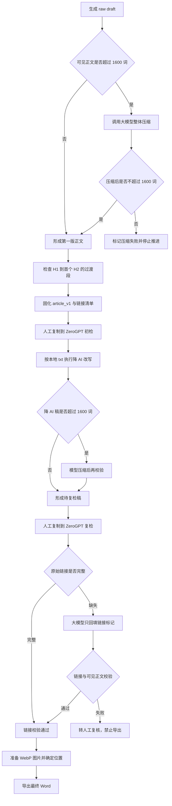

# Article Agent 写作、人工 AI 检测、链接恢复与插图流程改造规划

> 2026-07-10 更新：正文生成范围已改为 1000–1200 词，提示词字符预算约 8,000 个英文字符（含空格）。仍不进行机械截断或自动压缩；本文后续关于 1500/1600 词阻塞或压缩的旧规划不再适用。

## 1. 本次目标

在保留现有“标题 → 产品 → 大纲 → 正文 → Word”主链路的基础上，把正文后半程改造成一个可恢复、可校验、不会覆盖原稿的工作流：

1. 标题、大纲和正文提示词尽量贴合 `D:\article\Chatgpt写作流程.docx` 中的实际提示词。
2. 正文以 1000–1500 个英文单词为生成目标；只有可见正文超过 1600 词时，才再调用一次大模型做整体压缩，不再直接从文章末尾机械截断。
3. 第一版正文固定保存，用户手动复制到 ZeroGPT 做第一次检测。
4. 使用 `D:\article\降ai提示词-未测试效果版.txt` 对第一版正文做“降 AI”改写。
5. 用户手动复制降 AI 版本到 ZeroGPT 做第二次检测。
6. 以第一版正文为基准检查并恢复降 AI 版本丢失的超链接。
7. 插入首图和正文产品图，转换为 WebP，并保证每张图片下一行都有 `img.图片名.webp`。
8. 完成所有人工节点和自动校验后，才允许导出 Word。

本次不自动操作 ZeroGPT，也不承诺某个固定 AI 率。AI 率由用户手工检测、录入和确认。

## 2. 已确认的现状与缺口

- 写标题、大纲、正文和降 AI 的提示词都硬编码在 `backend/services/generator.py`；两份新提供的本地材料目前没有被代码读取。
- 当前正文超过默认 1500 词时会被本地按行、句子和单词边界截断，文章尾部可能被直接丢掉。
- 当前只有一个 `article` 字段；执行 `/humanize` 会覆盖第一版正文，无法再拿第一版做链接对照。
- ZeroGPT 目前只有一个报告字段，无法区分第一次检测与降 AI 后复检，也没有对应的状态门禁。
- 当前降 AI 提示词可能引导模型补充原文没有的场景和数字，与新 txt 中“不得创造新事实”的要求冲突。
- 当前产品图片统一追加到 Word 末尾，没有首图角色、段落锚点、WebP 转换、标题重命名或图片 marker。
- `data/tasks.json` 中 774 条任务已经都存在 `hero_image` 字段，但当前 Pydantic 模型没有声明它；直接保存任务可能静默删除该字段，迁移时必须优先修复。
- 当前仓库没有后端或前端自动化测试。
- 工作区已有用户对 `backend/services/llm.py` 的未提交修改，实施时必须保留，不能覆盖。

## 3. 目标流程



推荐状态机：

```text
new
→ titles_ready
→ title_selected
→ outline_ready
→ draft_ready
→ initial_ai_checked
→ humanized_ready
→ final_ai_checked
→ links_verified
→ images_ready
→ docx_exported
```

“超长压缩”是生成正文或降 AI 后的条件动作，不单独作为人工阶段。任何上游正文被编辑，都必须使下游检测结果、链接校验和旧导出文件失效，并回退到对应阶段。

## 4. 提示词规划

### 4.1 文件化管理

新增 `backend/prompts/`，至少包含：

- `titles.txt`
- `outline.txt`
- `article.txt`
- `compress.txt`
- `transition.txt`
- `restore_links.txt`

`humanize` 不再维护一份重复的硬编码文本，而是按 UTF-8 直接读取配置指定的 `D:\article\降ai提示词-未测试效果版.txt`，替换其中的 `{{ARTICLE}}`。每次调用同时把实际使用的提示词快照保存到任务目录，便于之后复现和调参。

### 4.2 标题提示词

贴合原流程中的要求：

- 身份为熟悉制造业、工业设备和 B2B 外贸内容的 Google SEO 编辑。
- 输入公司名、官网、公司知识库、主题、主关键词、竞品资料。
- 输出 10 个英文博客标题。
- 标题可使用问句或指南型表达；原则上不用冒号。
- 只返回编号标题，不返回解释。

原文档要求“搜索 Google 前 50 条结果”。当前 LLM 调用没有真实搜索工具，因此不能在提示词里假装已经完成搜索。本阶段只使用系统实际采集到的竞品和知识库材料；如果后续增加真实搜索服务，再单独加入 SERP 采集阶段。

### 4.3 大纲提示词

贴合原流程中的 9 条规则：

- 以用户选中的标题贯穿全文，并自然结合已确认产品及 URL。
- H2 尽量使用疑问句；H3 回答对应 H2，使用简短名词短语或陈述句。
- 不生成 H4。
- 每个 H2 下优先使用 3 个并列 H3，但只在内容确实需要时使用。
- 主要 H2 最多 5 个，FAQ、结论、服务或联系部分不计入该限制。
- 标题使用自然的英文 Title Case，实词大写、短虚词按英文习惯小写。
- 逻辑要体现产品优势，结尾包含 service、contact 或下一步行动。
- 可以参考竞品内容，但不得出现竞品公司名和产品名，也不得复制其措辞。

### 4.4 正文提示词

贴合原流程的正文规则，并改成可程序校验的表达：

- 生成目标为 1000–1500 个英文单词，绝不主动扩写到 1600 以上。
- 严格按已确认大纲写作，减少不必要的 H4；正常情况下只允许 H1/H2/H3。
- 公司介绍放在正文前 300 词内，长度不超过 300 词，并以官网 Markdown 超链接自然植入。
- 除公司介绍所需位置外，尽量不重复品牌名。
- 禁用 `understanding`、`exploring` 等原流程明确排除的模板词。
- H2 与其 H3 之间必须有衔接内容；重复的 H2/H3 合并，不为凑字数写空话。
- 逻辑清楚、句式直接，优先使用自然的第二人称 `you`。
- 自然介绍已确认产品，不改产品名、型号、数字或 URL。
- 文章末尾包含 3 个 FAQ，问题使用 H3 标题，答案使用普通正文段落，不添加 `Q:` / `A:` 标签。
- 正文中保留 3–4 个有实际语义位置的链接：通常为 1 个公司首页和 2–3 个产品、服务、证书或 Contact 链接。Word 导出时把这些链接加粗并生成真实超链接关系。

### 4.5 超长压缩提示词

当“可见正文词数”大于 1600 时，自动调用一次专用压缩提示词：

- 目标压缩到约 1450–1550 词，硬上限 1600 词。
- 保留 H1/H2/H3、FAQ、表格、关键词、公司/产品名、型号、数字、技术结论和全部 Markdown 链接。
- 通过合并重复内容、删掉空泛语句和缩短冗长解释来压缩，不得直接丢弃文章后半部分。
- 只返回完整 Markdown 文章。

自动压缩一次后仍超过 1600 词时，不再机械裁尾；记录 `compression_failed`，禁止进入 ZeroGPT 或导出，并在 UI 提供“重新压缩”按钮。

同一规则也用于降 AI 结果，但必须在第二次 ZeroGPT 检测之前完成，避免用户检测的版本与最终候选正文不一致。

### 4.6 降 AI 提示词

完整使用新 txt 的 KEEP/LIGHT/DEEP 逻辑和事实锁定规则。ZeroGPT 的数字分数仅作为人工记录，不默认发送给模型；只有报告中包含明确的问题段落时，才作为附加参考，且不得覆盖以下硬约束：

- 不创造原文没有的公司、产品、认证、数字、性能或使用经验。
- 不提高承诺强度，不改变技术含义。
- 标题层级、FAQ、表格、列表、关键词、链接锚文本和 URL 保持不变。
- 只输出改写后的完整文章。

由于该文件标明“未测试效果版”，必须保留改写前后版本和两次人工分数，不能用代码承诺固定降幅。

### 4.7 链接回填提示词

第一版形成时先保存链接清单：`anchor + URL + 出现次数 + 所属标题 + 上下文`。降 AI 后先做本地比较：

- 链接完全一致时直接跳过模型调用。
- 只有链接缺失时，才向模型发送“第一版正文、降 AI 正文、缺失链接清单”。
- 模型只能给现有可见文字补 Markdown 链接标记，不能重写句子、标题或段落，不能新增 URL。
- 后端移除 Markdown 链接标记后比较前后可见正文哈希；哈希变化则拒绝结果。
- 再比较 `(anchor, URL)` 多重集合。仍有缺失或新增 URL 时进入人工复核，不能静默在文末追加 `Useful Links` 代替正文链接。

## 5. 字数口径

前后端统一使用“可见英文正文词数”：

- 计入标题、正文、列表、表格可见文字和 FAQ。
- Markdown 链接只计锚文本，不计 URL 目标。
- Markdown 图片路径和 `img.图片名.webp` marker 不计入正文词数。
- 不把文件路径或图片元数据算成文章内容。

UI 同时显示“目标 1000–1500 / 最大 1600 / 当前 N 词”。1501–1600 词可以继续，但显示黄色提示；大于 1600 词禁止推进。

## 6. 正文版本与任务产物

不能继续让一个 `article` 字段承担全部版本。建议新增 `ArticleVersion`，至少记录 `kind`、正文、可见词数、hash、生成时间、来源版本和提示词版本。

每个任务目录保留：

```text
01_raw_draft.md
02_initial_article.md
02_initial_links.json
02_initial_prompt.txt
03_zerogpt_before.txt
04_humanized_candidate.md
04_humanize_prompt.txt
05_zerogpt_after.txt
06_links_restored.md
07_final_with_images.md
images/
最终标题.docx
```

任务模型至少增加：

- `schema_version`、`revision`、`workflow_error`
- `raw_draft_article`、`initial_article`、`humanized_article`、`linked_article`、`final_article`
- 各版本词数和 hash
- `initial_ai_check` 与 `final_ai_check`，分别保存可选分数、报告、确认时间和被检测正文 hash
- `source_links` 与链接校验结果
- `hero_image` 与结构化 `images` 列表
- `transition_added`

保留现有 `article` 作为兼容字段，始终镜像当前可编辑版本。保存任何上游版本时，根据 hash 使下游人工检测、链接校验、图片准备和旧 Word 导出失效。

## 7. ZeroGPT 人工步骤与前端

把正文后半程拆为 6 个明确页面或步骤面板：

1. **第一版正文**：显示 raw 与压缩后词数；提供“复制第一版正文”。
2. **ZeroGPT 初检**：用户手动粘贴到 ZeroGPT，回来填写可选分数和备注，点击“确认初检完成”。
3. **降 AI**：显示实际使用的 txt 文件；点击后生成独立候选稿，并提供第一版/候选稿对照。
4. **ZeroGPT 复检**：提供“复制降 AI 正文”，单独保存第二份分数和报告。默认合格线使用原流程文档中的 `<30%`，但做成配置，不写死；即使分数较高，也由用户决定是否再执行一轮降 AI。
5. **链接校验/回填**：显示原链接数、已保留数、缺失和新增 URL；通过后才能进入图片阶段。
6. **插图与导出**：设置首图、正文图位置、文件名和 marker，预览最终顺序，再导出 Word。

按钮是否可用由后端返回的 `allowed_actions` 决定；后端仍需对非法跳步返回 HTTP 409，不能只依赖前端禁用按钮。

## 8. 图片规则

### 8.1 图片来源与命名

- 每篇文章最终最多使用 3 张不同图片，首图计入总数；有首图时最多再使用 2 张正文产品图。
- 自动产品候选只接受真实详情页，分类页、归档页和产品列表页不能作为产品链接。
- 按规范化产品 URL、图片 URL 和图片内容去重；同一画面即使文件名、尺寸或编码不同，也不能重复使用。
- 在现有产品图片路径基础上增加“设为首图”，同时保留本地上传/路径选择。
- 所有最终使用图片转换为 `.webp`，统一存放到任务目录的 `images` 下。
- 首图实际文件名使用文章 H1 标题：`安全化文章标题.webp`。
- Windows 不允许 `<>:"/\\|?*` 等字符；只替换非法字符并限制长度，UI 显示最终实际文件名。
- 产品图使用产品名：`安全化产品名.webp`；重名时使用 `-2`、`-3`。
- marker 必须与实际文件名完全一致，且 `img.` 中的 `i` 必须小写。

### 8.2 首图位置和过渡段

在固化第一版、进入第一次 ZeroGPT 之前检查 Markdown 结构：

- 找到唯一 H1 和第一个 H2。
- 如果 H1 与第一个 H2 之间没有非空正文段落，使用窄范围 `transition.txt` 提示词生成一个自然过渡段，再重新校验词数。
- 这样新增过渡段会进入两次人工检测，不会在复检后偷偷改变正文。

最终 Word 顺序固定为：

```text
H1
引言/过渡段
首图
img.安全化文章标题.webp
第一个 H2
```

即首图必须紧邻第一个 H2 之前，marker 紧跟首图之后。

### 8.3 正文产品图

- 达到 3 张总图上限后不再追加产品图；重复图片直接跳过并继续尝试后续候选。
- 优先放在第一次出现对应产品名或产品链接的相关段落之后。
- 如果正文没有对应提及，放到最相关的 H2/H3 段落；无法可靠确定时要求用户在 UI 选择锚点，不能全部静默堆到文末。
- 每张图后立即插入一个普通文本段落：`img.实际文件名.webp`。
- `docx_export.py` 改为按结构化图片占位符内联渲染，不再额外追加一整段 `Recommended Products` 和重复图片。

## 9. 后端与 API 改造范围

- `backend/models.py`：扩展状态、正文版本、两次人工检查、链接和图片模型。
- 新增 `backend/workflow/state_machine.py`：集中维护合法转换、`allowed_actions`、409 校验和下游失效规则。
- `backend/services/generator.py`：拆出模板渲染、原始生成、模型压缩、过渡段、降 AI 和链接恢复；移除机械裁尾作为正常路径。
- 新增 `backend/services/article_validation.py`：可见词数、Markdown 结构、标题、FAQ、链接、正文 hash 校验。
- 新增 `backend/services/article_images.py`：图片校验、WebP 转换、安全命名、锚点和 marker 生成。
- `backend/services/docx_export.py`：支持内联图片、正确顺序、marker、加粗真实超链接，删除文末重复图片逻辑。
- `backend/storage.py`：增加 schema migration、任务级锁或 `revision` 乐观锁，防止 240 秒模型请求期间后写覆盖先写。
- `backend/app.py`：保留现有正文接口作兼容入口，新增初检、复检、链接恢复、图片上传/准备等显式接口。

建议接口：

```text
POST /api/tasks/{id}/article
PUT  /api/tasks/{id}/checks/initial-ai
POST /api/tasks/{id}/humanize
PUT  /api/tasks/{id}/checks/final-ai
POST /api/tasks/{id}/restore-links
POST /api/tasks/{id}/images/upload
PUT  /api/tasks/{id}/images
POST /api/tasks/{id}/prepare-images
POST /api/tasks/{id}/export-docx
```

## 10. 数据迁移顺序

1. 备份 `data/tasks.json`。
2. 先让新模型声明并 round-trip 保存现有 `hero_image`，避免 774 条记录中的字段丢失。
3. 增加 `schema_version`，执行显式 v1 → v2 迁移。
4. 旧 `draft_ready` 任务：把现有 `article` 复制为 `initial_article`，从“待初检”继续。
5. 旧 `docx_exported` 任务：保留完成状态并标记 `legacy_export=true`，不强迫回退。
6. 旧 `zero_gpt_report` 若非空，只迁移到“初检备注”；不能猜测它是复检结果。
7. 验证任务数量仍为 774、未知字段无丢失，再开放新 API。

## 11. 测试与验收

### 11.1 后端测试

- 旧任务 JSON 迁移后字段不丢，774 条任务数量不变。
- 正文不超过 1600 时不触发压缩；超过 1600 时恰好触发一次自动模型压缩。
- 压缩后仍超过 1600 时禁止推进和导出，且不发生本地裁尾。
- 可见词数不统计 URL、图片路径和 `img.*`。
- 初检与复检绑定各自正文 hash；正文修改后检测结果自动失效。
- 降 AI 结果不得新增事实性实体、修改标题层级、产品名、数字、FAQ/表格结构；可自动校验的项目必须失败即停止。
- 链接回填后 URL/锚文本集合完整、无新增 URL，且可见正文 hash 不变。
- 首图转换为 WebP、文件名与安全化标题一致、位置在首个 H2 前。
- 每张图后都有精确 marker；损坏图片、非法文件名、重名和路径穿越被正确处理。
- 解压 DOCX 验证真实超链接 relationship、媒体文件、段落和图片顺序。

### 11.2 前端测试

- 两次 ZeroGPT 报告互不覆盖。
- 未完成上一步时，下一步按钮和导出不可用。
- 上游正文编辑后，旧检测结果和链接/图片完成状态显示为失效。
- UI 正确展示压缩前后词数、链接缺失项、图片最终文件名和顺序。
- 增加一条完整主链路的浏览器测试；ZeroGPT 两个节点使用人工确认模拟，不做自动网页操作。

### 11.3 真实验收

选一个真实任务完整跑通：

1. 生成标题、大纲和 raw draft。
2. 人为准备一篇超过 1600 词的样本，确认触发模型压缩且文章结构完整。
3. 用户完成两次 ZeroGPT 手工复制/录入。
4. 人为让降 AI 稿缺一个链接，确认只恢复链接标记而不改可见正文。
5. 设置首图和至少两张产品图，验证 WebP 文件、命名、位置和所有 marker。
6. 导出 Word，检查 H1/H2/过渡段、真实超链接、图片顺序及 `img.*.webp`。

## 12. 推荐实施批次

1. **数据安全与迁移**：模型补齐 `hero_image`、备份、schema migration、版本字段。
2. **提示词与字数链路**：模板文件化、可见词数、模型压缩、结构校验和版本产物。
3. **人工 ZeroGPT 与降 AI**：双报告、hash 绑定、状态门禁、前端复制按钮和版本对照。
4. **链接恢复**：第一版链接清单、条件模型调用、可见正文不变校验。
5. **图片与 Word**：WebP、安全命名、首图/正文图锚点、marker 和内联导出。
6. **测试与真实干跑**：自动测试、构建、API 健康检查，再由用户完成 ZeroGPT 人工节点。

每一批完成后都应能单独验证和回退；不建议一次性同时改完全部模块。
